# Introduction :

This program is a sophisticated, user-friendly system designed to facilitate the integration of gesture recognition with Spotify, providing an innovative and interactive way to control music playback. Comprised of three main modules, each serving a distinct purpose, it ensures a seamless and efficient operation.

The first module, 'gesture_recognition.py,' is the backbone of the system. It leverages a webcam to recognize hand gestures, transforming physical movements into meaningful commands. This cutting-edge technology enables users to control their Spotify experience using just their hands, making it both accessible and intuitive.

Next, we have the 'main.py' module, which serves as the orchestrator of the system. It authenticates the user, initiates the gesture capturing process, and translates the recognized gestures into Spotify controls. By coordinating between the gesture recognition and Spotify functions, it ensures a smooth and uninterrupted user experience.

Finally, the 'spotify_functions.py' module is our interface with Spotify. It interacts directly with the Spotify API, allowing the program to control playback, adjust volume, and retrieve user information. This module is essential for translating the output of the gesture recognition into tangible actions on Spotify.

In essence, this system is an amalgamation of advanced AI and music technology, designed with the aim of revolutionizing how we interact with our favorite music platforms. Utilizing the most capable AI models such as GPT-4 or similar, it is equipped to handle complex prompts and advanced reasoning, ensuring an efficient, reliable, and enjoyable user experience.

# Full System Overview

# Module Overview
## Module: gesture_recognition.py
- **Module Name**: The module is named `gesture_recognition.py`.

- **Primary Objectives**: This module is designed to recognize hand gestures using a webcam, and control music playback on Spotify based on the recognized gestures.

- **Critical Functions**: The main function in this module is `start_capture()`, which starts capturing video from the webcam, processes the frames to detect hand gestures, and performs the corresponding actions on Spotify.

- **Key Variables**: Some key variables in this module include `mediaCap` (the video capture object), `max_distance` (used for volume control), `play_pause_active` and `next_prev_active` (used to avoid repeated play/pause and next/prev actions), and `finger_up` and `finger_count` (used to track the state of each finger).

- **Interdependencies**: This module depends on the `mediapipe`, `cv2`, `math`, `time`, and `spotify_functions` modules.

- **Core vs. Auxiliary Operations**: The core operations of this module are the capturing and processing of video frames, and the detection and interpretation of hand gestures. Auxiliary operations include drawing the detected hand landmarks on the video frames and adjusting the volume on Spotify.

- **Operational Sequence**: The module starts by initializing the video capture and other necessary variables. It then enters a loop where it continuously captures video frames, processes them to detect hand landmarks, interprets the detected landmarks as gestures, and performs the corresponding actions on Spotify. The loop continues until the user presses 'q' to quit.

- **Performance Aspects**: The performance of this module largely depends on the speed and accuracy of the hand landmark detection and gesture interpretation. The speed of video capture and processing can also impact performance.

- **Reusability**: This module is highly specific to its task of gesture-based Spotify control, but parts of it could potentially be reused for other applications that involve hand gesture recognition.

- **Usage**: This module is used by running the `start_capture()` function, which will start the gesture recognition and Spotify control process.

- **Assumptions**: This module assumes that the user's webcam is functioning and accessible, that the `mediapipe` and `cv2` modules are installed and working correctly, and that the `spotify_functions` module is available and properly set up for controlling Spotify.
## Mermaid Diagram

## Module: main.py
- **Module Name**: The module name is 'main.py'.

- **Primary Objectives**: The primary objective of this module is to integrate gesture recognition and Spotify functions. It authenticates the user, starts gesture capturing, and controls the Spotify account based on the recognized gestures.

- **Critical Functions**: 
  - `sf.get_user()`: This function is used to get the username and trigger account authentication.
  - `gr.start_capture()`: This function starts gesture capturing.

- **Key Variables**: 'username' is the essential variable in this module, which holds the username for account authentication.

- **Interdependencies**: This module interacts with two other modules - 'gesture_recognition' and 'spotify_functions'. It uses functions from these modules to authenticate the user and start capturing gestures.

- **Core vs. Auxiliary Operations**: The core operation of this module is to start capturing gestures (`gr.start_capture()`) after the user's authentication (`sf.get_user()`). There are no auxiliary operations in this module.

- **Operational Sequence**: The sequence of operations is straightforward. First, the username is fetched and authentication is triggered. Then, gesture capturing is started.

- **Performance Aspects**: The performance of this module is dependent on the 'gesture_recognition' and 'spotify_functions' modules. Any performance considerations would be related to the efficiency and accuracy of gesture recognition and the responsiveness of Spotify functions.

- **Reusability**: This module can be reused for any application that requires user authentication followed by gesture recognition. The specific functions for Spotify and gesture recognition can be replaced with other functionalities as per the requirement.

- **Usage**: This module is used to control a Spotify account using gestures. It is initiated by running the 'main.py' script.

- **Assumptions**: The module assumes that the 'gesture_recognition' and 'spotify_functions' modules are correctly implemented and that the user's Spotify account is accessible and can be controlled by the application.
## Mermaid Diagram

## Module: spotify_functions.py
- **Module Name**: The module is named `spotify_functions.py`.

- **Primary Objectives**: The purpose of this module is to interact with the Spotify API to control playback, adjust volume, and retrieve user information.

- **Critical Functions**: The main functions include:
  - `get_user()`: Retrieves the Spotify username of the connected user.
  - `adjust_volume(vol_percent)`: Adjusts the volume to a given percentage (0-100).
  - `play_pause()`: Checks the user's current playback status and toggles between play and pause.
  - `next_song()`: Skips to the next song in the queue.
  - `prev_song()`: Goes back to the previous song.

- **Key Variables**: The essential variables include:
  - `SPOTIPY_CLIENT_ID`: Spotify API client ID.
  - `SPOTIPY_CLIENT_SECRET`: Spotify client secret.
  - `SPOTIPY_REDIRECT_URI`: URI to redirect after successful login.
  - `scope`: Permissions for the Spotify API.
  - `sp`: Spotipy object for interacting with the Spotify API.

- **Interdependencies**: This module interacts with the Spotipy library and the Spotify API.

- **Core vs. Auxiliary Operations**: The core operations are the functions that control the playback (`play_pause()`, `next_song()`, `prev_song()`) and adjust the volume (`adjust_volume()`). The auxiliary operation is the `get_user()` function, which retrieves the username of the connected Spotify user.

- **Operational Sequence**: The Spotipy object `sp` is initialized first. Then, the other functions can be called as needed.

- **Performance Aspects**: Performance considerations include the speed of the Spotify API responses and the Spotipy library's efficiency.

- **Reusability**: This module is highly reusable. It can be imported and used in any Python application that needs to control Spotify playback.

- **Usage**: This module can be used in a Python application by importing it and calling its functions. For example, to adjust the volume to 50%, you would call `adjust_volume(50)`.

- **Assumptions**: The module assumes that the Spotify API client ID, client secret, and redirect URI are correctly set. It also assumes that the user has granted the permissions specified in the `scope` variable.
## Mermaid Diagram

