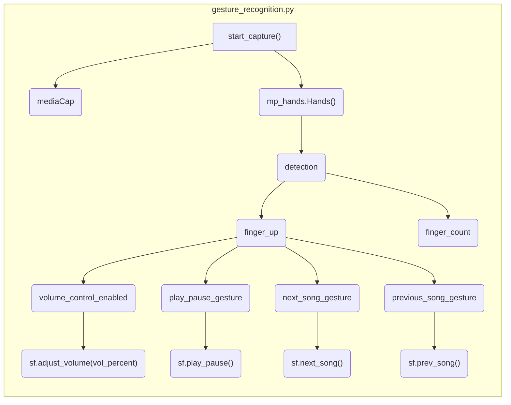

## Module: gesture_recognition.py
- **Module Name**: The module is named `gesture_recognition.py`.

- **Primary Objectives**: This module is designed to recognize hand gestures using a webcam, and control music playback on Spotify based on the recognized gestures.

- **Critical Functions**: The main function in this module is `start_capture()`, which starts capturing video from the webcam, processes the frames to detect hand gestures, and performs the corresponding actions on Spotify.

- **Key Variables**: Some key variables in this module include `mediaCap` (the video capture object), `max_distance` (used for volume control), `play_pause_active` and `next_prev_active` (used to avoid repeated play/pause and next/prev actions), and `finger_up` and `finger_count` (used to track the state of each finger).

- **Interdependencies**: This module depends on the `mediapipe`, `cv2`, `math`, `time`, and `spotify_functions` modules.

- **Core vs. Auxiliary Operations**: The core operations of this module are the capturing and processing of video frames, and the detection and interpretation of hand gestures. Auxiliary operations include drawing the detected hand landmarks on the video frames and adjusting the volume on Spotify.

- **Operational Sequence**: The module starts by initializing the video capture and other necessary variables. It then enters a loop where it continuously captures video frames, processes them to detect hand landmarks, interprets the detected landmarks as gestures, and performs the corresponding actions on Spotify. The loop continues until the user presses 'q' to quit.

- **Performance Aspects**: The performance of this module largely depends on the speed and accuracy of the hand landmark detection and gesture interpretation. The speed of video capture and processing can also impact performance.

- **Reusability**: This module is highly specific to its task of gesture-based Spotify control, but parts of it could potentially be reused for other applications that involve hand gesture recognition.

- **Usage**: This module is used by running the `start_capture()` function, which will start the gesture recognition and Spotify control process.

- **Assumptions**: This module assumes that the user's webcam is functioning and accessible, that the `mediapipe` and `cv2` modules are installed and working correctly, and that the `spotify_functions` module is available and properly set up for controlling Spotify.
## Mermaid Diagram

