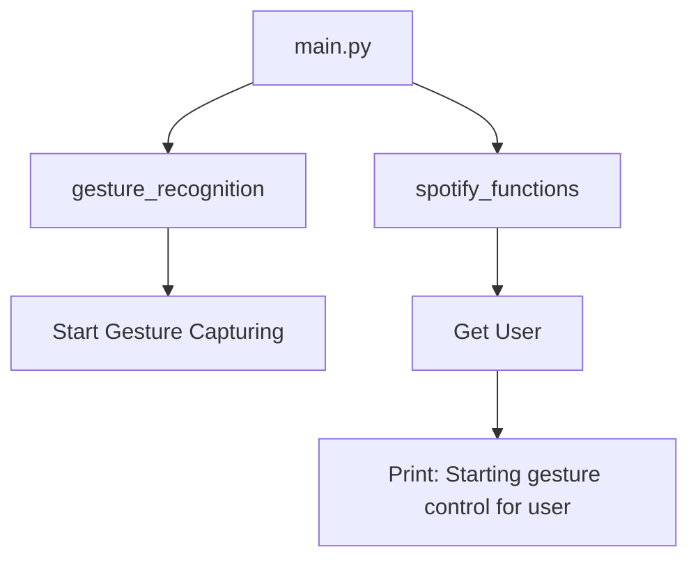

## Module: main.py
- **Module Name**: The module name is 'main.py'.

- **Primary Objectives**: The primary objective of this module is to integrate gesture recognition and Spotify functions. It authenticates the user, starts gesture capturing, and controls the Spotify account based on the recognized gestures.

- **Critical Functions**: 
  - `sf.get_user()`: This function is used to get the username and trigger account authentication.
  - `gr.start_capture()`: This function starts gesture capturing.

- **Key Variables**: 'username' is the essential variable in this module, which holds the username for account authentication.

- **Interdependencies**: This module interacts with two other modules - 'gesture_recognition' and 'spotify_functions'. It uses functions from these modules to authenticate the user and start capturing gestures.

- **Core vs. Auxiliary Operations**: The core operation of this module is to start capturing gestures (`gr.start_capture()`) after the user's authentication (`sf.get_user()`). There are no auxiliary operations in this module.

- **Operational Sequence**: The sequence of operations is straightforward. First, the username is fetched and authentication is triggered. Then, gesture capturing is started.

- **Performance Aspects**: The performance of this module is dependent on the 'gesture_recognition' and 'spotify_functions' modules. Any performance considerations would be related to the efficiency and accuracy of gesture recognition and the responsiveness of Spotify functions.

- **Reusability**: This module can be reused for any application that requires user authentication followed by gesture recognition. The specific functions for Spotify and gesture recognition can be replaced with other functionalities as per the requirement.

- **Usage**: This module is used to control a Spotify account using gestures. It is initiated by running the 'main.py' script.

- **Assumptions**: The module assumes that the 'gesture_recognition' and 'spotify_functions' modules are correctly implemented and that the user's Spotify account is accessible and can be controlled by the application.
## Mermaid Diagram

