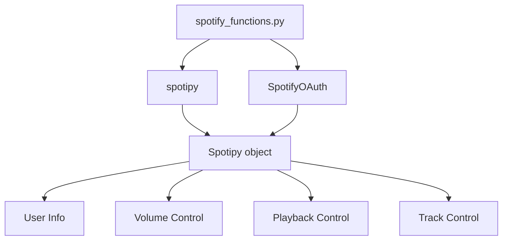

## Module: spotify_functions.py
- **Module Name**: The module is named `spotify_functions.py`.

- **Primary Objectives**: The purpose of this module is to interact with the Spotify API to control playback, adjust volume, and retrieve user information.

- **Critical Functions**: The main functions include:
  - `get_user()`: Retrieves the Spotify username of the connected user.
  - `adjust_volume(vol_percent)`: Adjusts the volume to a given percentage (0-100).
  - `play_pause()`: Checks the user's current playback status and toggles between play and pause.
  - `next_song()`: Skips to the next song in the queue.
  - `prev_song()`: Goes back to the previous song.

- **Key Variables**: The essential variables include:
  - `SPOTIPY_CLIENT_ID`: Spotify API client ID.
  - `SPOTIPY_CLIENT_SECRET`: Spotify client secret.
  - `SPOTIPY_REDIRECT_URI`: URI to redirect after successful login.
  - `scope`: Permissions for the Spotify API.
  - `sp`: Spotipy object for interacting with the Spotify API.

- **Interdependencies**: This module interacts with the Spotipy library and the Spotify API.

- **Core vs. Auxiliary Operations**: The core operations are the functions that control the playback (`play_pause()`, `next_song()`, `prev_song()`) and adjust the volume (`adjust_volume()`). The auxiliary operation is the `get_user()` function, which retrieves the username of the connected Spotify user.

- **Operational Sequence**: The Spotipy object `sp` is initialized first. Then, the other functions can be called as needed.

- **Performance Aspects**: Performance considerations include the speed of the Spotify API responses and the Spotipy library's efficiency.

- **Reusability**: This module is highly reusable. It can be imported and used in any Python application that needs to control Spotify playback.

- **Usage**: This module can be used in a Python application by importing it and calling its functions. For example, to adjust the volume to 50%, you would call `adjust_volume(50)`.

- **Assumptions**: The module assumes that the Spotify API client ID, client secret, and redirect URI are correctly set. It also assumes that the user has granted the permissions specified in the `scope` variable.
## Mermaid Diagram

