# Introduction :

The program is a complex, well-structured application designed to interact with Large Language Models (LLMs) and provide a range of services including document ingestion, text chunking, chat functionalities, and embeddings generation. 

At the heart of the application is the __main__.py module, which serves as the entry point of the application and starts a FastAPI server with uvicorn. The program uses a modular approach, with different modules handling different aspects of the application.

The auth.py module is responsible for the authentication mechanism of the API, ensuring that only authenticated requests are processed. 

The batched_chroma.py module handles batching additions to a Chroma vector store, which is used for storing and retrieving embeddings within a ChromaDB collection.

The chat_router.py and chat_service.py modules handle chat-related requests and services respectively, using different components such as LLMComponent, VectorStoreComponent, EmbeddingComponent, and NodeStoreComponent.

The chunks_router.py and chunks_service.py modules manage the retrieval of relevant text chunks from ingested documents based on a given input text.

The completions_router.py module serves as an API endpoint for generating text completions based on user prompts, using OpenAI's GPT model.

The conftest.py module provides a centralized fixture for pytest, defining setup methods that are common to multiple test cases.

The constants.py module defines and manages constants used throughout the project, while the context_filter.py module provides a context filter for the application.

The di.py module handles dependency injection within the application, creating a global injector and binding settings to it. 

The embedding_component.py module initializes and manages the embedding model used in the application, handling different types of embeddings including HuggingFace, Sagemaker, OpenAI, and MockEmbedding.

The embeddings_router.py and embeddings_service.py modules handle requests related to embeddings generation and provide services related to embeddings respectively.

The extract_openapi.py module extracts OpenAPI specifications from the application, writing them to a file in either JSON or YAML format.

The fast_api_test_client.py module sets up a test client for the FastAPI application, allowing for thorough testing of the application.

The health_router.py module provides a health check endpoint for the system, allowing users to verify if the system is up and running.

The images.py module stores logo images in the SVG (Scalable Vector Graphics) format, encoded in Base64.

The ingest_folder.py and ingest_helper.py modules facilitate the ingestion of files into the system, while the ingest_router.py and ingest_service.py modules manage the ingestion of documents.

The ingest_watcher.py module monitors a specified path for any file or directory changes, triggering a callback function when a file is modified or created.

The launcher.py module creates the FastAPI application, configures the logger, and defines the main API routes.

The llm_component.py module initializes the LLM based on the mode specified in the settings.

The mock_injector.py module creates a mock injector for testing, binding interfaces to mock objects and settings.

The node_store_component.py module manages the document and index stores for the Llama Index.

The openai_models.py module manages interactions with OpenAI's GPT model, handling different types of responses from the model.

The paths.py module defines and manages various paths used throughout the project.

The sagemaker.py module interacts with the AWS Sagemaker service, invoking Sagemaker endpoints, handling responses, and performing tasks such as completing prompts and streaming chat.

The settings.py and settings_loader.py modules manage the configuration settings of the application and load application settings based on active profiles respectively.

The typing.py module provides support for type hints, while the ui.py module provides a user interface for interacting with a GPT model.

The utils.py module provides utility functions for wiping files and directories in a specified path and the yaml.py module loads a YAML file and replaces any environment variables found within the file with their actual values.

The application also includes several testing modules like test_auth.py, test_chat_routes.py, test_chunk_routes.py, test_embedding_routes.py, test_ingest_routes.py, test_ingest_service.py, test_settings.py, test_settings_loader.py, test_simple_auth.py, and test_ui.py, which test different aspects of the application to ensure its correct functioning.

In summary, the program is designed to provide an interactive, user-friendly interface for interacting with advanced large language models, offering a range of services from document ingestion to chat functionalities. It uses a modular approach, with different modules handling different aspects of the application, and includes comprehensive testing to ensure its correct functioning.

# Full System Overview

# Module Overview
## Module: __main__.py
- **Module Name**: The module name is "__main__.py".

- **Primary Objectives**: The primary purpose of this module is to start a FastAPI server with uvicorn. It serves as the entry point of the application.

- **Critical Functions**: The main function in this module is `uvicorn.run()`, which starts the FastAPI server. It takes the FastAPI application instance, host IP, port number, and log configuration as arguments.

- **Key Variables**: 
  - `app`: This is the FastAPI application imported from `private_gpt.main`.
  - `settings`: This is the settings module that contains configuration details like server port.

- **Interdependencies**: This module depends on the `uvicorn` package to run the server. It also imports `app` from `private_gpt.main` and `settings` from `private_gpt.settings.settings`.

- **Core vs. Auxiliary Operations**: The core operation of this module is to run the FastAPI server using uvicorn. There are no auxiliary operations in this module.

- **Operational Sequence**: The module starts by importing necessary modules and settings. It then runs the FastAPI server using the uvicorn package.

- **Performance Aspects**: Performance considerations are largely dependent on the uvicorn server and the FastAPI application. The module itself does not have any specific performance considerations.

- **Reusability**: The module is not designed for reuse as it serves as the entry point of the application. However, the concept of starting a FastAPI server with uvicorn can be reused in other applications.

- **Usage**: This module is used to start the FastAPI server when the application is run.

- **Assumptions**: It assumes that the necessary packages (FastAPI, uvicorn) are installed and the server settings (like host IP and port) are correctly configured in the settings module.
## Mermaid Diagram

## Module: auth.py
- **Module Name**: auth.py

- **Primary Objectives**: This module is responsible for the authentication mechanism of the API. It checks if the request is authenticated and defines more complex authentication mechanisms if needed.

- **Critical Functions**: 
  - `_simple_authentication(authorization: Annotated[str, Header()] = "") -> bool:`: This function checks if the request is authenticated by comparing the "Authorization" header with the expected one.
  - `authenticated() -> bool:`: This function checks if the request is authenticated. The implementation of this function changes based on the config.

- **Key Variables**: 
  - `NOT_AUTHENTICATED`: It is an HTTPException that signifies that the request requires authentication.
  - `authorization`: It is the "Authorization" header of the request.
  - `settings().server.auth.secret`: It is the expected "Authorization" header.
  - `settings().server.auth.enabled`: It is a config variable that determines if the authentication is enabled.

- **Interdependencies**: This module interacts with the `settings` module to get the config variables.

- **Core vs. Auxiliary Operations**: The core operations of this module are the authentication mechanisms. The auxiliary operations include logging and raising exceptions.

- **Operational Sequence**: 
  - If the authentication is not enabled, a dummy authentication method that always returns True is defined.
  - If the authentication is enabled, the `_simple_authentication` method is used to check if the request is authenticated.

- **Performance Aspects**: The module uses the secrets.compare_digest function for comparing the "Authorization" header with the expected one, which is a constant time comparison function and helps prevent timing attacks.

- **Reusability**: This module is highly reusable. The authentication mechanisms can be easily adapted for different APIs by changing the `settings` module.

- **Usage**: This module is used in FastAPI routers to authenticate requests.

- **Assumptions**: 
  - The module assumes that the "Authorization" header is present in the request.
  - The module assumes that the config variables are correctly set in the `settings` module.
## Mermaid Diagram
## Module: batched_chroma.py
- **Module Name**: batched_chroma.py

- **Primary Objectives**: This module is designed to handle batching additions to a Chroma vector store to avoid reaching the maximum batch limit. It is used for storing and retrieving embeddings within a ChromaDB collection.

- **Critical Functions**: 
  - `__init__`: Initializes the BatchedChromaVectorStore object.
  - `add`: Adds nodes to the index, batching the insertion to avoid issues. This method also checks if the client and collection are initialized and handles chunking the nodes into manageable sizes.

- **Key Variables**: 
  - `chroma_client`: API instance
  - `chroma_collection`: ChromaDB collection instance
  - `host`, `port`, `ssl`, `headers`, `collection_kwargs`: Configuration for the ChromaDB connection.
  - `max_chunk_size`: Maximum size of each batch.
  - `node_chunks`: List of node chunks.
  - `all_ids`: List of all node IDs.

- **Interdependencies**: This module interacts with the `ChromaVectorStore` from the `llama_index.vector_stores.chroma` package, `BaseNode` from the `llama_index.schema` package, and `node_to_metadata_dict` from the `llama_index.vector_stores.utils` package.

- **Core vs. Auxiliary Operations**: The core operation of this module is the `add` method, which handles the addition of nodes to the ChromaDB. Auxiliary operations include initialization of the object and chunking the nodes.

- **Operational Sequence**: The `add` function is called with a list of nodes. It first checks if the client and collection are initialized and then chunks the nodes into manageable sizes. For each chunk, it extracts the embeddings, metadata, IDs, and documents, and adds them to the collection. It then returns a list of all node IDs.

- **Performance Aspects**: The batching process is a critical performance aspect of this module. It ensures that the system doesn't reach the max batch size limit, thereby maintaining the system's efficiency and effectiveness.

- **Reusability**: The `BatchedChromaVectorStore` class can be reused to handle any Chroma vector store that requires batch additions. The `add` method is particularly adaptable because it can handle any list of nodes.

- **Usage**: This module is used when there is a need to store and retrieve embeddings in a ChromaDB collection, especially when the number of embeddings is large enough to require batching.

- **Assumptions**: The module assumes that the `chroma_client` and `_collection` are already initialized. It also assumes that each node in the `nodes` list has an embedding, metadata, node_id, and content.
## Mermaid Diagram

## Module: chat_router.py
- **Module Name**: The module name is `chat_router.py`.

- **Primary Objectives**: The primary purpose of this module is to handle chat-related requests in a web application. It uses the FastAPI library to define HTTP routes for chat functionalities. 

- **Critical Functions**: The main function in this module is `chat_completion()`. This function handles POST requests to the `/chat/completions` endpoint. It accepts a list of messages as input, processes them, and returns a response from the chat service. If the `stream` option is set to `true`, the function will return a streaming response.

- **Key Variables**: The key variables in this module are `chat_router`, which is an instance of FastAPI's `APIRouter`, and `ChatBody`, which is a Pydantic model defining the structure of the request body for the `/chat/completions` endpoint.

- **Interdependencies**: This module interacts with several other components of the system, including `ChatService` from `chat_service.py`, `OpenAICompletion` and `OpenAIMessage` from `openai_models.py`, `ContextFilter` from `context_filter.py`, and `authenticated` from `auth.py`.

- **Core vs. Auxiliary Operations**: The core operation of this module is to facilitate chat functionalities in the application. Auxiliary operations include authentication (handled by the `authenticated` dependency) and request/response formatting.

- **Operational Sequence**: When a POST request is made to the `/chat/completions` endpoint, the `chat_completion()` function is called. This function retrieves the chat service, processes the messages, and returns a response. If the `stream` option is set to `true`, the response will be streamed.

- **Performance Aspects**: Performance considerations include the handling of streaming responses, which can be more efficient for large amounts of data. Additionally, the use of FastAPI and Pydantic ensures fast request handling and validation.

- **Reusability**: The `ChatBody` model and the `authenticated` dependency can be reused in other parts of the application. The `chat_completion()` function can also be adapted for different chat-related endpoints.

- **Usage**: This module is used whenever a user makes a request to the `/chat/completions` endpoint of the application. The user provides a list of messages, and the module returns a response from the chat service.

- **Assumptions**: The module assumes that the user is authenticated and that the request body follows the structure defined by the `ChatBody` model. It also assumes that the chat service is able to process the provided messages and return a response.
## Mermaid Diagram

## Module: chat_service.py
- **Module Name**: The module name is `chat_service.py`.

- **Primary Objectives**: The purpose of this module is to handle chat services. It uses different components such as `LLMComponent`, `VectorStoreComponent`, `EmbeddingComponent`, and `NodeStoreComponent` to perform chat operations.

- **Critical Functions**: 
    - `__init__`: Initializes the chat service with required components.
    - `_chat_engine`: Returns a `BaseChatEngine` instance.
    - `stream_chat`: Streams chat messages.
    - `chat`: Handles chat operations.

- **Key Variables**: 
    - `self.llm_service`
    - `self.vector_store_component`
    - `self.storage_context`
    - `self.service_context`
    - `self.index`

- **Interdependencies**: This module interacts with several other modules such as `llama_index`, `private_gpt`, `pydantic`, and `injector`.

- **Core vs. Auxiliary Operations**: 
    - Core operations: `stream_chat`, `chat`
    - Auxiliary operations: `_chat_engine`, `__init__`

- **Operational Sequence**: The `__init__` function is called when an object of `ChatService` is created. It initializes all the necessary components. The `stream_chat` and `chat` methods are called to handle chat operations.

- **Performance Aspects**: The performance of this module greatly depends on the efficiency of the `LLMComponent`, `VectorStoreComponent`, `EmbeddingComponent`, and `NodeStoreComponent` modules.

- **Reusability**: The `ChatService` class can be reused in any part of the application where chat services are required.

- **Usage**: This module is used to handle chat operations in the application.

- **Assumptions**: 
    - It's assumed that all the required components are properly initialized and passed to the `ChatService` class.
    - The `stream_chat` and `chat` methods assume that the messages passed to them are in the form of a list of `ChatMessage` objects.
    - It's assumed that the `context_filter` passed to the `_chat_engine` method is either an instance of `ContextFilter` or `None`.
## Mermaid Diagram
## Module: chunks_router.py
- **Module Name**: chunks_router.py

- **Primary Objectives**: The primary purpose of this module is to handle the routing for the "/chunks" API endpoint. It is responsible for retrieving the most relevant chunks of text from ingested documents based on a given input text.

- **Critical Functions**: 
  - `chunks_retrieval()`: This is the main function. It retrieves the most relevant chunks from the ingested documents given a `text`. The returned information can be used to generate prompts for other APIs. It also handles the request and body parameters for the API call.

- **Key Variables**: 
  - `chunks_router`: This is an instance of `APIRouter`, which is responsible for handling the API routing.
  - `ChunksBody`: This is a Pydantic model that defines the expected format of the request body for the API call.
  - `ChunksResponse`: This is another Pydantic model that defines the format of the response that will be returned by the API.

- **Interdependencies**: This module interacts with the `ContextFilter`, `ChunksService`, `Chunk`, and `authenticated` modules.

- **Core vs. Auxiliary Operations**: The core operation of this module is the `chunks_retrieval()` function, which handles the API call. Auxiliary operations include the definition of the `ChunksBody` and `ChunksResponse` models and the authentication dependency.

- **Operational Sequence**: The `chunks_retrieval()` function is called when a POST request is made to the "/chunks" endpoint. It retrieves the relevant service, calls the `retrieve_relevant` method with the appropriate parameters, and returns a `ChunksResponse` with the results.

- **Performance Aspects**: This module is generally fast because it only involves the Embeddings model and not the LLM.

- **Reusability**: This module can be reused for any task that requires retrieving relevant chunks of text from ingested documents.

- **Usage**: This module is used to handle the "/chunks" API endpoint. It takes a `text`, and optional `context_filter`, `limit`, and `prev_next_chunks` parameters, and returns the most relevant chunks from the ingested documents.

- **Assumptions**: It is assumed that the ingested documents are available and that the `text` parameter is provided in the request. It's also assumed that the `authenticated` dependency is set up correctly.
## Mermaid Diagram
## Module: chunks_service.py
- **Module Name**: chunks_service.py

- **Primary Objectives**: This module is designed to work with chunks of text from ingested documents. It retrieves relevant chunks based on the provided text and context filter, and it also retrieves sibling nodes (previous and next chunks) of a given node.

- **Critical Functions**: 
  - `from_node(cls: type["Chunk"], node: NodeWithScore) -> "Chunk"`: This class method creates a Chunk object from a NodeWithScore object.
  - `_get_sibling_nodes_text(self, node_with_score: NodeWithScore, related_number: int, forward: bool = True) -> list[str]`: This method retrieves the text of sibling nodes of a given node.
  - `retrieve_relevant(self, text: str, context_filter: ContextFilter | None = None, limit: int = 10, prev_next_chunks: int = 0) -> list[Chunk]`: This method retrieves relevant chunks based on the provided text and context filter.

- **Key Variables**: 
  - `vector_store_component`: An instance of the VectorStoreComponent class.
  - `storage_context`: An instance of the StorageContext class.
  - `query_service_context`: An instance of the ServiceContext class.

- **Interdependencies**: This module interacts with several other components of the system, including the LLMComponent, VectorStoreComponent, EmbeddingComponent, and NodeStoreComponent.

- **Core vs. Auxiliary Operations**: The core operation of this module is to retrieve relevant chunks of text. Auxiliary operations include getting the text of sibling nodes and creating a Chunk object from a NodeWithScore object.

- **Operational Sequence**: First, the module creates an instance of the VectorStoreIndex class. Then, it retrieves nodes using the `retrieve` method of the `vector_index_retriever` object. After sorting the nodes by score, it loops through each node, creates a Chunk object, retrieves previous and next texts, and appends the Chunk object to the `retrieved_nodes` list.

- **Performance Aspects**: The module is optimized to retrieve relevant chunks of text efficiently. It sorts nodes by score in descending order to prioritize higher-scored nodes.

- **Reusability**: The module can be reused in any context where it's necessary to retrieve relevant chunks of text from ingested documents.

- **Usage**: This module is used when there's a need to retrieve relevant chunks of text from ingested documents based on a provided text and context filter.

- **Assumptions**: The module assumes that the VectorStoreComponent, LLMComponent, EmbeddingComponent, and NodeStoreComponent are properly initialized and functioning as expected. It also assumes that the nodes retrieved from the `vector_index_retriever` object are valid NodeWithScore objects.
## Mermaid Diagram

## Module: completions_router.py
- **Module Name**: completions_router.py

- **Primary Objectives**: This module serves as an API endpoint for generating text completions based on user prompts. It uses OpenAI's GPT model to generate responses.

- **Critical Functions**: 
  - `prompt_completion`: This function takes a user's prompt and returns a predicted completion generated by the OpenAI model. It can optionally use context from ingested documents to create the response, include source chunks used to create the response, and return data chunks following OpenAI's streaming model.

- **Key Variables**: 
  - `completions_router`: The API router object.
  - `CompletionsBody`: A class representing the request body for the completions endpoint. It includes variables for the user's prompt, whether to use context, whether to include sources, whether to stream, and a context filter.

- **Interdependencies**: This module depends on the FastAPI library for routing, pydantic for data validation, and several modules from the private_gpt package for handling completions and authentication.

- **Core vs. Auxiliary Operations**: The core operation of this module is to provide an API endpoint for generating text completions. The auxiliary operations include authenticating requests and handling the request/response data.

- **Operational Sequence**: The module receives a POST request at the "/completions" endpoint, authenticates the request, validates the request body, generates a completion using the OpenAI model, and returns the completion as the response.

- **Performance Aspects**: Performance considerations in this module might include the latency of generating completions with the OpenAI model, the overhead of request authentication, and the efficiency of the request/response handling code.

- **Reusability**: The `prompt_completion` function could be reused in other contexts where text completions need to be generated. The `CompletionsBody` class could also be reused for validating similar types of request data.

- **Usage**: This module is used as an API endpoint in a larger application. Clients send POST requests to the "/completions" endpoint with a body containing their text prompt and optional parameters for using context, including sources, streaming, and filtering context.

- **Assumptions**: The module assumes that requests will be authenticated and that the request body will contain valid data that can be used to generate a completion. It also assumes that the OpenAI model will be available and capable of generating completions.
## Mermaid Diagram
## Module: conftest.py
- **Module Name**: The module name is `conftest.py`.

- **Primary Objectives**: The primary purpose of this module is to provide a centralized fixture for pytest. It is used to define setup methods that are common to multiple test cases, and to share fixture functions across multiple test files.

- **Critical Functions**: 
  - `_as_module(fixture_path: str) -> str`: This function converts the fixture path into a module path. It replaces slashes and backslashes with dots and removes the '.py' extension.
  - `os.chdir(root_path)`: Changes the current working directory to the root path.

- **Key Variables**: 
  - `root_path`: This is the path to the parent directory of the current file.
  - `pytest_plugins`: This is a list of all the fixture modules.

- **Interdependencies**: This module interacts with the `os`, `pathlib`, and `glob` modules from the Python Standard Library, and the `pytest` testing tool.

- **Core vs. Auxiliary Operations**: 
  - Core operations include changing the working directory and converting fixture paths into module paths.
  - Auxiliary operations include defining the root path and the `pytest_plugins` list.

- **Operational Sequence**: 
  - First, the root path is defined and the working directory is changed to this root path.
  - Then, the `pytest_plugins` list is populated with the module paths of all the fixture modules.

- **Performance Aspects**: This module has a minimal impact on performance as it mainly deals with setup for testing.

- **Reusability**: This module is highly reusable as it provides a centralized fixture for pytest, which can be used across multiple test cases and files.

- **Usage**: This module is used during the setup phase of pytest to define common setup methods and share fixture functions.

- **Assumptions**: 
  - The module assumes that the fixtures are located in the `tests/fixtures` directory and do not start with an underscore.
  - It also assumes that the working directory needs to be changed to the root path to prevent a bug in IntelliJ.
## Mermaid Diagram

## Module: constants.py
- **Module Name**: The module is named "constants.py".

- **Primary Objectives**: The purpose of this module is to define and manage constants that will be used throughout the project. It specifically defines a constant for the root path of the project.

- **Critical Functions**: This module does not contain any functions or methods, it only defines a constant.

- **Key Variables**: The key variable in this module is `PROJECT_ROOT_PATH`. It is a `Path` object that represents the path to the project's root directory. This is determined by finding the parent directory of the directory where this file is located.

- **Interdependencies**: This module depends on the `pathlib` module for creating the `Path` object. It might be used by other modules that need to know the root path of the project.

- **Core vs. Auxiliary Operations**: As a constants module, its main operation is to provide a central location for defining and accessing project-wide constants. There are no auxiliary operations.

- **Operational Sequence**: There is no distinct flow in this module as it only involves the declaration of a constant.

- **Performance Aspects**: Performance is not a significant concern for this module since it only involves the declaration of a constant. The computation to determine the project root path is done only once.

- **Reusability**: This module is highly reusable. The `PROJECT_ROOT_PATH` constant can be imported into any other module in the project where the root path is required.

- **Usage**: This module is used by importing the `PROJECT_ROOT_PATH` constant into other modules. For example, `from constants import PROJECT_ROOT_PATH`.

- **Assumptions**: The assumption made in this module is that the project's root directory is always one level up from the directory where this file is located. If the file structure changes, this assumption might not hold, and the `PROJECT_ROOT_PATH` may need to be updated.
## Mermaid Diagram
## Module: context_filter.py
**Module Name:** context_filter.py

**Primary Objectives:** The primary objective of the `context_filter` module is to define a data model for filtering contexts. It allows for the specification of document IDs to filter contexts based on specific criteria.

**Critical Functions:** The main method/function in this module is `ContextFilter`. It is a class that inherits from `BaseModel` from the `pydantic` library. The `ContextFilter` class has the following attributes:
- `docs_ids`: A list of document IDs to filter contexts. It can be `None` or a list of strings. An example value is provided as `["c202d5e6-7b69-4869-81cc-dd574ee8ee11"]`.

**Key Variables:** The key variable in this module is `docs_ids`, which represents the list of document IDs used for filtering contexts.

**Interdependencies:** This module does not have any explicit dependencies on other system components. However, it may be used in conjunction with other modules or components that utilize the `ContextFilter` class.

**Core vs. Auxiliary Operations:** The core operation of this module is to provide a data model for filtering contexts based on document IDs. It does not have any auxiliary operations.

**Operational Sequence:** There is no distinct operational sequence in this module. It mainly provides a data model that can be used in other parts of the system.

**Performance Aspects:** Since this module primarily defines a data model, there are no specific performance aspects associated with it. However, the performance of the overall system may depend on how this module is used in conjunction with other components.

**Reusability:** The `ContextFilter` class defined in this module can be easily reused in other parts of the system. It provides a standardized way to specify document IDs for context filtering.

**Usage:** This module can be used by importing the `ContextFilter` class and instantiating objects of this class with the desired document IDs. These objects can then be used in other parts of the system for filtering contexts based on the specified document IDs.

**Assumptions:** The assumptions made in this module are:
- The `docs_ids` attribute can be `None` or a list of strings.
- The provided example value for `docs_ids` is representative of the expected input format.
## Mermaid Diagram

## Module: di.py
- **Module Name**: The module name is `di.py`.

- **Primary Objectives**: The primary purpose of this module is to handle dependency injection within the application. It creates a global injector for the application and binds the settings to it.

- **Critical Functions**: 
    - `create_application_injector()`: This function creates an instance of `Injector` and binds the `Settings` to `unsafe_typed_settings`.

- **Key Variables**: 
    - `_injector`: An instance of `Injector` which is used for dependency injection.
    - `global_injector`: A global reference to the `Injector` created by `create_application_injector()`.

- **Interdependencies**: This module is dependent on the `Injector` class from `injector` module and `Settings`, `unsafe_typed_settings` from `private_gpt.settings.settings`.

- **Core vs. Auxiliary Operations**: The core operation of this module is the creation of an application injector and binding the settings to it. There are no auxiliary operations in this module.

- **Operational Sequence**: The sequence is straightforward: an instance of `Injector` is created with auto binding enabled, then `Settings` is bound to `unsafe_typed_settings`, and finally, the injector is returned.

- **Performance Aspects**: The performance of this module would largely depend on the efficiency of the `Injector` class and how well it manages the dependencies.

- **Reusability**: The `create_application_injector()` function can be reused to create an injector and bind settings to it. However, the global injector is specific to this application.

- **Usage**: This module is used to create a global injector for the application, which can then be used to manage dependencies throughout the application.

- **Assumptions**: It assumes that the `Injector` class and `Settings`, `unsafe_typed_settings` are correctly implemented and available for import. It also assumes that the `Injector` instance created will be used for handling dependencies in the application.
## Mermaid Diagram
## Module: embedding_component.py
- **Module Name**: The module is named `embedding_component.py`.

- **Primary Objectives**: The primary purpose of this module is to initialize and manage the embedding model used in the application. It handles different types of embeddings including HuggingFace, Sagemaker, OpenAI, and MockEmbedding.

- **Critical Functions**: The main function in this module is the `__init__` method, which initializes the EmbeddingComponent class and sets the embedding model based on the settings provided.

- **Key Variables**: The key variables include `embedding_model`, which holds the instance of the embedding model being used, and `settings`, which contains the configuration settings for the application.

- **Interdependencies**: This module interacts with several other system components such as `injector`, `llama_index`, `private_gpt.paths`, `private_gpt.settings.settings`, and specific embedding modules like `HuggingFaceEmbedding`, `SagemakerEmbedding`, `OpenAIEmbedding`, and `MockEmbedding`.

- **Core vs. Auxiliary Operations**: The core operation of this module is to initialize and set the embedding model. Auxiliary operations include importing necessary modules and managing dependencies.

- **Operational Sequence**: Initially, the `EmbeddingComponent` class is defined with an `__init__` method. Depending on the mode specified in the settings, the appropriate embedding model is initialized and set.

- **Performance Aspects**: The performance of this module depends on the embedding model being used and how efficiently it can process and generate embeddings.

- **Reusability**: The module is highly reusable as it provides a standardized way to handle different types of embeddings, allowing for easy switching between different models based on the application's settings.

- **Usage**: This module is used whenever an embedding model is required in the application. An instance of `EmbeddingComponent` is created, which automatically initializes the appropriate embedding model based on the settings.

- **Assumptions**: The module assumes that the settings provided are valid and that the specified embedding model and its dependencies are available. It also assumes that the dimensionality used by the default embedding model is 384 in the case of a mock model.
## Mermaid Diagram
## Module: embeddings_router.py
- **Module Name**: The module is named as `embeddings_router.py`.

- **Primary Objectives**: This module is designed to provide a FastAPI router for handling requests related to embeddings generation. It takes in a string or a list of strings, generates their embeddings using the `EmbeddingsService`, and returns the embeddings in the response.

- **Critical Functions**: 
    - `embeddings_generation(request: Request, body: EmbeddingsBody) -> EmbeddingsResponse`: This function is a POST request handler that generates embeddings for the given input text(s) and returns them in the response.

- **Key Variables**: 
    - `embeddings_router`: This is a FastAPI router object for handling requests related to embeddings.
    - `EmbeddingsBody`: This is a Pydantic model that validates the request body for the embeddings generation endpoint.
    - `EmbeddingsResponse`: This is a Pydantic model that shapes the response for the embeddings generation endpoint.
    - `service`: This is an instance of `EmbeddingsService` retrieved from the request's state object.

- **Interdependencies**: This module interacts with the `EmbeddingsService` module for generating embeddings, and the `auth` module for user authentication.

- **Core vs. Auxiliary Operations**: The core operation of this module is the generation of embeddings for the given input text(s). The auxiliary operations include request validation and user authentication.

- **Operational Sequence**: 
    - The module receives a POST request at the `/embeddings` endpoint.
    - The `authenticated` dependency is checked.
    - The request body is validated and parsed into the `EmbeddingsBody` model.
    - The `EmbeddingsService` is retrieved from the request's state object.
    - The input text(s) are passed to the `EmbeddingsService` to generate their embeddings.
    - The embeddings are returned in the response shaped by the `EmbeddingsResponse` model.

- **Performance Aspects**: The performance of this module largely depends on the efficiency of the `EmbeddingsService` and the size of the input text(s).

- **Reusability**: This module can be reused in any FastAPI application that requires an endpoint for generating embeddings. The `EmbeddingsService` and the `authenticated` dependency would need to be provided in the application's dependency injection container.

- **Usage**: This module is used by sending a POST request to the `/embeddings` endpoint with a string or a list of strings in the request body. The response will contain the embeddings for the input text(s).

- **Assumptions**: 
    - The module assumes that the `EmbeddingsService` and the `authenticated` dependency are provided in the application's dependency injection container.
    - It also assumes that the request body is a JSON object containing a string or a list of strings under the `input` key.
## Mermaid Diagram
## Module: embeddings_service.py
- **Module Name**: The module name is `embeddings_service.py`.

- **Primary Objectives**: The main purpose of this module is to provide services related to embeddings. It uses an embedding model to convert a list of texts into their corresponding embeddings.

- **Critical Functions**: 
  - `__init__`: This is the constructor method for the `EmbeddingsService` class. It initializes the embedding model using dependency injection.
  - `texts_embeddings`: This method converts a list of texts into their corresponding embeddings.

- **Key Variables**: 
  - `embedding_model`: This is an instance of the `EmbeddingComponent` class. It is used to generate embeddings for texts.
  - `texts`: This is a list of texts for which embeddings are to be generated.
  - `texts_embeddings`: This is a list of embeddings corresponding to the input texts.

- **Interdependencies**: This module interacts with the `EmbeddingComponent` module to generate embeddings for texts.

- **Core vs. Auxiliary Operations**: The core operation of this module is to generate embeddings for texts. The auxiliary operations include initializing the `EmbeddingComponent` instance and creating `Embedding` objects.

- **Operational Sequence**: The sequence of operations is as follows:
  1. The `EmbeddingsService` class is instantiated.
  2. The `texts_embeddings` method is called with a list of texts.
  3. The `get_text_embedding_batch` method of the `embedding_model` is called to generate embeddings for the texts.
  4. The embeddings are wrapped in `Embedding` objects and returned.

- **Performance Aspects**: The performance of this module depends on the efficiency of the `EmbeddingComponent` and the size of the input texts list. For larger lists, the time taken to generate embeddings will be higher.

- **Reusability**: This module is highly reusable as it provides a service for generating embeddings for any list of texts. It can be used in any context where text embeddings are required.

- **Usage**: This module can be used by instantiating the `EmbeddingsService` class and calling the `texts_embeddings` method with the required list of texts.

- **Assumptions**: The module assumes that the `EmbeddingComponent` is correctly implemented and that the input texts are in a format that can be processed by the `EmbeddingComponent`.
## Mermaid Diagram

## Module: extract_openapi.py
- **Module Name**: The name of the module is `extract_openapi.py`.

- **Primary Objectives**: The purpose of this module is to extract OpenAPI specifications from an application. It imports the application, generates the OpenAPI specification, and writes it to a file in either JSON or YAML format.

- **Critical Functions**: 
  - `argparse.ArgumentParser()`: This function is used to handle command-line parsing.
  - `import_from_string(args.app)`: This function is used to import the app from a given string.
  - `app.openapi()`: This function is used to generate the OpenAPI specification from the app.
  - `json.dump(openapi, f, indent=2)`: This function writes the OpenAPI specification to a JSON file.
  - `yaml.dump(openapi, f, sort_keys=False)`: This function writes the OpenAPI specification to a YAML file.

- **Key Variables**: 
  - `args.app`: This variable holds the import string of the app.
  - `args.app_dir`: This variable holds the directory containing the app.
  - `args.out`: This variable holds the name of the output file.
  - `openapi`: This variable holds the OpenAPI specification generated from the app.

- **Interdependencies**: This module is dependent on the `argparse`, `json`, `sys`, `yaml`, and `uvicorn.importer` libraries.

- **Core vs. Auxiliary Operations**: The core operations of this module are the extraction of OpenAPI specifications from the app and writing them to a file. The auxiliary operations include handling command-line arguments and importing the app.

- **Operational Sequence**: The module first parses command-line arguments, then imports the app, generates the OpenAPI specification, and finally writes the specification to a file.

- **Performance Aspects**: The performance of this module mainly depends on the complexity of the app from which the OpenAPI specification is being extracted.

- **Reusability**: This module is highly reusable as it can be used to extract OpenAPI specifications from any application.

- **Usage**: This module is used by running it from the command line with the appropriate arguments.

- **Assumptions**: It is assumed that the app from which the OpenAPI specification is to be extracted can be imported using the provided import string. It is also assumed that the app has a method `openapi()` that can generate the OpenAPI specification.
## Mermaid Diagram
## Module: fast_api_test_client.py
- **Module Name**: The module is named `fast_api_test_client.py`.

- **Primary Objectives**: This module's purpose is to set up a test client for the FastAPI application. It uses pytest fixtures to create a test client that can be used to send HTTP requests to the application and receive HTTP responses, allowing for thorough testing of the application.

- **Critical Functions**: 
  - `test_client`: This is the main function in the module. It creates a `TestClient` instance which can be used to simulate HTTP requests to the FastAPI application.

- **Key Variables**: 
  - `request`: This is a pytest request object. It contains information about the ongoing test request.
  - `injector`: This is a `MockInjector` instance. It's used to bind settings for the test client.
  - `app_under_test`: This is the FastAPI application that is under test.
  - `TestClient(app_under_test)`: This is the test client instance that is used to simulate HTTP requests to the application.

- **Interdependencies**: This module interacts with the `pytest`, `fastapi.testclient`, `private_gpt.launcher`, and `tests.fixtures.mock_injector` modules.

- **Core vs. Auxiliary Operations**: The core operation is the creation of the test client. The auxiliary operations involve binding settings to the injector and checking if the request object has a `param` attribute.

- **Operational Sequence**: The module first checks if the request object has a `param` attribute. If it does, it binds the settings to the injector. Then it creates the FastAPI application and the test client.

- **Performance Aspects**: The performance of this module depends on the efficiency of the FastAPI application and the test client. It's important to ensure that the application and the client are properly optimized to ensure fast and efficient testing.

- **Reusability**: This module is highly reusable. It can be used to set up a test client for any FastAPI application. It can also be extended to include more features.

- **Usage**: This module is used during the testing phase of the application development process. It's used to simulate HTTP requests to the application and receive HTTP responses.

- **Assumptions**: The module assumes that the `request` object has a `param` attribute. If it doesn't, the module might not work as expected. It also assumes that the `injector` object can bind settings, and that the `create_app` function can create a FastAPI application.
## Mermaid Diagram

## Module: health_router.py
- **Module Name**: The module is named `health_router.py`.

- **Primary Objectives**: The primary purpose of this module is to provide a health check endpoint for the system. This allows users to verify if the system is up and running. No authentication or authorization is required to access this status.

- **Critical Functions**: The main function in this module is `health()`. This function responds with a "ok" status if the system is up.

- **Key Variables**: The key variable in this module is `status`. This is a field in the `HealthResponse` class, which is set to "ok" by default. 

- **Interdependencies**: This module depends on several packages including `typing`, `fastapi`, and `pydantic`. 

- **Core vs. Auxiliary Operations**: The core operation of this module is to return the system's health status. There are no auxiliary operations in this module.

- **Operational Sequence**: The operational flow is straightforward - when the `/health` endpoint is hit, the `health()` function is invoked, which returns the `HealthResponse` with a status of "ok".

- **Performance Aspects**: Performance considerations are minimal as the module only returns a static response. However, its performance might indirectly indicate the overall performance of the system, as a failure to respond might suggest system downtime.

- **Reusability**: The module is highly reusable. It can be incorporated into any system that requires a health check endpoint.

- **Usage**: This module is used to monitor the health of the system. Users can send a GET request to the `/health` endpoint to receive a "ok" status if the system is up.

- **Assumptions**: The module assumes that the system is in a healthy state by default, as it returns "ok" unless the system is down. It also assumes that the health check will be performed via a GET request to the `/health` endpoint.
## Mermaid Diagram

## Module: images.py
- **Module Name**: The module's name is `images.py`

- **Primary Objectives**: The main purpose of this module is to store logo images in the SVG (Scalable Vector Graphics) format, encoded in Base64. This allows images to be easily embedded within scripts or HTML files and reduces the need for additional HTTP requests to fetch the images.

- **Critical Functions**: The main function of this module is to provide the logo image as a Base64 encoded string. This string can be used in an HTML file to display the logo.

- **Key Variables**: The key variable in this module is `logo_svg`. This variable holds the Base64 encoded SVG data for the logo.

- **Interdependencies**: As a standalone module that only provides a string variable, it doesn't have any dependencies on other modules. However, other modules or scripts that require the logo would depend on this module.

- **Core vs. Auxiliary Operations**: The core operation of this module is to provide the `logo_svg` variable. There are no auxiliary operations.

- **Operational Sequence**: There is no distinct operational sequence as this is a simple module with a single variable.

- **Performance Aspects**: The performance of this module is not a concern as it only provides a static string. However, the size of the SVG file could impact the performance of scripts or web pages that use it.

- **Reusability**: This module is highly reusable. The `logo_svg` variable can be imported into any Python script or module that needs to use the logo.

- **Usage**: To use this module, you would import it into your Python script or module with a statement like `from images import logo_svg`. You could then use the `logo_svg` variable in your code.

- **Assumptions**: The main assumption is that the Base64 string in `logo_svg` correctly represents an SVG image. If this string is not a valid Base64 encoded SVG, scripts or web pages that try to display the image will fail.
## Mermaid Diagram

## Module: ingest_folder.py
- **Module Name**: ingest_folder.py

- **Primary Objectives**: This module is designed to ingest or import data from a specific folder. It can also watch for changes in the folder and ingest new files as they are added. 

- **Critical Functions**: 
    - `count_documents(folder_path: Path)`: Counts the total number of documents in a given folder.
    - `_recursive_ingest_folder(folder_path: Path)`: Recursively ingests files from the folder and its subfolders.
    - `_do_ingest(changed_path: Path)`: Handles the ingestion of a single file.

- **Key Variables**:
    - `total_documents`: Keeps track of the total number of documents in the folder.
    - `current_document_count`: Keeps track of the number of documents that have been ingested so far.

- **Interdependencies**: This module interacts with the `IngestService` and `IngestWatcher` from the `private_gpt.server.ingest` package. 

- **Core vs. Auxiliary Operations**: The core operation of this module is the ingestion of files from a folder (`_recursive_ingest_folder` and `_do_ingest`). Auxiliary operations include counting the total number of documents (`count_documents`) and setting up logging.

- **Operational Sequence**: The module first counts the total number of documents in the folder, then ingests each document one by one. If the `--watch` argument is passed, the module will continue to watch the folder for changes and ingest new files as they are added.

- **Performance Aspects**: This module uses recursion for both counting and ingesting documents, which could lead to a stack overflow for folders with a very deep structure. The module also logs the progress of the ingestion, which could slow down the process if the number of documents is large.

- **Reusability**: The module is quite adaptable and could be reused for ingesting files from different folders. The ingestion function could also be modified to handle different types of files.

- **Usage**: This module is used by running `ingest_folder.py` with the path to the folder as an argument. The `--watch` argument can be used to watch the folder for changes, and the `--log-file` argument can be used to specify a log file.

- **Assumptions**: The module assumes that the path provided exists and contains files to be ingested. It also assumes that the `IngestService` is capable of ingesting the files in the folder.
## Mermaid Diagram
## Module: ingest_helper.py
- **Module Name**: ingest_helper.py

- **Primary Objectives**: The main purpose of this module is to facilitate the ingestion of files into the system. It provides a helper class `IngestHelper` that simplifies the process of file ingestion by abstracting the details of the HTTP request and response validation.

- **Critical Functions**: 
  - `__init__(self, test_client: TestClient)`: This is the constructor of the `IngestHelper` class. It initializes the `test_client` attribute which is used to make HTTP requests.
  - `ingest_file(self, path: Path) -> IngestResponse`: This function ingests a file into the system. It sends a POST request to the "/v1/ingest" endpoint with the file as the request body and validates the response using the `IngestResponse` model.

- **Key Variables**: 
  - `test_client`: This is an instance of `TestClient` used to make HTTP requests.
  - `path`: This is a `Path` object representing the path of the file to be ingested.
  - `files`: This is a dictionary that maps the file name to the file object.
  - `response`: This is the HTTP response received from the "/v1/ingest" endpoint.
  - `ingest_result`: This is an `IngestResponse` object representing the validated response.

- **Interdependencies**: This module interacts with the "/v1/ingest" endpoint of the system. It also depends on the `TestClient` class for making HTTP requests and the `IngestResponse` model for validating the response.

- **Core vs. Auxiliary Operations**: The core operation of the module is the `ingest_file` function which ingests the file into the system. The `__init__` function is an auxiliary operation that sets up the `IngestHelper` instance.

- **Operational Sequence**: The `ingest_file` function is called with the path of the file to be ingested. It sends a POST request to the "/v1/ingest" endpoint with the file as the request body. The response is then validated using the `IngestResponse` model.

- **Performance Aspects**: The performance of this module largely depends on the speed of the HTTP requests and the size of the file being ingested.

- **Reusability**: The `IngestHelper` class is highly reusable as it abstracts the details of the file ingestion process. It can be instantiated with different `TestClient` instances and used to ingest multiple files.

- **Usage**: This module is used in the context of testing the file ingestion functionality of the system. The `IngestHelper` class can be instantiated with a `TestClient` instance and the `ingest_file` function can be called with the path of the file to be ingested.

- **Assumptions**: The module assumes that the "/v1/ingest" endpoint is working correctly and that the `IngestResponse` model accurately represents the expected response. It also assumes that the file to be ingested exists at the given path.
## Mermaid Diagram

## Module: ingest_router.py
- **Module Name**: ingest_router.py

- **Primary Objectives**: This module is responsible for managing the ingestion of documents. It provides functions to ingest and process a file, list already ingested documents, and delete a specific ingested document.

- **Critical Functions**: 
    - `ingest(request: Request, file: UploadFile) -> IngestResponse`: This function ingests and processes a file, storing its chunks to be used as context. It returns an IngestResponse object.
    - `list_ingested(request: Request) -> IngestResponse`: This function lists already ingested Documents including their Document ID and metadata. It returns an IngestResponse object.
    - `delete_ingested(request: Request, doc_id: str) -> None`: This function deletes the specified ingested Document.

- **Key Variables**: 
    - `request`: The HTTP request object.
    - `file`: The file to be ingested.
    - `doc_id`: The ID of the document to be deleted.
    - `ingest_router`: The API router object.

- **Interdependencies**: This module interacts with the IngestService from the private_gpt.server.ingest.ingest_service package, which provides the functionality for ingesting and managing documents.

- **Core vs. Auxiliary Operations**: The core operations of this module are the ingestion, listing, and deletion of documents. The auxiliary operations include error handling and the creation of response objects.

- **Operational Sequence**: First, the file is ingested and processed. Then, the ingested documents can be listed or deleted as needed.

- **Performance Aspects**: The performance of this module depends on the efficiency of the IngestService and the size and type of the files being ingested.

- **Reusability**: This module is highly reusable as it provides a generic API for ingesting and managing documents. It can be used in any application that requires document ingestion functionality.

- **Usage**: This module is used by making HTTP requests to the provided endpoints. The ingest function is used by making a POST request to "/ingest", the list_ingested function is used by making a GET request to "/ingest/list", and the delete_ingested function is used by making a DELETE request to "/ingest/{doc_id}".

- **Assumptions**: This module assumes that the IngestService is correctly implemented and that the files being ingested are in a format that the service can handle. It also assumes that the doc_id provided to the delete_ingested function is valid.
## Mermaid Diagram
## Module: ingest_service.py
- **Module Name**: ingest_service.py
- **Primary Objectives**: This module is designed to handle the ingestion of documents. It reads files of various types, transforms them into documents, and then stores them in an index for further processing. It also supports operations like listing ingested documents and deleting a particular document.
- **Critical Functions**: 
  - `__init__`: Initializes the IngestService with components like LLMComponent, VectorStoreComponent, EmbeddingComponent, and NodeStoreComponent.
  - `ingest`: Takes a file name and file data, reads the file, transforms it into documents, and stores them.
  - `_save_docs`: Saves documents into an index.
  - `list_ingested`: Lists all the documents that have been ingested.
  - `delete`: Deletes a specific document from the index.
- **Key Variables**: 
  - `llm_service`: An instance of the LLMComponent.
  - `storage_context`: An instance of the StorageContext.
  - `ingest_service_context`: An instance of the ServiceContext.
  - `documents`: A list of documents obtained from the file data.
- **Interdependencies**: This module interacts with several other components like LLMComponent, VectorStoreComponent, EmbeddingComponent, and NodeStoreComponent. It also uses various classes and functions from the llama_index library.
- **Core vs. Auxiliary Operations**: The core operations of this module are the ingestion of documents (`ingest` function), saving them (`_save_docs`), listing them (`list_ingested`), and deleting them (`delete`). The auxiliary operations include setting up the service context and storage context in the `__init__` method and curating the metadata in the `IngestedDoc` class.
- **Operational Sequence**: The typical flow would be to initialize the IngestService, ingest a file to transform it into documents, save these documents, and then perform operations like listing or deleting them as needed.
- **Performance Aspects**: This module reads files and transforms them into documents, which could be a time-consuming process depending on the size and type of the files. It also performs operations on an index, which could have performance implications depending on the size of the index.
- **Reusability**: This module is highly reusable for any tasks that involve ingesting documents from files, storing them in an index, and performing operations on them.
- **Usage**: This module is used whenever a new file needs to be ingested, an ingested document needs to be deleted, or the list of ingested documents needs to be retrieved.
- **Assumptions**: The module assumes that the file data provided is of a supported type (Path, bytes, or str). It also assumes that the index can be loaded from the storage context, and if not, a new one is created.
## Mermaid Diagram
## Module: ingest_watcher.py
- **Module Name**: The module name is `ingest_watcher.py`.

- **Primary Objectives**: This module's purpose is to monitor a specified path for any file or directory changes. It's a file system watcher that triggers a callback function when a file is modified or created.

- **Critical Functions**:
    - `__init__`: Initializes the watcher with a path to watch and a callback function to execute when a file is modified or created.
    - `start`: Starts the watcher and keeps it running until interrupted.
    - `stop`: Stops the watcher.
    - `Handler.on_modified`: Called when a file or directory is modified.
    - `Handler.on_created`: Called when a file or directory is created.

- **Key Variables**:
    - `self.watch_path`: The path that the watcher is monitoring.
    - `self.on_file_changed`: The callback function that is triggered when a file is modified or created.
    - `self._observer`: The observer object that is doing the watching.

- **Interdependencies**: This module depends on the `watchdog` library for watching file system events.

- **Core vs. Auxiliary Operations**: The core operations of this module are the `start` and `stop` methods, which control the watcher. The `Handler.on_modified` and `Handler.on_created` methods are auxiliary operations that handle specific file system events.

- **Operational Sequence**: The watcher is initialized with a path and a callback function. When `start` is called, the watcher begins monitoring the path. If a file is modified or created, the callback function is executed. The watcher continues running until `stop` is called.

- **Performance Aspects**: The performance of this module depends on the efficiency of the `watchdog` library and the complexity of the callback function.

- **Reusability**: This module is highly reusable. It can be used to watch any file system path and can execute any callback function when a file is modified or created.

- **Usage**: To use this module, you would instantiate `IngestWatcher` with a path to watch and a callback function. Then, call `start` to begin watching. When you want to stop watching, call `stop`.

- **Assumptions**: This module assumes that the `watchdog` library is installed and that the path being watched exists and can be read. It also assumes that the callback function does not throw any unhandled exceptions.
## Mermaid Diagram
## Module: launcher.py
- **Module Name**: launcher.py

- **Primary Objectives**: This module is responsible for creating the FastAPI application, configuring the logger, and defining the main API routes. 

- **Critical Functions**: 
  - `create_app(root_injector: Injector) -> FastAPI`: This function is responsible for initializing the FastAPI application, setting up the API routes, configuring CORS middleware, and integrating the UI module if enabled.

- **Key Variables**: 
  - `logger`: It is used for logging.
  - `app`: An instance of FastAPI application.
  - `settings`: Settings for the server, UI, and CORS.

- **Interdependencies**: This module interacts with several other components such as chat_router, chunks_router, completions_router, embeddings_router, health_router, ingest_router, and the settings module.

- **Core vs. Auxiliary Operations**: The core operation is the creation of the FastAPI application and the inclusion of different routers using `app.include_router()`. Auxiliary operations include setting up CORS middleware and integrating the UI module.

- **Operational Sequence**: The FastAPI application is initially created, then the OpenAPI schema is customized, various routers are included, CORS middleware is set up if enabled, and finally, the UI module is integrated if enabled.

- **Performance Aspects**: Performance considerations are not explicitly mentioned in this module. However, FastAPI itself is designed to be high performing. 

- **Reusability**: The `create_app()` function is designed to be reusable as it can be called to create an instance of the FastAPI application with the required configuration.

- **Usage**: This module is used to launch the FastAPI application with the necessary configurations and API routes.

- **Assumptions**: The module assumes that the necessary routers and settings are available and correctly configured. It also assumes that the UI module and CORS middleware can be set up based on the settings.
## Mermaid Diagram
## Module: llm_component.py
- **Module Name**: The module is named as 'llm_component.py'.

- **Primary Objectives**: The purpose of this module is to initialize the LLM (Language Learning Model) based on the mode specified in the settings. It supports local, sagemaker, openAI, and mock modes.

- **Critical Functions**: The main function is the '__init__' method, which initializes the LLM based on the mode specified in the settings.

- **Key Variables**: 
  - `llm`: It's the Language Learning Model object.
  - `settings`: It's an instance of the Settings class, which contains the settings for the LLM.

- **Interdependencies**: This module interacts with several other modules such as 'llama_index.llms', 'private_gpt.paths', 'private_gpt.settings.settings', 'private_gpt.components.llm.custom.sagemaker', and 'llama_index.llms'.

- **Core vs. Auxiliary Operations**: The core operation is the initialization of the LLM. Auxiliary operations include importing required modules and classes, and setting up the LLM based on the mode specified in the settings.

- **Operational Sequence**: When an instance of LLMComponent is created, the '__init__' method is called. Depending on the mode specified in the settings, the appropriate LLM is initialized.

- **Performance Aspects**: The performance of this module depends on the mode of the LLM. For example, if the mode is 'local', the performance might be faster as the model is loaded from the local machine. If the mode is 'sagemaker' or 'openai', the performance might depend on the network speed and the response time of the respective services.

- **Reusability**: This module is highly reusable as it abstracts the initialization of the LLM. Any part of the system that requires an LLM can simply create an instance of LLMComponent.

- **Usage**: This module is used when an LLM is required. An instance of LLMComponent is created, which initializes the LLM based on the mode specified in the settings.

- **Assumptions**: The module assumes that the settings are correctly set. It also assumes that the required modules and classes are available for import.
## Mermaid Diagram
## Module: main.py
- **Module Name**: The module name is `main.py`.

- **Primary Objectives**: The primary purpose of this module is to create a FastAPI application, configure a logger, and define the main API routes.

- **Critical Functions**: The main method in this module is `create_app(global_injector)`. This function creates the FastAPI application.

- **Key Variables**: 
  - `llama_index` is used to set a global handler for observability.
  - `app` is the main variable that holds the FastAPI application instance.

- **Interdependencies**: This module depends on `llama_index` for observability, `global_injector` from `private_gpt.di` for dependency injection, and `create_app` from `private_gpt.launcher` to create the FastAPI application.

- **Core vs. Auxiliary Operations**: The core operation is the creation of the FastAPI application. The auxiliary operation is the configuration of the logger and the setting of the global handler for observability.

- **Operational Sequence**: 
  1. The module imports necessary dependencies.
  2. It sets a global handler for `llama_index` for simple observability.
  3. It creates the FastAPI application using the `create_app()` function with `global_injector` as an argument.

- **Performance Aspects**: This module is lightweight and does not have significant performance considerations. However, the performance of the FastAPI application created by this module depends on the logic defined in the `create_app()` function and the efficiency of the `global_injector` for dependency injection.

- **Reusability**: This module is highly reusable. You can use it as a template to create FastAPI applications. However, you might need to modify the `create_app()` function and `global_injector` depending on your specific needs.

- **Usage**: This module is typically used to create a FastAPI application in a Python project. It configures the logger, sets up observability, and defines the main API routes.

- **Assumptions**: The module assumes that the `create_app()` function and `global_injector` are correctly defined in their respective modules. It also assumes that `llama_index` is correctly set up for observability.
## Mermaid Diagram
## Module: mock_injector.py
- **Module Name**: The module name is `mock_injector.py`.

- **Primary Objectives**: The module's purpose is to create a mock injector for testing. It is used to bind interfaces to mock objects and settings, which can be used in testing different components of the application.

- **Critical Functions**: 
    - `__init__`: Initializes the `MockInjector` class by creating an application injector.
    - `bind_mock`: Binds an interface to a mock object. If no mock is provided, it will create a new `MagicMock`.
    - `bind_settings`: Binds the settings by merging the unsafe settings with the provided settings.
    - `get`: Returns the object that an interface is bound to.
    - `injector`: A pytest fixture that returns an instance of `MockInjector`.

- **Key Variables**: 
    - `self.test_injector`: The application injector used for binding.
    - `interface`: The interface to be bound to a mock object or settings.
    - `mock`: The mock object that an interface is bound to.
    - `settings`: The settings to be merged with the unsafe settings.

- **Interdependencies**: This module interacts with other components such as the `Settings` class, `unsafe_settings`, `merge_settings` function, and the `create_application_injector` function.

- **Core vs. Auxiliary Operations**: 
    - Core operations include binding interfaces to mock objects or settings (`bind_mock` and `bind_settings`), and retrieving the object bound to a specific interface (`get`).
    - Auxiliary operations include the initialization of the `MockInjector` class (`__init__`), and the creation of the pytest fixture (`injector`).

- **Operational Sequence**: 
    - First, an instance of `MockInjector` is created.
    - Then, interfaces are bound to mock objects or settings using the `bind_mock` and `bind_settings` methods.
    - The bound objects can then be retrieved using the `get` method.

- **Performance Aspects**: The module has been designed to be efficient for testing purposes. However, the performance may be influenced by the complexity and size of the interfaces and mock objects being bound.

- **Reusability**: The module is highly reusable as it provides a way to create mock objects and bind them to interfaces for testing purposes.

- **Usage**: This module is used in testing where interfaces need to be bound to mock objects or settings. It can be used with the pytest framework.

- **Assumptions**: The module assumes that the interfaces and mock objects provided are compatible. It also assumes that the settings provided are in the correct format to be merged with the unsafe settings.
## Mermaid Diagram
## Module: node_store_component.py
- **Module Name**: The module is named `node_store_component.py`.

- **Primary Objectives**: The purpose of this module is to manage the document and index stores for the Llama Index. It initializes and retrieves the stores from persistent storage, or creates new ones if they don't exist.

- **Critical Functions**: 
  - `__init__`: This is the constructor method that is called when an object is created from this class. It tries to retrieve the `index_store` and `doc_store` from persistent storage, if not found, it creates new ones.

- **Key Variables**: 
  - `index_store`: This variable holds the instance of the IndexStore.
  - `doc_store`: This variable holds the instance of the DocumentStore.
  - `local_data_path`: This variable holds the path to the local data directory.

- **Interdependencies**: 
  - This module interacts with the `SimpleIndexStore` and `SimpleDocumentStore` classes from the `llama_index.storage` package. 
  - It also interacts with the `local_data_path` from the `private_gpt.paths` module.

- **Core vs. Auxiliary Operations**: 
  - Core operations include initializing and managing the `index_store` and `doc_store`. 
  - Auxiliary operations include logging debug messages when the stores are not found in the local data directory.

- **Operational Sequence**: 
  - On initialization, the module tries to load the `index_store` and `doc_store` from the local data directory. 
  - If not found, it creates new instances of these stores.

- **Performance Aspects**: 
  - The performance of this module largely depends on the speed of the file system where the local data directory resides, as it needs to load and save data to this directory.

- **Reusability**: 
  - This module is highly reusable as it encapsulates the logic for managing the document and index stores, which can be used wherever these stores are needed.

- **Usage**: 
  - An instance of `NodeStoreComponent` is created and used to manage the document and index stores.

- **Assumptions**: 
  - It assumes that the `local_data_path` is a valid directory path. 
  - It also assumes that if the `index_store` or `doc_store` cannot be loaded from this path, it is safe to create new ones.
## Mermaid Diagram
## Module: openai_models.py
- **Module Name**: openai_models.py

- **Primary Objectives**: This module is designed to manage interactions with OpenAI's GPT model. It includes classes and methods for handling different types of responses from the model, converting them to the desired format, and streaming them.

- **Critical Functions**: 
    - `from_text(cls, text: str | None, finish_reason: str | None = None, sources: list[Chunk] | None = None)`: A class method that creates an instance of OpenAICompletion from the provided text, finish reason, and sources.
    - `json_from_delta(cls, text: str | None, finish_reason: str | None = None, sources: list[Chunk] | None = None)`: A class method that creates a JSON string from the provided text, finish reason, and sources.
    - `to_openai_response(response: str | ChatResponse, sources: list[Chunk] | None = None)`: A function that converts a response to an OpenAICompletion instance.
    - `to_openai_sse_stream(response_generator: Iterator[str | CompletionResponse | ChatResponse], sources: list[Chunk] | None = None,)`: A function that generates an iterator of string responses in the Server-Sent Events (SSE) format.

- **Key Variables**: 
    - `content`: The content of the OpenAIDelta or OpenAIMessage.
    - `role`: The role of the OpenAIMessage.
    - `finish_reason`: The reason for finishing the OpenAIChoice.
    - `delta`: The delta of the OpenAIChoice.
    - `message`: The message of the OpenAIChoice.
    - `sources`: The sources of the OpenAIChoice.
    - `id`: The ID of the OpenAICompletion.
    - `object`: The object type of the OpenAICompletion.
    - `created`: The creation time of the OpenAICompletion.
    - `model`: The model of the OpenAICompletion.
    - `choices`: The choices of the OpenAICompletion.

- **Interdependencies**: This module interacts with other system components such as the `private_gpt.server.chunks.chunks_service`, `ChatResponse`, `CompletionResponse`, and `llama_index.llms`.

- **Core vs. Auxiliary Operations**: The core operations of this module are the creation of OpenAICompletion instances and the conversion of responses to the OpenAI format. The auxiliary operations include the creation of JSON strings from the responses.

- **Operational Sequence**: The sequence of operations depends on the usage of the module. However, a typical sequence could be the generation of a response from the GPT model, conversion of this response to an OpenAICompletion instance, and then conversion of this instance to a JSON string or a SSE stream.

- **Performance Aspects**: The module seems efficient as it uses Python's built-in data types and functions. However, the performance could be affected by the size and complexity of the responses from the GPT model.

- **Reusability**: This module is highly reusable. The classes and methods defined can be used in any application that needs to interact with OpenAI's GPT model.

- **Usage**: This module is used to handle responses from OpenAI's GPT model. It can convert these responses to a specific format (OpenAICompletion instance, JSON string, or SSE stream) and stream them.

- **Assumptions**: The module assumes that the responses from the GPT model can be converted to the OpenAICompletion format. It also assumes that the responses can be represented as a JSON string or a SSE stream.
## Mermaid Diagram
## Module: paths.py
- **Module Name**: The module name is `paths.py`.

- **Primary Objectives**: The purpose of this module is to define and manage various paths used throughout the project. It helps in maintaining a consistent way of accessing and managing file paths, ensuring that the project structure is adhered to.

- **Critical Functions**: The main function in this module is `_absolute_or_from_project_root(path: str) -> Path:`. This function takes a string as an input and returns a `Path` object. If the path starts with "/", it returns the absolute path. Otherwise, it returns the path relative to the `PROJECT_ROOT_PATH`.

- **Key Variables**: 
  - `PROJECT_ROOT_PATH`: The root path of the project.
  - `models_path`: Path to the models directory.
  - `models_cache_path`: Path to the cache directory inside the models directory.
  - `docs_path`: Path to the docs directory.
  - `local_data_path`: Path to the local data folder specified in the settings.

- **Interdependencies**: This module interacts with the `constants` and `settings` modules from the `private_gpt` package.

- **Core vs. Auxiliary Operations**: The core operation of this module is to provide reliable and consistent paths to various resources used in the project. The auxiliary operation is the `_absolute_or_from_project_root` function, which helps in determining whether a given path is absolute or relative to the project root.

- **Operational Sequence**: The module first imports necessary libraries and modules. It then defines the `_absolute_or_from_project_root` function. After that, it defines several paths using the aforementioned function and the `PROJECT_ROOT_PATH`.

- **Performance Aspects**: This module is not performance-sensitive as it only deals with path creation and doesn't perform any heavy computations.

- **Reusability**: This module is highly reusable. It can be used in any project where consistent and reliable path management is required.

- **Usage**: This module is used to access various paths in the project. It is imported wherever a file or directory path is needed.

- **Assumptions**: The module assumes that the `PROJECT_ROOT_PATH` is correctly set in the `constants` module. It also assumes that the `settings` module correctly provides the `local_data_folder` setting.
## Mermaid Diagram
## Module: sagemaker.py
- **Module Name**: sagemaker.py

- **Primary Objectives**: This module is designed to interact with the AWS Sagemaker service. It provides functionality for invoking Sagemaker endpoints, handling responses, and performing tasks such as completing prompts and streaming chat.

- **Critical Functions**:
    - `__init__`: Initializes the SagemakerLLM class with various parameters.
    - `complete`: Invokes the Sagemaker endpoint to complete a given prompt.
    - `stream_complete`: Similar to `complete`, but handles streamed responses.
    - `chat`: Converts a sequence of chat messages into a prompt and completes it.
    - `stream_chat`: Similar to `chat`, but handles streamed responses.

- **Key Variables**:
    - `endpoint_name`: The name of the Sagemaker endpoint to be used.
    - `temperature`: Parameter for controlling the randomness of the model's output.
    - `max_new_tokens`: The maximum number of tokens to generate.
    - `context_window`: The maximum number of context tokens for the model.
    - `_boto_client`: The boto3 client used to interact with AWS services.

- **Interdependencies**: This module interacts with the AWS Sagemaker service, and also relies on various other modules and classes such as `boto3`, `llama_index.llms`, and `llama_index.callbacks`.

- **Core vs. Auxiliary Operations**: The core operations of this module involve invoking the Sagemaker endpoint and handling its responses (`complete`, `stream_complete`, `chat`, `stream_chat`). Auxiliary operations include setting up the class (`__init__`) and managing the internal buffer (`LineIterator`).

- **Operational Sequence**: The typical sequence would involve initializing a `SagemakerLLM` instance, then using it to perform completions and/or chat operations. These operations may be performed in a streaming manner, depending on the use case.

- **Performance Aspects**: Performance considerations would include the latency of the Sagemaker endpoint, the efficiency of the buffer management (`LineIterator`), and the overhead of the various conversion and formatting operations.

- **Reusability**: This module is designed to be reusable in any context where interaction with a Sagemaker endpoint is required. It can be adapted to different endpoints and parameters.

- **Usage**: To use this module, one would typically create an instance of `SagemakerLLM` with the desired parameters, then call its methods as needed.

- **Assumptions**: This module assumes that the Sagemaker endpoint is correctly set up and available, and that the AWS credentials are correctly configured. It also assumes that the `boto3` library is available and functional.
## Mermaid Diagram
## Module: sagemaker.py
- **Module Name**: SagemakerEmbedding in sagemaker.py
- **Primary Objectives**: The module is designed to interact with a deployed Sagemaker embedding model. It uses the endpoint of the Sagemaker model to fetch embeddings for given inputs.
- **Critical Functions**: 
  - `_embed`: This is the main function that interacts with the Sagemaker model endpoint, sending a list of sentences and receiving their corresponding embeddings.
  - `_get_query_embedding`, `_get_text_embedding`, `_get_text_embeddings`: These functions are used to get embeddings for a query, a text, and a list of texts respectively.
  - `_aget_query_embedding`, `_aget_text_embedding`: These are asynchronous versions of the above functions but they fallback to synchronous methods as async is not implemented.
- **Key Variables**: 
  - `endpoint_name`: The name of the Sagemaker model endpoint.
  - `_boto_client`: The boto3 client used to interact with AWS services.
  - `_async_not_implemented_warned`: A flag to track if the user has been warned about async not being implemented.
- **Interdependencies**: This module interacts with the AWS Sagemaker service via the boto3 client.
- **Core vs. Auxiliary Operations**: The core operations are the embedding functions. The auxiliary operations include warning about async not being implemented.
- **Operational Sequence**: The module first initializes the boto3 client and then uses it in the embedding functions to interact with the Sagemaker model endpoint.
- **Performance Aspects**: The performance of this module is heavily dependent on the response time of the Sagemaker model endpoint and the network latency.
- **Reusability**: This module is highly reusable for any task that requires fetching embeddings from a Sagemaker model.
- **Usage**: This module is used by creating an instance of the SagemakerEmbedding class with the appropriate endpoint name and then calling the embedding functions.
- **Assumptions**: The module assumes that the Sagemaker model endpoint is correctly set up and that the AWS credentials are correctly configured.
## Mermaid Diagram

## Module: settings.py
- **Module Name**: settings.py

- **Primary Objectives**: This module is responsible for managing the configuration settings of the application. It handles settings related to CORS, Authentication, Server, Data, LLM, Local, Sagemaker, OpenAI, Vectorstore, UI, and Qdrant. It also provides methods for loading and accessing these settings.

- **Critical Functions**:
    - `settings()`: This function returns the current loaded settings from the DI container. It is used to maintain compatibility with existing code that requires global access to the settings.

- **Key Variables**:
    - `unsafe_settings`: This variable holds the active settings loaded from the settings loader.
    - `unsafe_typed_settings`: This variable holds the active settings loaded from the settings loader, cast into the `Settings` data model.

- **Interdependencies**: This module interacts with the settings loader module to load the active settings. It also interacts with the `private_gpt.di` module to get the global injector.

- **Core vs. Auxiliary Operations**: The core operations of this module are the definition of the settings data models and the loading of the active settings. The auxiliary operation is the provision of the `settings()` function to maintain compatibility with existing code.

- **Operational Sequence**: The active settings are loaded when the module is imported. These settings can then be accessed through the `settings()` function or directly through the `unsafe_settings` and `unsafe_typed_settings` variables.

- **Performance Aspects**: This module is not performance-critical as it is primarily concerned with configuration management.

- **Reusability**: This module is highly reusable as it provides a standardized way of managing application settings. The settings data models can be easily adapted to suit the needs of different applications.

- **Usage**: This module is used whenever access to the application settings is required. This can be for configuring the application at startup, or for accessing settings during runtime.

- **Assumptions**: It is assumed that the settings loader module correctly loads the active settings. It is also assumed that any code accessing the settings through this module will do so in a thread-safe manner.
## Mermaid Diagram
## Module: settings_loader.py
- **Module Name**: The module is named as `settings_loader.py`

- **Primary Objectives**: The module is designed to load application settings based on active profiles. It supports loading multiple profiles and merging them into one unified configuration.

- **Critical Functions**: 
    - `merge_settings(settings: Iterable[dict[str, Any]]) -> dict[str, Any]`: This function merges multiple settings dictionaries into one.
    - `load_settings_from_profile(profile: str) -> dict[str, Any]`: This function loads settings from a specific profile.
    - `load_active_settings() -> dict[str, Any]`: This function loads all active profiles and merges them.

- **Key Variables**: 
    - `_settings_folder`: The environment variable that holds the settings folder path.
    - `active_profiles`: A list of active profiles from which settings should be loaded.

- **Interdependencies**: The module interacts with other system components by providing them with the necessary configurations. It depends on `functools`, `logging`, `os`, `sys`, `Iterable`, `Path`, `Any`, `deep_update`, `unique_list`, `PROJECT_ROOT_PATH`, and `load_yaml_with_envvars`.

- **Core vs. Auxiliary Operations**: 
    - Core operations include loading settings from profiles and merging multiple settings.
    - Auxiliary operations include logging and error handling.

- **Operational Sequence**: The module first identifies the active profiles. Then, for each profile, it loads the settings and merges them into one dictionary.

- **Performance Aspects**: The module's performance is dependent on the number of active profiles and the size of the settings in each profile. It uses `functools.reduce` for efficient merging of settings.

- **Reusability**: The module is highly reusable as it can load settings from any profile and merge multiple settings. It can be used in any project that requires loading configurations from multiple sources.

- **Usage**: This module is used at the start of the application to load and merge settings from active profiles.

- **Assumptions**: The module assumes that the settings for each profile are stored in a `yaml` file in the settings folder. It also assumes that the settings can be merged into one dictionary.
## Mermaid Diagram
## Module: test_auth.py
- **Module Name**: The module name is "test_auth.py".

- **Primary Objectives**: The primary purpose of this module is to test the authentication process of the API endpoint "/v1/ingest/list". Specifically, it checks if this endpoint can be accessed without requiring authentication.

- **Critical Functions**: The main function in this module is "test_default_does_not_require_auth". This function sends a GET request to the "/v1/ingest/list" endpoint and checks if the response status code is 200, indicating a successful request.

- **Key Variables**: The key variable here is "response_before", which stores the response from the GET request to the "/v1/ingest/list" endpoint.

- **Interdependencies**: This module depends on the "TestClient" from the "fastapi.testclient" package to send the GET request.

- **Core vs. Auxiliary Operations**: The core operation is sending the GET request and checking the response status code. There are no auxiliary operations in this module.

- **Operational Sequence**: The sequence is straightforward: the GET request is sent to the "/v1/ingest/list" endpoint, the response is stored in "response_before", and then the status code of the response is checked to be 200.

- **Performance Aspects**: Performance considerations are minimal in this module, as it only sends a single GET request and checks the response.

- **Reusability**: This module, or specifically the "test_default_does_not_require_auth" function, can be adapted for reuse to test the authentication requirements of other API endpoints. Just replace "/v1/ingest/list" with the endpoint you want to test.

- **Usage**: This module is used in the testing phase of the software development lifecycle to ensure that the API endpoint "/v1/ingest/list" does not require authentication.

- **Assumptions**: The main assumption made here is that a status code of 200 indicates a successful request and thus means that the endpoint does not require authentication. However, a status code of 200 only means that the request was successful and does not necessarily imply anything about authentication requirements.
## Mermaid Diagram
## Module: test_chat_routes.py
- **Module Name**: test_chat_routes.py
- **Primary Objectives**: The purpose of this module is to test the functionality of the chat routes in a FastAPI application.
- **Critical Functions**: 
  - `test_chat_route_produces_a_stream`: This function tests the chat route when the `stream` parameter is set to `True`. It sends a chat message to the route and checks if the response contains a stream of events.
  - `test_chat_route_produces_a_single_value`: This function tests the chat route when the `stream` parameter is set to `False`. It sends a chat message to the route and validates the response.
- **Key Variables**: 
  - `body`: An instance of the `ChatBody` class that represents the request body for the chat route. It contains the chat message and other parameters.
  - `response`: The response object returned by the test client when making a request to the chat route.
  - `raw_events`: A list of raw events extracted from the response text.
  - `events`: A list of processed events extracted from the raw events.
- **Interdependencies**: This module depends on the following components:
  - `fastapi.testclient.TestClient`: The test client used to make requests to the FastAPI application.
  - `private_gpt.open_ai.openai_models.OpenAICompletion`: The model used to validate the response from the chat route.
  - `private_gpt.server.chat.chat_router.ChatBody`: The class representing the request body for the chat route.
- **Core vs. Auxiliary Operations**: The core operations of this module are the two test functions that validate the behavior of the chat route. The auxiliary operations include extracting and processing events from the response, as well as validating the response using the `OpenAICompletion` model.
- **Operational Sequence**: The operational sequence of this module is as follows:
  1. The `test_chat_route_produces_a_stream` function sends a chat message with `stream=True` to the chat route and checks if the response contains a stream of events.
  2. The `test_chat_route_produces_a_single_value` function sends a chat message with `stream=False` to the chat route and validates the response using the `OpenAICompletion` model.
- **Performance Aspects**: There are no specific performance aspects mentioned in the provided code module.
- **Reusability**: This module is specific to testing the chat routes in a FastAPI application and may not be directly reusable in other contexts.
- **Usage**: This module is used to test the functionality of the chat routes by making requests to the routes and validating the responses.
- **Assumptions**: No assumptions are explicitly mentioned in the provided code module.
## Mermaid Diagram
## Module: test_chunk_routes.py
- **Module Name**: The module name is `test_chunk_routes.py`.

- **Primary Objectives**: The main purpose of this module is to test the retrieval of chunks from the database. It checks if the system is correctly querying and returning chunks of data.

- **Critical Functions**: 
  - `test_chunks_retrieval(test_client: TestClient, ingest_helper: IngestHelper)`: This is the main function of the module. It tests the retrieval of chunks from the database.

- **Key Variables**: 
  - `test_client`: An instance of `TestClient` used to make requests to the API.
  - `ingest_helper`: An instance of `IngestHelper` used to ingest a file into the database.
  - `path`: The path of the file to be ingested.
  - `body`: The body of the POST request, which includes the text to be queried.
  - `response`: The response received from the POST request.
  - `chunk_response`: The validated response data.

- **Interdependencies**: This module interacts with the `ChunksBody`, `ChunksResponse`, `TestClient`, `IngestHelper`, and `pathlib.Path` modules.

- **Core vs. Auxiliary Operations**: The core operation is the `test_chunks_retrieval` function which tests the retrieval of chunks from the database. The ingestion of the file and the assertions are auxiliary operations that support the main test function.

- **Operational Sequence**: The module first ensures there's some chunk to query in the database by ingesting a file. It then sends a POST request to the "/v1/chunks" endpoint and validates the response.

- **Performance Aspects**: The performance of this module depends on the efficiency of the chunk retrieval process and the speed of the database query.

- **Reusability**: This module can be reused to test any chunk retrieval functionality in similar systems.

- **Usage**: This module is used during the testing phase of the software development lifecycle to ensure the chunk retrieval functionality works as expected.

- **Assumptions**: The module assumes that the `ingest_helper.ingest_file(path)` function correctly ingests the file into the database, and that the "/v1/chunks" endpoint correctly processes the POST request and returns the expected response.
## Mermaid Diagram
## Module: test_embedding_routes.py
- **Module Name**: The module is named `test_embedding_routes.py`.

- **Primary Objectives**: This module's purpose is to test the functionality of the embeddings generation. It ensures that the system is correctly generating embeddings for provided inputs.

- **Critical Functions**: The main function in this module is `test_embeddings_generation(test_client: TestClient)`. This function tests the embeddings generation by making a POST request to the "/v1/embeddings" endpoint with a predefined input and validates the response.

- **Key Variables**: 
  - `body`: an instance of `EmbeddingsBody` with the input "Embed me".
  - `response`: the response from the server after making a POST request.
  - `embedding_response`: the validated response converted into an `EmbeddingsResponse` object.

- **Interdependencies**: This module interacts with the `TestClient` from `fastapi.testclient`, `EmbeddingsBody`, and `EmbeddingsResponse` from `private_gpt.server.embeddings.embeddings_router`.

- **Core vs. Auxiliary Operations**: The core operation is the testing of the embeddings generation. Auxiliary operations include creating the body for the request, making the POST request, and validating the response.

- **Operational Sequence**: The sequence is as follows: Create a body for the request -> Make a POST request to the "/v1/embeddings" endpoint -> Validate the response -> Check if the response has the correct status code and if the data in the response is valid.

- **Performance Aspects**: The module tests the efficiency of the embeddings generation by checking the status code and the data in the response. If the status code is 200 and the data is valid, the embeddings generation is considered efficient.

- **Reusability**: This module is highly reusable. It can be used to test the embeddings generation with different inputs by changing the value of the `input` attribute in the `EmbeddingsBody` instance.

- **Usage**: This module is used in the testing phase of the development process to ensure that the embeddings generation functionality works as expected.

- **Assumptions**: The module assumes that the server will return a response with a status code of 200 and valid data when a POST request is made to the "/v1/embeddings" endpoint with a valid body.
## Mermaid Diagram

## Module: test_ingest_routes.py
- **Module Name**: The module name is `test_ingest_routes.py`.

- **Primary Objectives**: The purpose of this module is to test the ingestion of text and PDF files and to ensure that the ingestion process is working correctly.

- **Critical Functions**: 
  - `test_ingest_accepts_txt_files`: This function tests if the ingestion process correctly accepts and processes .txt files.
  - `test_ingest_accepts_pdf_files`: This function tests if the ingestion process correctly accepts and processes .pdf files.
  - `test_ingest_list_returns_something_after_ingestion`: This function tests if the ingestion process correctly returns a response after a file has been ingested.

- **Key Variables**: 
  - `ingest_helper`: This is an instance of the `IngestHelper` class used for ingesting files.
  - `path`: This variable holds the path of the file to be ingested.
  - `ingest_result`: This variable holds the result of the ingestion process.
  - `response_before`, `response_after`: These variables hold the responses before and after the ingestion process, respectively.
  - `count_ingest_before`, `count_ingest_after`: These variables hold the counts of the data in the responses before and after the ingestion process, respectively.

- **Interdependencies**: This module interacts with the `IngestHelper` class from the `tests.fixtures.ingest_helper` module and the `TestClient` class from the `fastapi.testclient` module.

- **Core vs. Auxiliary Operations**: The core operations are the ingestion of text and PDF files and the verification of the ingestion process. The auxiliary operations include writing to a temporary file and flushing and seeking it.

- **Operational Sequence**: The module first tests the ingestion of text files, then PDF files, and finally checks if the ingestion process correctly returns a response after a file has been ingested.

- **Performance Aspects**: The module uses assertions to ensure that the ingestion process is working correctly and efficiently.

- **Reusability**: This module is highly reusable for testing the ingestion process of different file types and for verifying the data returned after the ingestion process.

- **Usage**: This module is used for testing the ingestion process of text and PDF files and for verifying the data returned after the ingestion process.

- **Assumptions**: The module assumes that the ingestion process correctly accepts and processes text and PDF files and that it correctly returns a response after a file has been ingested.
## Mermaid Diagram

## Module: test_ingest_service.py
- **Module Name**: The module is named `test_ingest_service.py`. 

- **Primary Objectives**: This module is designed to test the save functionality of the `IngestService` within a local ChromaDB Vector Database setup. 

- **Critical Functions**: 
  - `test_save_many_nodes(injector: MockInjector)`: This function tests the `_save_docs` method of the `IngestService` class. It creates a list of documents, saves them via `IngestService`, and then checks if the number of ingested documents matches the original number.

- **Key Variables**: 
  - `max_batch_size`: A mock variable that controls the maximum batch size of ChromaDB.
  - `ingest_service`: An instance of the `IngestService` class.
  - `documents`: A list of document objects created for the test.
  - `ingested_docs`: A list of documents that have been ingested by the `IngestService`.

- **Interdependencies**: This module interacts with the `IngestService` from the `private_gpt.server.ingest.ingest_service` module, `Document` from the `llama_index` module, and `MockInjector` from the `tests.fixtures.mock_injector` module.

- **Core vs. Auxiliary Operations**: The core operation is testing the `_save_docs` method of `IngestService`. Auxiliary operations include creating mock documents and setting up the mock ChromaDB environment.

- **Operational Sequence**: The test first sets the `max_batch_size` to a small number. Then, it creates an instance of `IngestService` and a list of documents. It saves these documents using `IngestService` and checks if the number of ingested documents is the same as the original number.

- **Performance Aspects**: The performance of this test can be influenced by the `max_batch_size` variable, which is set to a small number to simulate a constrained environment.

- **Reusability**: This test module is highly reusable and can be used to test the save functionality of any service similar to `IngestService`.

- **Usage**: This module is used for testing purposes within the development environment to ensure the correct functionality of the `IngestService`'s `_save_docs` method.

- **Assumptions**: The test assumes that the `IngestService`'s `_save_docs` method will correctly save all documents and that the number of saved documents will match the number of original documents. It also assumes a local ChromaDB Vector Database setup.
## Mermaid Diagram

## Module: test_settings.py
- **Module Name**: The module is named `test_settings.py`.

- **Primary Objectives**: The purpose of this module is to test the settings of a server environment. It checks if the settings are loaded and merged correctly and whether they can be overridden.

- **Critical Functions**: The main methods/functions are `test_settings_are_loaded_and_merged()` and `test_settings_can_be_overriden(injector: MockInjector)`. The first function checks if the settings are loaded and merged correctly, and the second function tests if the settings can be overridden.

- **Key Variables**: The key variables in this module are `settings`, `MockInjector`, `mocked_settings`, and `injector`.

- **Interdependencies**: This module interacts with `private_gpt.settings.settings` and `tests.fixtures.mock_injector`.

- **Core vs. Auxiliary Operations**: The core operations are the testing of settings loading, merging, and overriding. There are no auxiliary operations in this module.

- **Operational Sequence**: The `test_settings_are_loaded_and_merged()` function is executed first to check the loading and merging of settings. Then, the `test_settings_can_be_overriden()` function is executed to test the override function of the settings.

- **Performance Aspects**: As this is a testing module, performance considerations are typically related to the speed and accuracy of the tests.

- **Reusability**: This module is highly reusable for testing settings in different environments or scenarios. The settings can be adjusted and the tests rerun as needed.

- **Usage**: This module is used during the testing phase of the development process to ensure that the settings are loaded, merged, and overridden correctly.

- **Assumptions**: The module assumes that the `private_gpt.settings.settings` and `tests.fixtures.mock_injector` modules are correctly implemented. It also assumes that the settings are initially set to "test" and can be overridden.
## Mermaid Diagram
## Module: test_settings_loader.py
- **Module Name**: The module is named "test_settings_loader.py".

- **Primary Objectives**: This module is designed to test the functionality of loading settings from a YAML file while replacing placeholders with environment variables.

- **Critical Functions**: 
    - `test_environment_variables_are_loaded`: Tests if environment variables are correctly loaded.
    - `test_environment_defaults_variables_are_loaded`: Tests if default variables are loaded when no environment variable is provided.
    - `test_environment_defaults_variables_are_loaded_with_duplicated_delimiters`: Tests if the function can handle duplicated delimiters.
    - `test_environment_without_defaults_fails`: Tests if an error is raised when an environment variable without a default value is not provided.

- **Key Variables**: 
    - `sample_yaml`: A string containing the YAML data to be loaded.
    - `env`: A dictionary containing environment variables.
    - `loaded`: The result of loading the YAML data.

- **Interdependencies**: This module depends on the `load_yaml_with_envvars` function from the `private_gpt.settings.yaml` module.

- **Core vs. Auxiliary Operations**: The core operations of this module are the tests that validate the correct functionality of the `load_yaml_with_envvars` function. The auxiliary operations include setting up the `sample_yaml` and `env` variables for testing.

- **Operational Sequence**: Each test function creates a sample YAML string, calls the `load_yaml_with_envvars` function with the sample and environment variables, and then asserts the expected outcome.

- **Performance Aspects**: The performance of this module is based on the speed and accuracy of the `load_yaml_with_envvars` function. Optimizing this function can improve the module's performance.

- **Reusability**: This module is designed for testing and can be reused in different environments where the `load_yaml_with_envvars` function is used.

- **Usage**: This module is used during testing to verify the correct functionality of the `load_yaml_with_envvars` function.

- **Assumptions**: 
    - It is assumed that the `load_yaml_with_envvars` function correctly replaces placeholders in the YAML data with environment variables.
    - It is also assumed that a `ValueError` will be raised if an environment variable without a default value is not provided.
## Mermaid Diagram

## Module: test_simple_auth.py
- **Module Name**: The module is named `test_simple_auth.py`.

- **Primary Objectives**: The main objective of this module is to test the simple authentication mechanism of a server.

- **Critical Functions**: 
  - `_copy_simple_authenticated()`: Checks if the request is authenticated.
  - `_patch_authenticated_dependency()`: Patches the server to use simple authentication for the test and removes the patch after the test.
  - `test_default_auth_working_when_enabled_401()`: Tests if the default authentication works when it is enabled and returns a 401 status code.
  - `test_default_auth_working_when_enabled_200()`: Tests if the default authentication works when it is enabled and returns a 200 status code when the authorization header is correctly set.

- **Key Variables**: 
  - `_simple_authentication`: A boolean that indicates if the request is authenticated.
  - `test_client`: An instance of `TestClient` used for testing.
  - `response`: The server response to the test client's request.

- **Interdependencies**: This module interacts with the `private_gpt.server.utils.auth` and `private_gpt.settings.settings` modules.

- **Core vs. Auxiliary Operations**: 
  - Core operations: The core operations of this module are the tests `test_default_auth_working_when_enabled_401` and `test_default_auth_working_when_enabled_200`.
  - Auxiliary operations: The auxiliary operations are the `_copy_simple_authenticated` and `_patch_authenticated_dependency` functions, which are used to set up the testing environment.

- **Operational Sequence**: The module first patches the server to use simple authentication, then it runs two tests to check if the default authentication works when it is enabled, and finally, it removes the patch.

- **Performance Aspects**: The performance of this module depends on how quickly the server can process the requests and respond.

- **Reusability**: This module is designed to be reusable for testing the authentication mechanism of any server that uses a similar authentication method.

- **Usage**: This module is used during the testing phase to ensure that the simple authentication mechanism of the server is working as expected.

- **Assumptions**: The module assumes that the server uses a simple authentication mechanism and that the server's response to an unauthenticated request is a 401 status code. It also assumes that a correctly authenticated request will return a 200 status code.
## Mermaid Diagram
## Module: test_ui.py
- **Module Name**: The module is named `test_ui.py`. It appears to be a test module for a user interface.

- **Primary Objectives**: The main purpose of this module is to test the user interface (UI) of a FastAPI application. It checks if the UI starts at the given endpoint.

- **Critical Functions**: 
  - `test_ui_starts_in_the_given_endpoint(test_client: TestClient)`: This function tests if the UI starts at the given endpoint. It sends a GET request to the "/ui" endpoint and asserts that the response status code is 200, indicating a successful request.

- **Key Variables**: 
  - `test_client`: This is an instance of the `TestClient` class from the FastAPI testing library. It is used to send requests to the FastAPI application.
  - `response`: This variable stores the response received from the GET request sent to the "/ui" endpoint.

- **Interdependencies**: This module interacts with FastAPI's TestClient for testing and pytest for the testing framework.

- **Core vs. Auxiliary Operations**: The core operation of this module is the `test_ui_starts_in_the_given_endpoint` function, which tests the UI's starting endpoint. The auxiliary operation is the parameterization of the `test_client` using pytest's `@pytest.mark.parametrize`.

- **Operational Sequence**: First, the `test_client` is parameterized with the UI settings. Then, a GET request is sent to the "/ui" endpoint using the `test_client`. The response status code is checked to be 200, indicating that the request was successful.

- **Performance Aspects**: Performance is not a key consideration in this module as it is a test module. However, the efficiency of the test could be influenced by the performance of the FastAPI application being tested.

- **Reusability**: This module is highly reusable. It can be used to test any FastAPI application's UI with minor modifications.

- **Usage**: This module is used in the testing phase of the software development lifecycle to ensure that the UI of the FastAPI application starts at the correct endpoint.

- **Assumptions**: The module assumes that the FastAPI application's UI is enabled and set to start at the "/ui" endpoint. It also assumes that a successful GET request to the "/ui" endpoint will return a status code of 200.
## Mermaid Diagram
## Module: typing.py
- **Module Name**: The module is `typing.py`.

- **Primary Objectives**: The purpose of this module is to provide support for type hints. It's a part of Python's standard library that provides runtime support for type hints as specified by PEP 484, PEP 526, PEP 560, and PEP 586.

- **Critical Functions**: The main functions in this module are `TypeVar` which is used for creating type variables which can be used with generic classes. In this case, three type variables T, K, and V are being created.

- **Key Variables**: The essential variables are T, K, and V. They are type variables that can be used to denote any type.

- **Interdependencies**: This module interacts with other system components that require type hinting. It can be used in conjunction with any module or function that uses type hints.

- **Core vs. Auxiliary Operations**: The core operation is the creation of type variables. There are no auxiliary operations in this snippet.

- **Operational Sequence**: First, the `TypeVar` function from the `typing` module is imported. Then, three type variables T, K, and V are created.

- **Performance Aspects**: Using type hints can improve the readability and maintainability of the code, but it does not directly affect the runtime performance.

- **Reusability**: This module and the type variables are highly reusable. They can be imported and used in any Python script that requires type hinting.

- **Usage**: This module is used when you want to specify that a function or method should return or accept values of a specific type, but you want to allow for a range of types rather than a single type.

- **Assumptions**: It assumes that the users are familiar with the concept of type hinting and generic programming in Python.
## Mermaid Diagram
## Module: ui.py
- **Module Name**: ui.py

- **Primary Objectives**: The purpose of this module is to provide a user interface for interacting with a GPT model. This includes querying documents, chatting with the model, and searching in documents. 

- **Critical Functions**: 
  - `_chat(self, message: str, history: list[list[str]], mode: str, *_: Any) -> Any`: Handles chat interactions with the model.
  - `_list_ingested_files(self) -> list[list[str]]`: Lists the files that have been ingested.
  - `_upload_file(self, file: TextIO) -> None`: Handles file upload.
  - `_build_ui_blocks(self) -> gr.Blocks`: Builds the UI blocks for the Gradio interface.
  - `get_ui_blocks(self) -> gr.Blocks`: Returns the UI blocks.
  - `mount_in_app(self, app: FastAPI, path: str) -> None`: Mounts the Gradio UI in a FastAPI app.

- **Key Variables**:
  - `UI_TAB_TITLE`: The title of the UI tab.
  - `SOURCES_SEPARATOR`: Separator used for sources.
  - `self._ingest_service`: The ingestion service used.
  - `self._chat_service`: The chat service used.
  - `self._chunks_service`: The chunks service used.
  - `self._ui_block`: Cache for the UI blocks.

- **Interdependencies**: This module interacts with several other components including ingestion, chat, and chunks services. It also uses the Gradio library for the UI.

- **Core vs. Auxiliary Operations**: The core operations of this module involve creating and managing the user interface for interaction with the GPT model. Auxiliary operations include functions like listing ingested files and uploading files.

- **Operational Sequence**: The sequence of operations depends on the user's actions. However, the general flow involves building the UI, waiting for user input (such as a chat message or file upload), processing the input, and updating the UI with the response.

- **Performance Aspects**: The performance of this module is dependent on the underlying services (ingestion, chat, and chunks services) and the Gradio library. 

- **Reusability**: This module is highly reusable. The UI can be mounted in any FastAPI application and the blocks can be easily customized for different use cases.

- **Usage**: This module is used to provide a user interface for interacting with a GPT model. It can be run locally or integrated into a FastAPI application.

- **Assumptions**: The module assumes that the necessary services (ingestion, chat, and chunks services) are available and properly configured. It also assumes that the Gradio library is installed and working correctly.
## Mermaid Diagram

## Module: utils.py
Here is a comprehensive analysis of the provided code module:

- **Module Name**: The module is named "utils.py".

- **Primary Objectives**: The purpose of this module is to provide utility functions for wiping files and directories in a specified path.

- **Critical Functions**: 
  - `wipe()`: This function is responsible for wiping files and directories in the specified path. It iterates over all the files in the path, excluding the ".gitignore" file, and removes them using the `os.remove()` function for files and `shutil.rmtree()` function for directories.

- **Key Variables**: 
  - `path`: This variable stores the path where the files and directories need to be wiped.
  - `all_files`: This variable stores a list of all the files in the specified path.
  - `files_to_remove`: This variable stores a filtered list of files to be removed, excluding the ".gitignore" file.
  - `file_name`: This variable stores the name of each file in the `files_to_remove` list.
  - `file_path`: This variable stores the complete path of each file in the `files_to_remove` list.

- **Interdependencies**: This module depends on the following components:
  - `argparse` module: It is used to parse command-line arguments.
  - `os` module: It is used for interacting with the operating system, such as listing files, removing files, and checking file types.
  - `shutil` module: It is used for removing directories and their contents.

- **Core vs. Auxiliary Operations**: The core operation of this module is the `wipe()` function, which is responsible for removing files and directories. There are no auxiliary operations in this module.

- **Operational Sequence**: The operational sequence of this module is as follows:
  1. The `wipe()` function is called.
  2. The function retrieves the list of files in the specified path.
  3. It filters out the files to be removed, excluding the ".gitignore" file.
  4. It iterates over the files to be removed and removes them using the appropriate function based on the file type (file or directory).

- **Performance Aspects**: The performance considerations for this module depend on the number of files and directories in the specified path. Removing a large number of files or directories can take a significant amount of time and system resources.

- **Reusability**: This module can be reused in other projects that require file and directory wiping functionality. The `wipe()` function can be called from other modules or scripts by importing the `utils` module.

- **Usage**: To use this module, you can import it in your Python script or module. You can then call the `wipe()` function with the desired path as an argument.

- **Assumptions**: This module assumes that the specified path exists and contains files and directories to be wiped. It also assumes that the user has the necessary permissions to remove the files and directories.
## Mermaid Diagram
## Module: vector_store_component.py
**Module Name**: vector_store_component.py

**Primary Objectives**: The primary objective of this module is to provide a component for managing vector stores in a private GPT system. It supports two types of vector stores: Chroma and Qdrant.

**Critical Functions**: 
1. `_chromadb_doc_id_metadata_filter`: This function filters the documents based on the context filter provided.
2. `VectorStoreComponent`: The constructor initializes the vector store component based on the settings provided. It creates and configures the appropriate vector store based on the database type specified in the settings.
3. `get_retriever`: This function returns a vector index retriever based on the vector store index and context filter provided.

**Key Variables**:
- `vector_store`: An instance variable that holds the vector store object.

**Interdependencies**: 
- The module depends on the `chromadb` package for the Chroma vector store functionality and the `qdrant_client` package for the Qdrant vector store functionality.
- It also depends on other modules such as `chromadb.config.Settings`, `llama_index.VectorStoreIndex`, `llama_index.indices.vector_store.VectorIndexRetriever`, `private_gpt.components.vector_store.batched_chroma.BatchedChromaVectorStore`, `private_gpt.open_ai.extensions.context_filter.ContextFilter`, `private_gpt.paths.local_data_path`, and `private_gpt.settings.settings.Settings`.

**Core vs. Auxiliary Operations**: 
- The core operations of this module include initializing the vector store component based on the settings and providing a retriever for the vector store index.
- The auxiliary operations include filtering documents based on the context filter and handling specific database types (Chroma and Qdrant).

**Operational Sequence**: 
1. The `VectorStoreComponent` constructor is called with the settings provided.
2. Based on the `vectorstore.database` setting, the appropriate vector store is created and configured.
3. The `get_retriever` function is called to create a vector index retriever based on the vector store index and context filter.

**Performance Aspects**: 
- The performance of the module may depend on the size of the vector store and the efficiency of the underlying vector store implementations (Chroma and Qdrant).
- The use of batched operations in the Chroma vector store may improve performance for large-scale vector stores.

**Reusability**: 
- The module can be reused in any private GPT system that requires vector store management.
- It provides a flexible interface for adding support for different vector store databases.

**Usage**: 
- To use the module, create an instance of `VectorStoreComponent` with the appropriate settings.
- Use the `vector_store` instance variable to access the vector store object.
- Use the `get_retriever` function to create a vector index retriever for the vector store index.

**Assumptions**: 
- The module assumes that the `settings` object provided to the constructor contains the necessary configuration for the vector store database.
- The module assumes that the `context_filter` object passed to the `get_retriever` function is compatible with the vector store implementation (specifically for Chroma vector store).
## Mermaid Diagram
## Module: yaml.py
- **Module Name**: The module name is `yaml.py`.

- **Primary Objectives**: The primary purpose of this module is to load a YAML file and replace any environment variables found within the file with their actual values. It can replace variables that follow the pattern `${VAR}` or `${VAR:default}`.

- **Critical Functions**: 
  - `load_yaml_with_envvars(stream: TextIO, environ: dict[str, Any] = os.environ) -> dict[str, Any]`: This is the main function that loads the YAML file, replaces environment variables, and returns the data as a dictionary.
  - `load_env_var(_, node) -> str`: This is a helper function used to extract the matched value, expand the environment variable, and replace the match.

- **Key Variables**: 
  - `stream`: This is the input YAML file.
  - `environ`: This is the environment variable dictionary, defaulting to the current OS environment.
  - `loader`: This is the YAML loader used to read the YAML file.
  - `env_var`: This is the environment variable extracted from the YAML file.
  - `value`: This is the value of the environment variable.
  - `default`: This is the default value if the environment variable is not set.

- **Interdependencies**: This module depends on the `os`, `re`, and `typing` modules from the Python standard library, and the `SafeLoader` class from the `yaml` module.

- **Core vs. Auxiliary Operations**: The core operation of this module is the loading of a YAML file and the replacement of environment variables. The auxiliary operations include the extraction of matched values and the handling of default values.

- **Operational Sequence**: The sequence of operations is as follows: 
  - Initialize the YAML loader with the input stream.
  - Add a resolver and a constructor to the loader to handle environment variable replacements.
  - Load the data from the YAML file with environment variables replaced.
  - Dispose of the loader.

- **Performance Aspects**: Performance considerations would primarily be dependent on the size of the YAML file and the number of environment variables to be replaced.

- **Reusability**: This module is highly reusable. It can be used whenever there is a need to load a YAML file and replace environment variables.

- **Usage**: This module is used by importing it and calling the `load_yaml_with_envvars` function with a YAML file as input.

- **Assumptions**: The module assumes that the YAML file is properly formatted and that any environment variables used in the file are either set in the environment or have a default value specified.
## Mermaid Diagram

