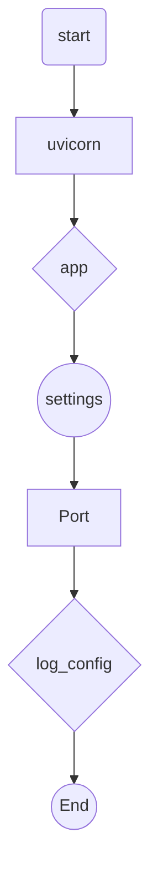

## Module: __main__.py
- **Module Name**: The module name is "__main__.py".

- **Primary Objectives**: The primary purpose of this module is to start a FastAPI server with uvicorn. It serves as the entry point of the application.

- **Critical Functions**: The main function in this module is `uvicorn.run()`, which starts the FastAPI server. It takes the FastAPI application instance, host IP, port number, and log configuration as arguments.

- **Key Variables**: 
  - `app`: This is the FastAPI application imported from `private_gpt.main`.
  - `settings`: This is the settings module that contains configuration details like server port.

- **Interdependencies**: This module depends on the `uvicorn` package to run the server. It also imports `app` from `private_gpt.main` and `settings` from `private_gpt.settings.settings`.

- **Core vs. Auxiliary Operations**: The core operation of this module is to run the FastAPI server using uvicorn. There are no auxiliary operations in this module.

- **Operational Sequence**: The module starts by importing necessary modules and settings. It then runs the FastAPI server using the uvicorn package.

- **Performance Aspects**: Performance considerations are largely dependent on the uvicorn server and the FastAPI application. The module itself does not have any specific performance considerations.

- **Reusability**: The module is not designed for reuse as it serves as the entry point of the application. However, the concept of starting a FastAPI server with uvicorn can be reused in other applications.

- **Usage**: This module is used to start the FastAPI server when the application is run.

- **Assumptions**: It assumes that the necessary packages (FastAPI, uvicorn) are installed and the server settings (like host IP and port) are correctly configured in the settings module.
## Mermaid Diagram

