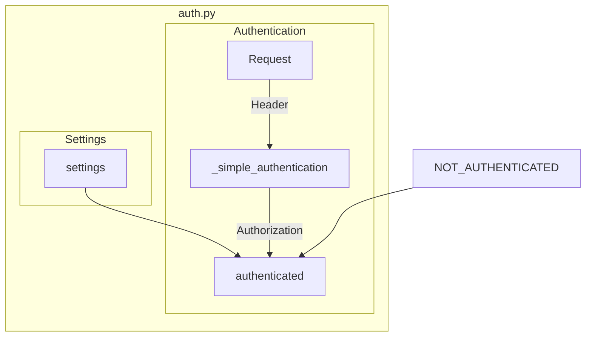

## Module: auth.py
- **Module Name**: auth.py

- **Primary Objectives**: This module is responsible for the authentication mechanism of the API. It checks if the request is authenticated and defines more complex authentication mechanisms if needed.

- **Critical Functions**: 
  - `_simple_authentication(authorization: Annotated[str, Header()] = "") -> bool:`: This function checks if the request is authenticated by comparing the "Authorization" header with the expected one.
  - `authenticated() -> bool:`: This function checks if the request is authenticated. The implementation of this function changes based on the config.

- **Key Variables**: 
  - `NOT_AUTHENTICATED`: It is an HTTPException that signifies that the request requires authentication.
  - `authorization`: It is the "Authorization" header of the request.
  - `settings().server.auth.secret`: It is the expected "Authorization" header.
  - `settings().server.auth.enabled`: It is a config variable that determines if the authentication is enabled.

- **Interdependencies**: This module interacts with the `settings` module to get the config variables.

- **Core vs. Auxiliary Operations**: The core operations of this module are the authentication mechanisms. The auxiliary operations include logging and raising exceptions.

- **Operational Sequence**: 
  - If the authentication is not enabled, a dummy authentication method that always returns True is defined.
  - If the authentication is enabled, the `_simple_authentication` method is used to check if the request is authenticated.

- **Performance Aspects**: The module uses the secrets.compare_digest function for comparing the "Authorization" header with the expected one, which is a constant time comparison function and helps prevent timing attacks.

- **Reusability**: This module is highly reusable. The authentication mechanisms can be easily adapted for different APIs by changing the `settings` module.

- **Usage**: This module is used in FastAPI routers to authenticate requests.

- **Assumptions**: 
  - The module assumes that the "Authorization" header is present in the request.
  - The module assumes that the config variables are correctly set in the `settings` module.
## Mermaid Diagram

