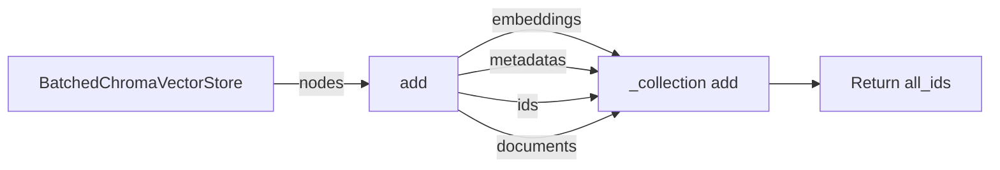

## Module: batched_chroma.py
- **Module Name**: batched_chroma.py

- **Primary Objectives**: This module is designed to handle batching additions to a Chroma vector store to avoid reaching the maximum batch limit. It is used for storing and retrieving embeddings within a ChromaDB collection.

- **Critical Functions**: 
  - `__init__`: Initializes the BatchedChromaVectorStore object.
  - `add`: Adds nodes to the index, batching the insertion to avoid issues. This method also checks if the client and collection are initialized and handles chunking the nodes into manageable sizes.

- **Key Variables**: 
  - `chroma_client`: API instance
  - `chroma_collection`: ChromaDB collection instance
  - `host`, `port`, `ssl`, `headers`, `collection_kwargs`: Configuration for the ChromaDB connection.
  - `max_chunk_size`: Maximum size of each batch.
  - `node_chunks`: List of node chunks.
  - `all_ids`: List of all node IDs.

- **Interdependencies**: This module interacts with the `ChromaVectorStore` from the `llama_index.vector_stores.chroma` package, `BaseNode` from the `llama_index.schema` package, and `node_to_metadata_dict` from the `llama_index.vector_stores.utils` package.

- **Core vs. Auxiliary Operations**: The core operation of this module is the `add` method, which handles the addition of nodes to the ChromaDB. Auxiliary operations include initialization of the object and chunking the nodes.

- **Operational Sequence**: The `add` function is called with a list of nodes. It first checks if the client and collection are initialized and then chunks the nodes into manageable sizes. For each chunk, it extracts the embeddings, metadata, IDs, and documents, and adds them to the collection. It then returns a list of all node IDs.

- **Performance Aspects**: The batching process is a critical performance aspect of this module. It ensures that the system doesn't reach the max batch size limit, thereby maintaining the system's efficiency and effectiveness.

- **Reusability**: The `BatchedChromaVectorStore` class can be reused to handle any Chroma vector store that requires batch additions. The `add` method is particularly adaptable because it can handle any list of nodes.

- **Usage**: This module is used when there is a need to store and retrieve embeddings in a ChromaDB collection, especially when the number of embeddings is large enough to require batching.

- **Assumptions**: The module assumes that the `chroma_client` and `_collection` are already initialized. It also assumes that each node in the `nodes` list has an embedding, metadata, node_id, and content.
## Mermaid Diagram

