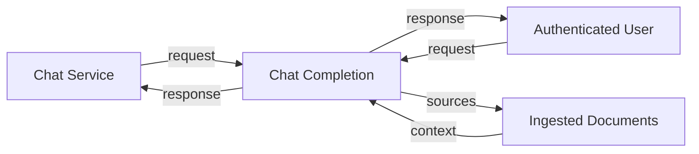

## Module: chat_router.py
- **Module Name**: The module name is `chat_router.py`.

- **Primary Objectives**: The primary purpose of this module is to handle chat-related requests in a web application. It uses the FastAPI library to define HTTP routes for chat functionalities. 

- **Critical Functions**: The main function in this module is `chat_completion()`. This function handles POST requests to the `/chat/completions` endpoint. It accepts a list of messages as input, processes them, and returns a response from the chat service. If the `stream` option is set to `true`, the function will return a streaming response.

- **Key Variables**: The key variables in this module are `chat_router`, which is an instance of FastAPI's `APIRouter`, and `ChatBody`, which is a Pydantic model defining the structure of the request body for the `/chat/completions` endpoint.

- **Interdependencies**: This module interacts with several other components of the system, including `ChatService` from `chat_service.py`, `OpenAICompletion` and `OpenAIMessage` from `openai_models.py`, `ContextFilter` from `context_filter.py`, and `authenticated` from `auth.py`.

- **Core vs. Auxiliary Operations**: The core operation of this module is to facilitate chat functionalities in the application. Auxiliary operations include authentication (handled by the `authenticated` dependency) and request/response formatting.

- **Operational Sequence**: When a POST request is made to the `/chat/completions` endpoint, the `chat_completion()` function is called. This function retrieves the chat service, processes the messages, and returns a response. If the `stream` option is set to `true`, the response will be streamed.

- **Performance Aspects**: Performance considerations include the handling of streaming responses, which can be more efficient for large amounts of data. Additionally, the use of FastAPI and Pydantic ensures fast request handling and validation.

- **Reusability**: The `ChatBody` model and the `authenticated` dependency can be reused in other parts of the application. The `chat_completion()` function can also be adapted for different chat-related endpoints.

- **Usage**: This module is used whenever a user makes a request to the `/chat/completions` endpoint of the application. The user provides a list of messages, and the module returns a response from the chat service.

- **Assumptions**: The module assumes that the user is authenticated and that the request body follows the structure defined by the `ChatBody` model. It also assumes that the chat service is able to process the provided messages and return a response.
## Mermaid Diagram

