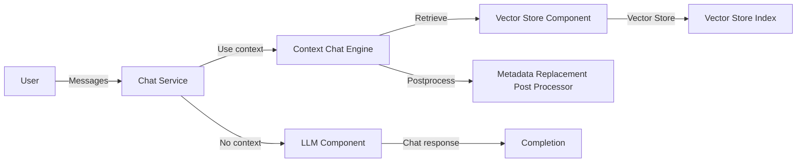

## Module: chat_service.py
- **Module Name**: The module name is `chat_service.py`.

- **Primary Objectives**: The purpose of this module is to handle chat services. It uses different components such as `LLMComponent`, `VectorStoreComponent`, `EmbeddingComponent`, and `NodeStoreComponent` to perform chat operations.

- **Critical Functions**: 
    - `__init__`: Initializes the chat service with required components.
    - `_chat_engine`: Returns a `BaseChatEngine` instance.
    - `stream_chat`: Streams chat messages.
    - `chat`: Handles chat operations.

- **Key Variables**: 
    - `self.llm_service`
    - `self.vector_store_component`
    - `self.storage_context`
    - `self.service_context`
    - `self.index`

- **Interdependencies**: This module interacts with several other modules such as `llama_index`, `private_gpt`, `pydantic`, and `injector`.

- **Core vs. Auxiliary Operations**: 
    - Core operations: `stream_chat`, `chat`
    - Auxiliary operations: `_chat_engine`, `__init__`

- **Operational Sequence**: The `__init__` function is called when an object of `ChatService` is created. It initializes all the necessary components. The `stream_chat` and `chat` methods are called to handle chat operations.

- **Performance Aspects**: The performance of this module greatly depends on the efficiency of the `LLMComponent`, `VectorStoreComponent`, `EmbeddingComponent`, and `NodeStoreComponent` modules.

- **Reusability**: The `ChatService` class can be reused in any part of the application where chat services are required.

- **Usage**: This module is used to handle chat operations in the application.

- **Assumptions**: 
    - It's assumed that all the required components are properly initialized and passed to the `ChatService` class.
    - The `stream_chat` and `chat` methods assume that the messages passed to them are in the form of a list of `ChatMessage` objects.
    - It's assumed that the `context_filter` passed to the `_chat_engine` method is either an instance of `ContextFilter` or `None`.
## Mermaid Diagram

