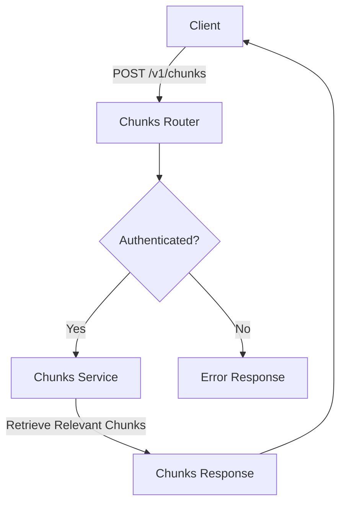

## Module: chunks_router.py
- **Module Name**: chunks_router.py

- **Primary Objectives**: The primary purpose of this module is to handle the routing for the "/chunks" API endpoint. It is responsible for retrieving the most relevant chunks of text from ingested documents based on a given input text.

- **Critical Functions**: 
  - `chunks_retrieval()`: This is the main function. It retrieves the most relevant chunks from the ingested documents given a `text`. The returned information can be used to generate prompts for other APIs. It also handles the request and body parameters for the API call.

- **Key Variables**: 
  - `chunks_router`: This is an instance of `APIRouter`, which is responsible for handling the API routing.
  - `ChunksBody`: This is a Pydantic model that defines the expected format of the request body for the API call.
  - `ChunksResponse`: This is another Pydantic model that defines the format of the response that will be returned by the API.

- **Interdependencies**: This module interacts with the `ContextFilter`, `ChunksService`, `Chunk`, and `authenticated` modules.

- **Core vs. Auxiliary Operations**: The core operation of this module is the `chunks_retrieval()` function, which handles the API call. Auxiliary operations include the definition of the `ChunksBody` and `ChunksResponse` models and the authentication dependency.

- **Operational Sequence**: The `chunks_retrieval()` function is called when a POST request is made to the "/chunks" endpoint. It retrieves the relevant service, calls the `retrieve_relevant` method with the appropriate parameters, and returns a `ChunksResponse` with the results.

- **Performance Aspects**: This module is generally fast because it only involves the Embeddings model and not the LLM.

- **Reusability**: This module can be reused for any task that requires retrieving relevant chunks of text from ingested documents.

- **Usage**: This module is used to handle the "/chunks" API endpoint. It takes a `text`, and optional `context_filter`, `limit`, and `prev_next_chunks` parameters, and returns the most relevant chunks from the ingested documents.

- **Assumptions**: It is assumed that the ingested documents are available and that the `text` parameter is provided in the request. It's also assumed that the `authenticated` dependency is set up correctly.
## Mermaid Diagram

