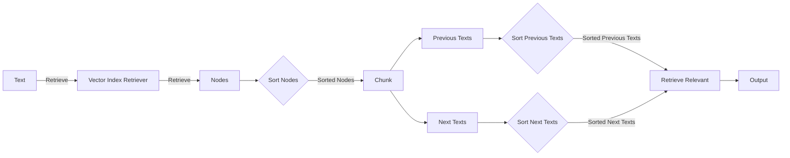

## Module: chunks_service.py
- **Module Name**: chunks_service.py

- **Primary Objectives**: This module is designed to work with chunks of text from ingested documents. It retrieves relevant chunks based on the provided text and context filter, and it also retrieves sibling nodes (previous and next chunks) of a given node.

- **Critical Functions**: 
  - `from_node(cls: type["Chunk"], node: NodeWithScore) -> "Chunk"`: This class method creates a Chunk object from a NodeWithScore object.
  - `_get_sibling_nodes_text(self, node_with_score: NodeWithScore, related_number: int, forward: bool = True) -> list[str]`: This method retrieves the text of sibling nodes of a given node.
  - `retrieve_relevant(self, text: str, context_filter: ContextFilter | None = None, limit: int = 10, prev_next_chunks: int = 0) -> list[Chunk]`: This method retrieves relevant chunks based on the provided text and context filter.

- **Key Variables**: 
  - `vector_store_component`: An instance of the VectorStoreComponent class.
  - `storage_context`: An instance of the StorageContext class.
  - `query_service_context`: An instance of the ServiceContext class.

- **Interdependencies**: This module interacts with several other components of the system, including the LLMComponent, VectorStoreComponent, EmbeddingComponent, and NodeStoreComponent.

- **Core vs. Auxiliary Operations**: The core operation of this module is to retrieve relevant chunks of text. Auxiliary operations include getting the text of sibling nodes and creating a Chunk object from a NodeWithScore object.

- **Operational Sequence**: First, the module creates an instance of the VectorStoreIndex class. Then, it retrieves nodes using the `retrieve` method of the `vector_index_retriever` object. After sorting the nodes by score, it loops through each node, creates a Chunk object, retrieves previous and next texts, and appends the Chunk object to the `retrieved_nodes` list.

- **Performance Aspects**: The module is optimized to retrieve relevant chunks of text efficiently. It sorts nodes by score in descending order to prioritize higher-scored nodes.

- **Reusability**: The module can be reused in any context where it's necessary to retrieve relevant chunks of text from ingested documents.

- **Usage**: This module is used when there's a need to retrieve relevant chunks of text from ingested documents based on a provided text and context filter.

- **Assumptions**: The module assumes that the VectorStoreComponent, LLMComponent, EmbeddingComponent, and NodeStoreComponent are properly initialized and functioning as expected. It also assumes that the nodes retrieved from the `vector_index_retriever` object are valid NodeWithScore objects.
## Mermaid Diagram

