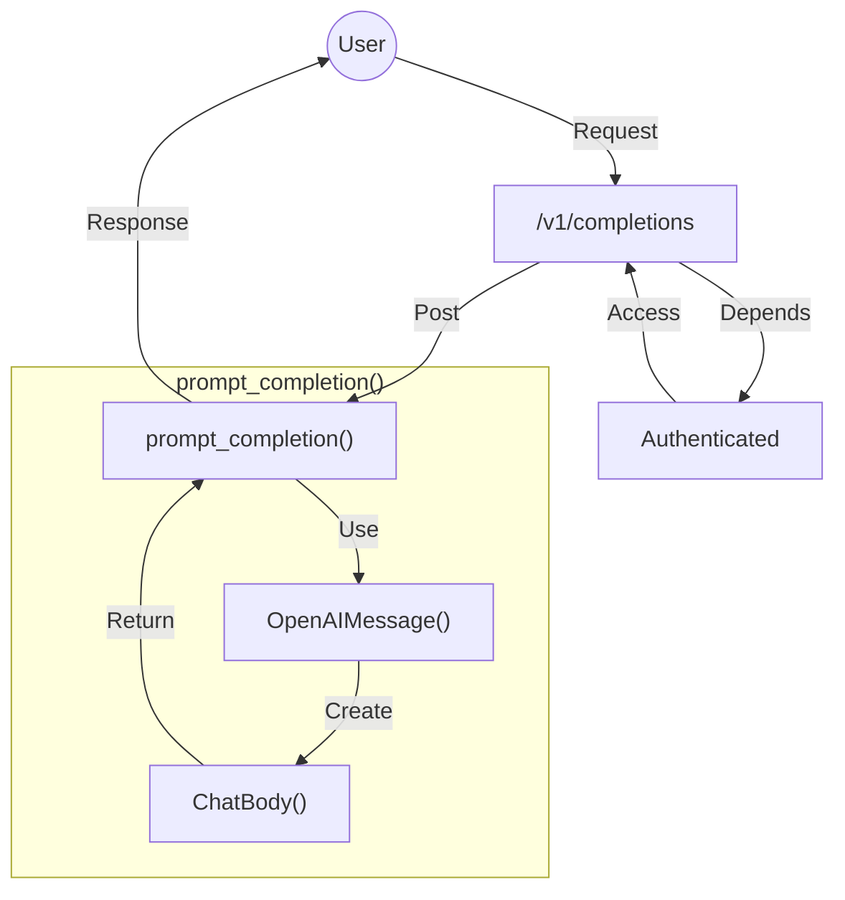

## Module: completions_router.py
- **Module Name**: completions_router.py

- **Primary Objectives**: This module serves as an API endpoint for generating text completions based on user prompts. It uses OpenAI's GPT model to generate responses.

- **Critical Functions**: 
  - `prompt_completion`: This function takes a user's prompt and returns a predicted completion generated by the OpenAI model. It can optionally use context from ingested documents to create the response, include source chunks used to create the response, and return data chunks following OpenAI's streaming model.

- **Key Variables**: 
  - `completions_router`: The API router object.
  - `CompletionsBody`: A class representing the request body for the completions endpoint. It includes variables for the user's prompt, whether to use context, whether to include sources, whether to stream, and a context filter.

- **Interdependencies**: This module depends on the FastAPI library for routing, pydantic for data validation, and several modules from the private_gpt package for handling completions and authentication.

- **Core vs. Auxiliary Operations**: The core operation of this module is to provide an API endpoint for generating text completions. The auxiliary operations include authenticating requests and handling the request/response data.

- **Operational Sequence**: The module receives a POST request at the "/completions" endpoint, authenticates the request, validates the request body, generates a completion using the OpenAI model, and returns the completion as the response.

- **Performance Aspects**: Performance considerations in this module might include the latency of generating completions with the OpenAI model, the overhead of request authentication, and the efficiency of the request/response handling code.

- **Reusability**: The `prompt_completion` function could be reused in other contexts where text completions need to be generated. The `CompletionsBody` class could also be reused for validating similar types of request data.

- **Usage**: This module is used as an API endpoint in a larger application. Clients send POST requests to the "/completions" endpoint with a body containing their text prompt and optional parameters for using context, including sources, streaming, and filtering context.

- **Assumptions**: The module assumes that requests will be authenticated and that the request body will contain valid data that can be used to generate a completion. It also assumes that the OpenAI model will be available and capable of generating completions.
## Mermaid Diagram

