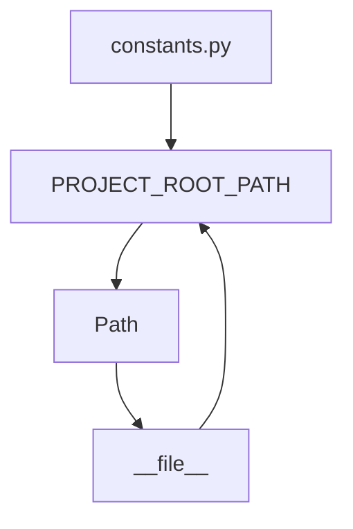

## Module: constants.py
- **Module Name**: The module is named "constants.py".

- **Primary Objectives**: The purpose of this module is to define and manage constants that will be used throughout the project. It specifically defines a constant for the root path of the project.

- **Critical Functions**: This module does not contain any functions or methods, it only defines a constant.

- **Key Variables**: The key variable in this module is `PROJECT_ROOT_PATH`. It is a `Path` object that represents the path to the project's root directory. This is determined by finding the parent directory of the directory where this file is located.

- **Interdependencies**: This module depends on the `pathlib` module for creating the `Path` object. It might be used by other modules that need to know the root path of the project.

- **Core vs. Auxiliary Operations**: As a constants module, its main operation is to provide a central location for defining and accessing project-wide constants. There are no auxiliary operations.

- **Operational Sequence**: There is no distinct flow in this module as it only involves the declaration of a constant.

- **Performance Aspects**: Performance is not a significant concern for this module since it only involves the declaration of a constant. The computation to determine the project root path is done only once.

- **Reusability**: This module is highly reusable. The `PROJECT_ROOT_PATH` constant can be imported into any other module in the project where the root path is required.

- **Usage**: This module is used by importing the `PROJECT_ROOT_PATH` constant into other modules. For example, `from constants import PROJECT_ROOT_PATH`.

- **Assumptions**: The assumption made in this module is that the project's root directory is always one level up from the directory where this file is located. If the file structure changes, this assumption might not hold, and the `PROJECT_ROOT_PATH` may need to be updated.
## Mermaid Diagram

