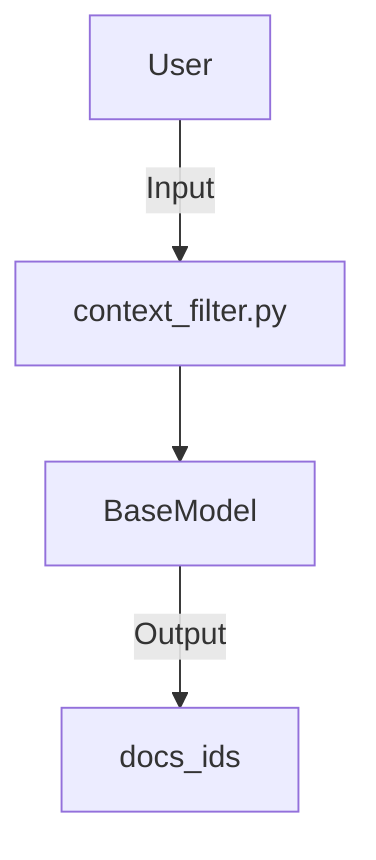

## Module: context_filter.py
**Module Name:** context_filter.py

**Primary Objectives:** The primary objective of the `context_filter` module is to define a data model for filtering contexts. It allows for the specification of document IDs to filter contexts based on specific criteria.

**Critical Functions:** The main method/function in this module is `ContextFilter`. It is a class that inherits from `BaseModel` from the `pydantic` library. The `ContextFilter` class has the following attributes:
- `docs_ids`: A list of document IDs to filter contexts. It can be `None` or a list of strings. An example value is provided as `["c202d5e6-7b69-4869-81cc-dd574ee8ee11"]`.

**Key Variables:** The key variable in this module is `docs_ids`, which represents the list of document IDs used for filtering contexts.

**Interdependencies:** This module does not have any explicit dependencies on other system components. However, it may be used in conjunction with other modules or components that utilize the `ContextFilter` class.

**Core vs. Auxiliary Operations:** The core operation of this module is to provide a data model for filtering contexts based on document IDs. It does not have any auxiliary operations.

**Operational Sequence:** There is no distinct operational sequence in this module. It mainly provides a data model that can be used in other parts of the system.

**Performance Aspects:** Since this module primarily defines a data model, there are no specific performance aspects associated with it. However, the performance of the overall system may depend on how this module is used in conjunction with other components.

**Reusability:** The `ContextFilter` class defined in this module can be easily reused in other parts of the system. It provides a standardized way to specify document IDs for context filtering.

**Usage:** This module can be used by importing the `ContextFilter` class and instantiating objects of this class with the desired document IDs. These objects can then be used in other parts of the system for filtering contexts based on the specified document IDs.

**Assumptions:** The assumptions made in this module are:
- The `docs_ids` attribute can be `None` or a list of strings.
- The provided example value for `docs_ids` is representative of the expected input format.
## Mermaid Diagram

