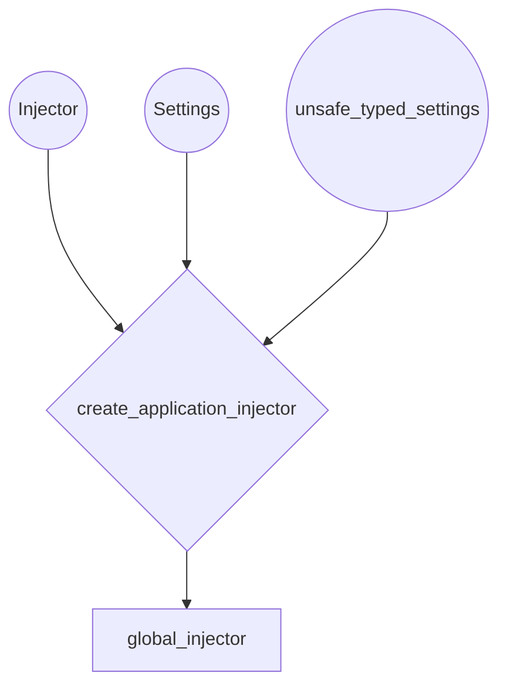

## Module: di.py
- **Module Name**: The module name is `di.py`.

- **Primary Objectives**: The primary purpose of this module is to handle dependency injection within the application. It creates a global injector for the application and binds the settings to it.

- **Critical Functions**: 
    - `create_application_injector()`: This function creates an instance of `Injector` and binds the `Settings` to `unsafe_typed_settings`.

- **Key Variables**: 
    - `_injector`: An instance of `Injector` which is used for dependency injection.
    - `global_injector`: A global reference to the `Injector` created by `create_application_injector()`.

- **Interdependencies**: This module is dependent on the `Injector` class from `injector` module and `Settings`, `unsafe_typed_settings` from `private_gpt.settings.settings`.

- **Core vs. Auxiliary Operations**: The core operation of this module is the creation of an application injector and binding the settings to it. There are no auxiliary operations in this module.

- **Operational Sequence**: The sequence is straightforward: an instance of `Injector` is created with auto binding enabled, then `Settings` is bound to `unsafe_typed_settings`, and finally, the injector is returned.

- **Performance Aspects**: The performance of this module would largely depend on the efficiency of the `Injector` class and how well it manages the dependencies.

- **Reusability**: The `create_application_injector()` function can be reused to create an injector and bind settings to it. However, the global injector is specific to this application.

- **Usage**: This module is used to create a global injector for the application, which can then be used to manage dependencies throughout the application.

- **Assumptions**: It assumes that the `Injector` class and `Settings`, `unsafe_typed_settings` are correctly implemented and available for import. It also assumes that the `Injector` instance created will be used for handling dependencies in the application.
## Mermaid Diagram

