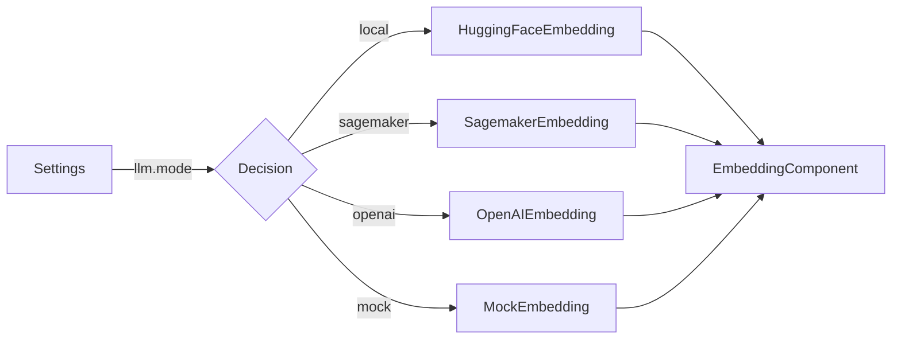

## Module: embedding_component.py
- **Module Name**: The module is named `embedding_component.py`.

- **Primary Objectives**: The primary purpose of this module is to initialize and manage the embedding model used in the application. It handles different types of embeddings including HuggingFace, Sagemaker, OpenAI, and MockEmbedding.

- **Critical Functions**: The main function in this module is the `__init__` method, which initializes the EmbeddingComponent class and sets the embedding model based on the settings provided.

- **Key Variables**: The key variables include `embedding_model`, which holds the instance of the embedding model being used, and `settings`, which contains the configuration settings for the application.

- **Interdependencies**: This module interacts with several other system components such as `injector`, `llama_index`, `private_gpt.paths`, `private_gpt.settings.settings`, and specific embedding modules like `HuggingFaceEmbedding`, `SagemakerEmbedding`, `OpenAIEmbedding`, and `MockEmbedding`.

- **Core vs. Auxiliary Operations**: The core operation of this module is to initialize and set the embedding model. Auxiliary operations include importing necessary modules and managing dependencies.

- **Operational Sequence**: Initially, the `EmbeddingComponent` class is defined with an `__init__` method. Depending on the mode specified in the settings, the appropriate embedding model is initialized and set.

- **Performance Aspects**: The performance of this module depends on the embedding model being used and how efficiently it can process and generate embeddings.

- **Reusability**: The module is highly reusable as it provides a standardized way to handle different types of embeddings, allowing for easy switching between different models based on the application's settings.

- **Usage**: This module is used whenever an embedding model is required in the application. An instance of `EmbeddingComponent` is created, which automatically initializes the appropriate embedding model based on the settings.

- **Assumptions**: The module assumes that the settings provided are valid and that the specified embedding model and its dependencies are available. It also assumes that the dimensionality used by the default embedding model is 384 in the case of a mock model.
## Mermaid Diagram

