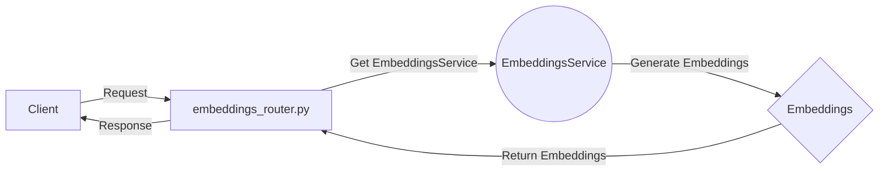

## Module: embeddings_router.py
- **Module Name**: The module is named as `embeddings_router.py`.

- **Primary Objectives**: This module is designed to provide a FastAPI router for handling requests related to embeddings generation. It takes in a string or a list of strings, generates their embeddings using the `EmbeddingsService`, and returns the embeddings in the response.

- **Critical Functions**: 
    - `embeddings_generation(request: Request, body: EmbeddingsBody) -> EmbeddingsResponse`: This function is a POST request handler that generates embeddings for the given input text(s) and returns them in the response.

- **Key Variables**: 
    - `embeddings_router`: This is a FastAPI router object for handling requests related to embeddings.
    - `EmbeddingsBody`: This is a Pydantic model that validates the request body for the embeddings generation endpoint.
    - `EmbeddingsResponse`: This is a Pydantic model that shapes the response for the embeddings generation endpoint.
    - `service`: This is an instance of `EmbeddingsService` retrieved from the request's state object.

- **Interdependencies**: This module interacts with the `EmbeddingsService` module for generating embeddings, and the `auth` module for user authentication.

- **Core vs. Auxiliary Operations**: The core operation of this module is the generation of embeddings for the given input text(s). The auxiliary operations include request validation and user authentication.

- **Operational Sequence**: 
    - The module receives a POST request at the `/embeddings` endpoint.
    - The `authenticated` dependency is checked.
    - The request body is validated and parsed into the `EmbeddingsBody` model.
    - The `EmbeddingsService` is retrieved from the request's state object.
    - The input text(s) are passed to the `EmbeddingsService` to generate their embeddings.
    - The embeddings are returned in the response shaped by the `EmbeddingsResponse` model.

- **Performance Aspects**: The performance of this module largely depends on the efficiency of the `EmbeddingsService` and the size of the input text(s).

- **Reusability**: This module can be reused in any FastAPI application that requires an endpoint for generating embeddings. The `EmbeddingsService` and the `authenticated` dependency would need to be provided in the application's dependency injection container.

- **Usage**: This module is used by sending a POST request to the `/embeddings` endpoint with a string or a list of strings in the request body. The response will contain the embeddings for the input text(s).

- **Assumptions**: 
    - The module assumes that the `EmbeddingsService` and the `authenticated` dependency are provided in the application's dependency injection container.
    - It also assumes that the request body is a JSON object containing a string or a list of strings under the `input` key.
## Mermaid Diagram

