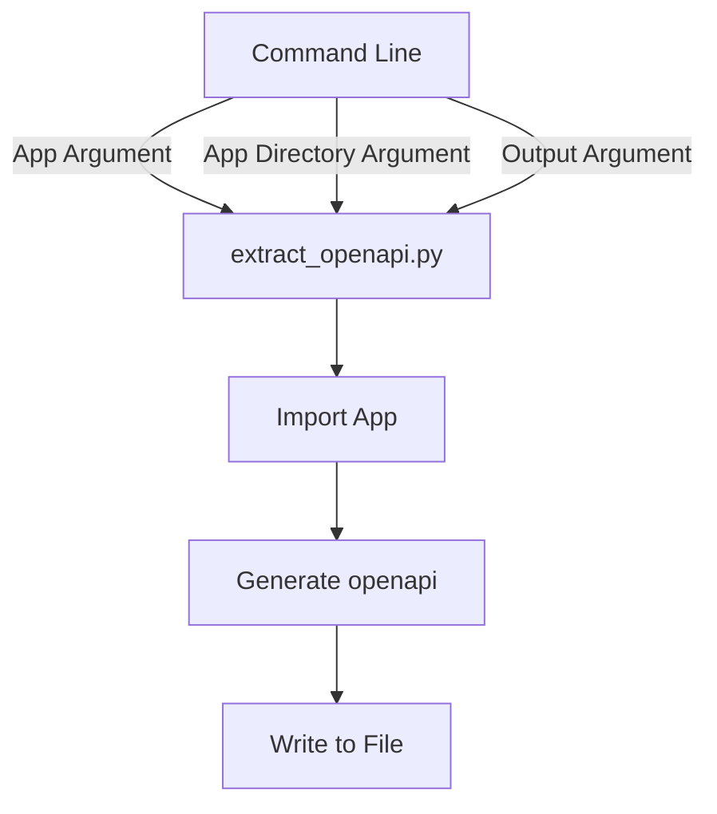

## Module: extract_openapi.py
- **Module Name**: The name of the module is `extract_openapi.py`.

- **Primary Objectives**: The purpose of this module is to extract OpenAPI specifications from an application. It imports the application, generates the OpenAPI specification, and writes it to a file in either JSON or YAML format.

- **Critical Functions**: 
  - `argparse.ArgumentParser()`: This function is used to handle command-line parsing.
  - `import_from_string(args.app)`: This function is used to import the app from a given string.
  - `app.openapi()`: This function is used to generate the OpenAPI specification from the app.
  - `json.dump(openapi, f, indent=2)`: This function writes the OpenAPI specification to a JSON file.
  - `yaml.dump(openapi, f, sort_keys=False)`: This function writes the OpenAPI specification to a YAML file.

- **Key Variables**: 
  - `args.app`: This variable holds the import string of the app.
  - `args.app_dir`: This variable holds the directory containing the app.
  - `args.out`: This variable holds the name of the output file.
  - `openapi`: This variable holds the OpenAPI specification generated from the app.

- **Interdependencies**: This module is dependent on the `argparse`, `json`, `sys`, `yaml`, and `uvicorn.importer` libraries.

- **Core vs. Auxiliary Operations**: The core operations of this module are the extraction of OpenAPI specifications from the app and writing them to a file. The auxiliary operations include handling command-line arguments and importing the app.

- **Operational Sequence**: The module first parses command-line arguments, then imports the app, generates the OpenAPI specification, and finally writes the specification to a file.

- **Performance Aspects**: The performance of this module mainly depends on the complexity of the app from which the OpenAPI specification is being extracted.

- **Reusability**: This module is highly reusable as it can be used to extract OpenAPI specifications from any application.

- **Usage**: This module is used by running it from the command line with the appropriate arguments.

- **Assumptions**: It is assumed that the app from which the OpenAPI specification is to be extracted can be imported using the provided import string. It is also assumed that the app has a method `openapi()` that can generate the OpenAPI specification.
## Mermaid Diagram

