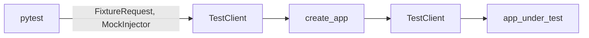

## Module: fast_api_test_client.py
- **Module Name**: The module is named `fast_api_test_client.py`.

- **Primary Objectives**: This module's purpose is to set up a test client for the FastAPI application. It uses pytest fixtures to create a test client that can be used to send HTTP requests to the application and receive HTTP responses, allowing for thorough testing of the application.

- **Critical Functions**: 
  - `test_client`: This is the main function in the module. It creates a `TestClient` instance which can be used to simulate HTTP requests to the FastAPI application.

- **Key Variables**: 
  - `request`: This is a pytest request object. It contains information about the ongoing test request.
  - `injector`: This is a `MockInjector` instance. It's used to bind settings for the test client.
  - `app_under_test`: This is the FastAPI application that is under test.
  - `TestClient(app_under_test)`: This is the test client instance that is used to simulate HTTP requests to the application.

- **Interdependencies**: This module interacts with the `pytest`, `fastapi.testclient`, `private_gpt.launcher`, and `tests.fixtures.mock_injector` modules.

- **Core vs. Auxiliary Operations**: The core operation is the creation of the test client. The auxiliary operations involve binding settings to the injector and checking if the request object has a `param` attribute.

- **Operational Sequence**: The module first checks if the request object has a `param` attribute. If it does, it binds the settings to the injector. Then it creates the FastAPI application and the test client.

- **Performance Aspects**: The performance of this module depends on the efficiency of the FastAPI application and the test client. It's important to ensure that the application and the client are properly optimized to ensure fast and efficient testing.

- **Reusability**: This module is highly reusable. It can be used to set up a test client for any FastAPI application. It can also be extended to include more features.

- **Usage**: This module is used during the testing phase of the application development process. It's used to simulate HTTP requests to the application and receive HTTP responses.

- **Assumptions**: The module assumes that the `request` object has a `param` attribute. If it doesn't, the module might not work as expected. It also assumes that the `injector` object can bind settings, and that the `create_app` function can create a FastAPI application.
## Mermaid Diagram

