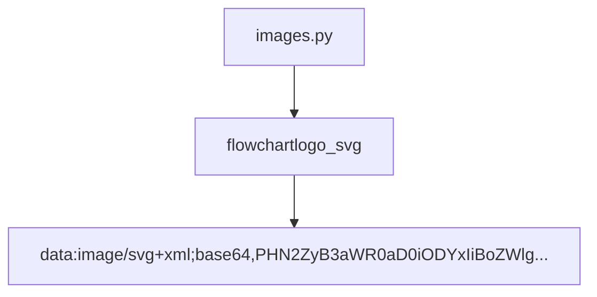

## Module: images.py
- **Module Name**: The module's name is `images.py`

- **Primary Objectives**: The main purpose of this module is to store logo images in the SVG (Scalable Vector Graphics) format, encoded in Base64. This allows images to be easily embedded within scripts or HTML files and reduces the need for additional HTTP requests to fetch the images.

- **Critical Functions**: The main function of this module is to provide the logo image as a Base64 encoded string. This string can be used in an HTML file to display the logo.

- **Key Variables**: The key variable in this module is `logo_svg`. This variable holds the Base64 encoded SVG data for the logo.

- **Interdependencies**: As a standalone module that only provides a string variable, it doesn't have any dependencies on other modules. However, other modules or scripts that require the logo would depend on this module.

- **Core vs. Auxiliary Operations**: The core operation of this module is to provide the `logo_svg` variable. There are no auxiliary operations.

- **Operational Sequence**: There is no distinct operational sequence as this is a simple module with a single variable.

- **Performance Aspects**: The performance of this module is not a concern as it only provides a static string. However, the size of the SVG file could impact the performance of scripts or web pages that use it.

- **Reusability**: This module is highly reusable. The `logo_svg` variable can be imported into any Python script or module that needs to use the logo.

- **Usage**: To use this module, you would import it into your Python script or module with a statement like `from images import logo_svg`. You could then use the `logo_svg` variable in your code.

- **Assumptions**: The main assumption is that the Base64 string in `logo_svg` correctly represents an SVG image. If this string is not a valid Base64 encoded SVG, scripts or web pages that try to display the image will fail.
## Mermaid Diagram

