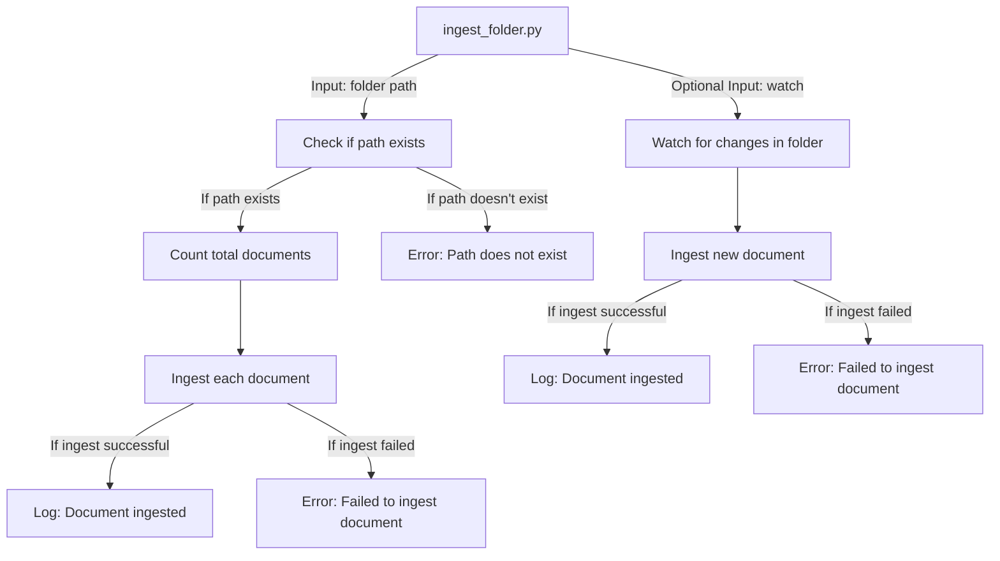

## Module: ingest_folder.py
- **Module Name**: ingest_folder.py

- **Primary Objectives**: This module is designed to ingest or import data from a specific folder. It can also watch for changes in the folder and ingest new files as they are added. 

- **Critical Functions**: 
    - `count_documents(folder_path: Path)`: Counts the total number of documents in a given folder.
    - `_recursive_ingest_folder(folder_path: Path)`: Recursively ingests files from the folder and its subfolders.
    - `_do_ingest(changed_path: Path)`: Handles the ingestion of a single file.

- **Key Variables**:
    - `total_documents`: Keeps track of the total number of documents in the folder.
    - `current_document_count`: Keeps track of the number of documents that have been ingested so far.

- **Interdependencies**: This module interacts with the `IngestService` and `IngestWatcher` from the `private_gpt.server.ingest` package. 

- **Core vs. Auxiliary Operations**: The core operation of this module is the ingestion of files from a folder (`_recursive_ingest_folder` and `_do_ingest`). Auxiliary operations include counting the total number of documents (`count_documents`) and setting up logging.

- **Operational Sequence**: The module first counts the total number of documents in the folder, then ingests each document one by one. If the `--watch` argument is passed, the module will continue to watch the folder for changes and ingest new files as they are added.

- **Performance Aspects**: This module uses recursion for both counting and ingesting documents, which could lead to a stack overflow for folders with a very deep structure. The module also logs the progress of the ingestion, which could slow down the process if the number of documents is large.

- **Reusability**: The module is quite adaptable and could be reused for ingesting files from different folders. The ingestion function could also be modified to handle different types of files.

- **Usage**: This module is used by running `ingest_folder.py` with the path to the folder as an argument. The `--watch` argument can be used to watch the folder for changes, and the `--log-file` argument can be used to specify a log file.

- **Assumptions**: The module assumes that the path provided exists and contains files to be ingested. It also assumes that the `IngestService` is capable of ingesting the files in the folder.
## Mermaid Diagram

