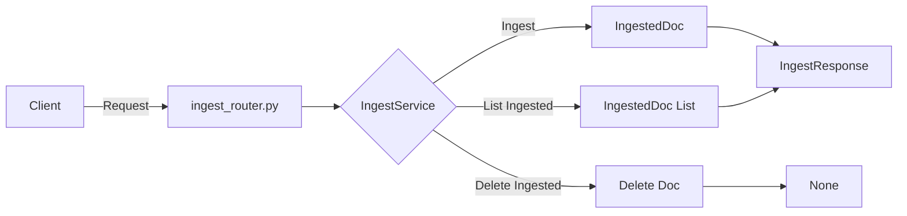

## Module: ingest_router.py
- **Module Name**: ingest_router.py

- **Primary Objectives**: This module is responsible for managing the ingestion of documents. It provides functions to ingest and process a file, list already ingested documents, and delete a specific ingested document.

- **Critical Functions**: 
    - `ingest(request: Request, file: UploadFile) -> IngestResponse`: This function ingests and processes a file, storing its chunks to be used as context. It returns an IngestResponse object.
    - `list_ingested(request: Request) -> IngestResponse`: This function lists already ingested Documents including their Document ID and metadata. It returns an IngestResponse object.
    - `delete_ingested(request: Request, doc_id: str) -> None`: This function deletes the specified ingested Document.

- **Key Variables**: 
    - `request`: The HTTP request object.
    - `file`: The file to be ingested.
    - `doc_id`: The ID of the document to be deleted.
    - `ingest_router`: The API router object.

- **Interdependencies**: This module interacts with the IngestService from the private_gpt.server.ingest.ingest_service package, which provides the functionality for ingesting and managing documents.

- **Core vs. Auxiliary Operations**: The core operations of this module are the ingestion, listing, and deletion of documents. The auxiliary operations include error handling and the creation of response objects.

- **Operational Sequence**: First, the file is ingested and processed. Then, the ingested documents can be listed or deleted as needed.

- **Performance Aspects**: The performance of this module depends on the efficiency of the IngestService and the size and type of the files being ingested.

- **Reusability**: This module is highly reusable as it provides a generic API for ingesting and managing documents. It can be used in any application that requires document ingestion functionality.

- **Usage**: This module is used by making HTTP requests to the provided endpoints. The ingest function is used by making a POST request to "/ingest", the list_ingested function is used by making a GET request to "/ingest/list", and the delete_ingested function is used by making a DELETE request to "/ingest/{doc_id}".

- **Assumptions**: This module assumes that the IngestService is correctly implemented and that the files being ingested are in a format that the service can handle. It also assumes that the doc_id provided to the delete_ingested function is valid.
## Mermaid Diagram

