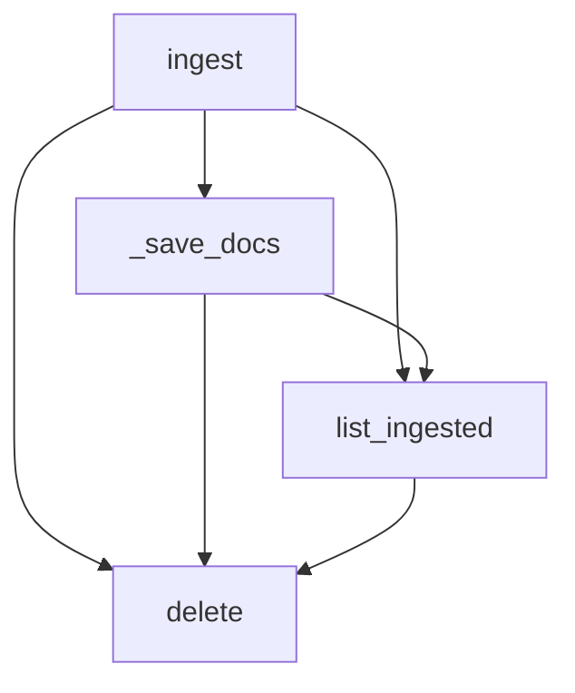

## Module: ingest_service.py
- **Module Name**: ingest_service.py
- **Primary Objectives**: This module is designed to handle the ingestion of documents. It reads files of various types, transforms them into documents, and then stores them in an index for further processing. It also supports operations like listing ingested documents and deleting a particular document.
- **Critical Functions**: 
  - `__init__`: Initializes the IngestService with components like LLMComponent, VectorStoreComponent, EmbeddingComponent, and NodeStoreComponent.
  - `ingest`: Takes a file name and file data, reads the file, transforms it into documents, and stores them.
  - `_save_docs`: Saves documents into an index.
  - `list_ingested`: Lists all the documents that have been ingested.
  - `delete`: Deletes a specific document from the index.
- **Key Variables**: 
  - `llm_service`: An instance of the LLMComponent.
  - `storage_context`: An instance of the StorageContext.
  - `ingest_service_context`: An instance of the ServiceContext.
  - `documents`: A list of documents obtained from the file data.
- **Interdependencies**: This module interacts with several other components like LLMComponent, VectorStoreComponent, EmbeddingComponent, and NodeStoreComponent. It also uses various classes and functions from the llama_index library.
- **Core vs. Auxiliary Operations**: The core operations of this module are the ingestion of documents (`ingest` function), saving them (`_save_docs`), listing them (`list_ingested`), and deleting them (`delete`). The auxiliary operations include setting up the service context and storage context in the `__init__` method and curating the metadata in the `IngestedDoc` class.
- **Operational Sequence**: The typical flow would be to initialize the IngestService, ingest a file to transform it into documents, save these documents, and then perform operations like listing or deleting them as needed.
- **Performance Aspects**: This module reads files and transforms them into documents, which could be a time-consuming process depending on the size and type of the files. It also performs operations on an index, which could have performance implications depending on the size of the index.
- **Reusability**: This module is highly reusable for any tasks that involve ingesting documents from files, storing them in an index, and performing operations on them.
- **Usage**: This module is used whenever a new file needs to be ingested, an ingested document needs to be deleted, or the list of ingested documents needs to be retrieved.
- **Assumptions**: The module assumes that the file data provided is of a supported type (Path, bytes, or str). It also assumes that the index can be loaded from the storage context, and if not, a new one is created.
## Mermaid Diagram

