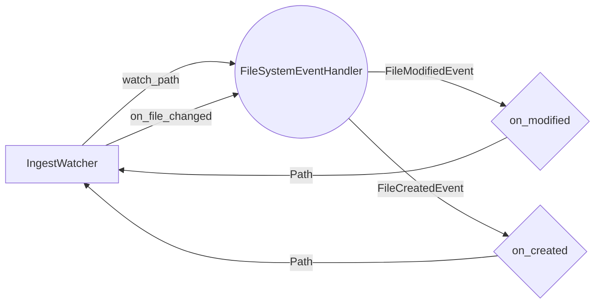

## Module: ingest_watcher.py
- **Module Name**: The module name is `ingest_watcher.py`.

- **Primary Objectives**: This module's purpose is to monitor a specified path for any file or directory changes. It's a file system watcher that triggers a callback function when a file is modified or created.

- **Critical Functions**:
    - `__init__`: Initializes the watcher with a path to watch and a callback function to execute when a file is modified or created.
    - `start`: Starts the watcher and keeps it running until interrupted.
    - `stop`: Stops the watcher.
    - `Handler.on_modified`: Called when a file or directory is modified.
    - `Handler.on_created`: Called when a file or directory is created.

- **Key Variables**:
    - `self.watch_path`: The path that the watcher is monitoring.
    - `self.on_file_changed`: The callback function that is triggered when a file is modified or created.
    - `self._observer`: The observer object that is doing the watching.

- **Interdependencies**: This module depends on the `watchdog` library for watching file system events.

- **Core vs. Auxiliary Operations**: The core operations of this module are the `start` and `stop` methods, which control the watcher. The `Handler.on_modified` and `Handler.on_created` methods are auxiliary operations that handle specific file system events.

- **Operational Sequence**: The watcher is initialized with a path and a callback function. When `start` is called, the watcher begins monitoring the path. If a file is modified or created, the callback function is executed. The watcher continues running until `stop` is called.

- **Performance Aspects**: The performance of this module depends on the efficiency of the `watchdog` library and the complexity of the callback function.

- **Reusability**: This module is highly reusable. It can be used to watch any file system path and can execute any callback function when a file is modified or created.

- **Usage**: To use this module, you would instantiate `IngestWatcher` with a path to watch and a callback function. Then, call `start` to begin watching. When you want to stop watching, call `stop`.

- **Assumptions**: This module assumes that the `watchdog` library is installed and that the path being watched exists and can be read. It also assumes that the callback function does not throw any unhandled exceptions.
## Mermaid Diagram

