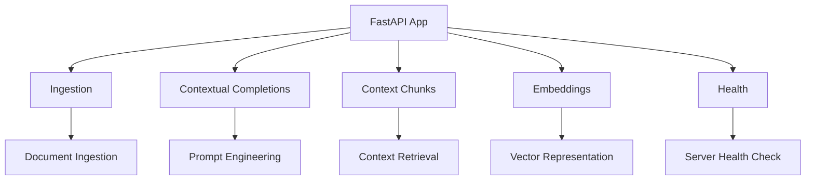

## Module: launcher.py
- **Module Name**: launcher.py

- **Primary Objectives**: This module is responsible for creating the FastAPI application, configuring the logger, and defining the main API routes. 

- **Critical Functions**: 
  - `create_app(root_injector: Injector) -> FastAPI`: This function is responsible for initializing the FastAPI application, setting up the API routes, configuring CORS middleware, and integrating the UI module if enabled.

- **Key Variables**: 
  - `logger`: It is used for logging.
  - `app`: An instance of FastAPI application.
  - `settings`: Settings for the server, UI, and CORS.

- **Interdependencies**: This module interacts with several other components such as chat_router, chunks_router, completions_router, embeddings_router, health_router, ingest_router, and the settings module.

- **Core vs. Auxiliary Operations**: The core operation is the creation of the FastAPI application and the inclusion of different routers using `app.include_router()`. Auxiliary operations include setting up CORS middleware and integrating the UI module.

- **Operational Sequence**: The FastAPI application is initially created, then the OpenAPI schema is customized, various routers are included, CORS middleware is set up if enabled, and finally, the UI module is integrated if enabled.

- **Performance Aspects**: Performance considerations are not explicitly mentioned in this module. However, FastAPI itself is designed to be high performing. 

- **Reusability**: The `create_app()` function is designed to be reusable as it can be called to create an instance of the FastAPI application with the required configuration.

- **Usage**: This module is used to launch the FastAPI application with the necessary configurations and API routes.

- **Assumptions**: The module assumes that the necessary routers and settings are available and correctly configured. It also assumes that the UI module and CORS middleware can be set up based on the settings.
## Mermaid Diagram

