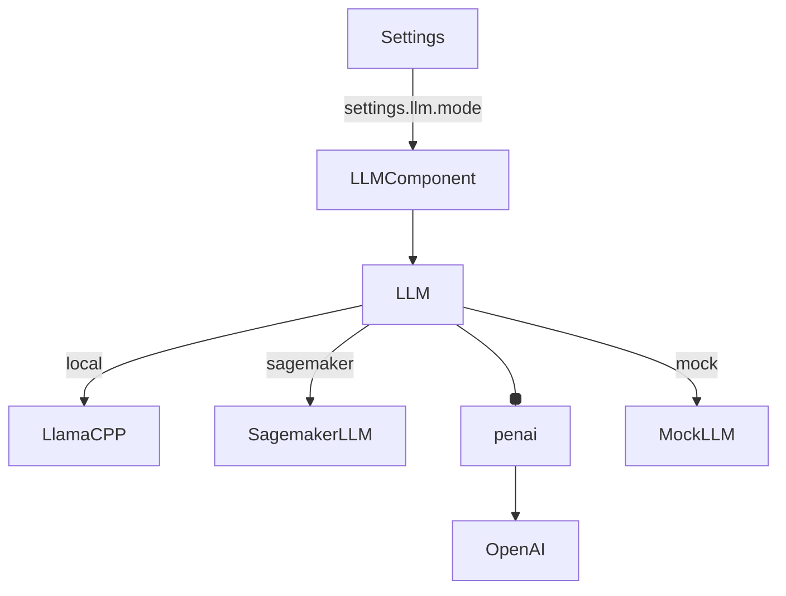

## Module: llm_component.py
- **Module Name**: The module is named as 'llm_component.py'.

- **Primary Objectives**: The purpose of this module is to initialize the LLM (Language Learning Model) based on the mode specified in the settings. It supports local, sagemaker, openAI, and mock modes.

- **Critical Functions**: The main function is the '__init__' method, which initializes the LLM based on the mode specified in the settings.

- **Key Variables**: 
  - `llm`: It's the Language Learning Model object.
  - `settings`: It's an instance of the Settings class, which contains the settings for the LLM.

- **Interdependencies**: This module interacts with several other modules such as 'llama_index.llms', 'private_gpt.paths', 'private_gpt.settings.settings', 'private_gpt.components.llm.custom.sagemaker', and 'llama_index.llms'.

- **Core vs. Auxiliary Operations**: The core operation is the initialization of the LLM. Auxiliary operations include importing required modules and classes, and setting up the LLM based on the mode specified in the settings.

- **Operational Sequence**: When an instance of LLMComponent is created, the '__init__' method is called. Depending on the mode specified in the settings, the appropriate LLM is initialized.

- **Performance Aspects**: The performance of this module depends on the mode of the LLM. For example, if the mode is 'local', the performance might be faster as the model is loaded from the local machine. If the mode is 'sagemaker' or 'openai', the performance might depend on the network speed and the response time of the respective services.

- **Reusability**: This module is highly reusable as it abstracts the initialization of the LLM. Any part of the system that requires an LLM can simply create an instance of LLMComponent.

- **Usage**: This module is used when an LLM is required. An instance of LLMComponent is created, which initializes the LLM based on the mode specified in the settings.

- **Assumptions**: The module assumes that the settings are correctly set. It also assumes that the required modules and classes are available for import.
## Mermaid Diagram

