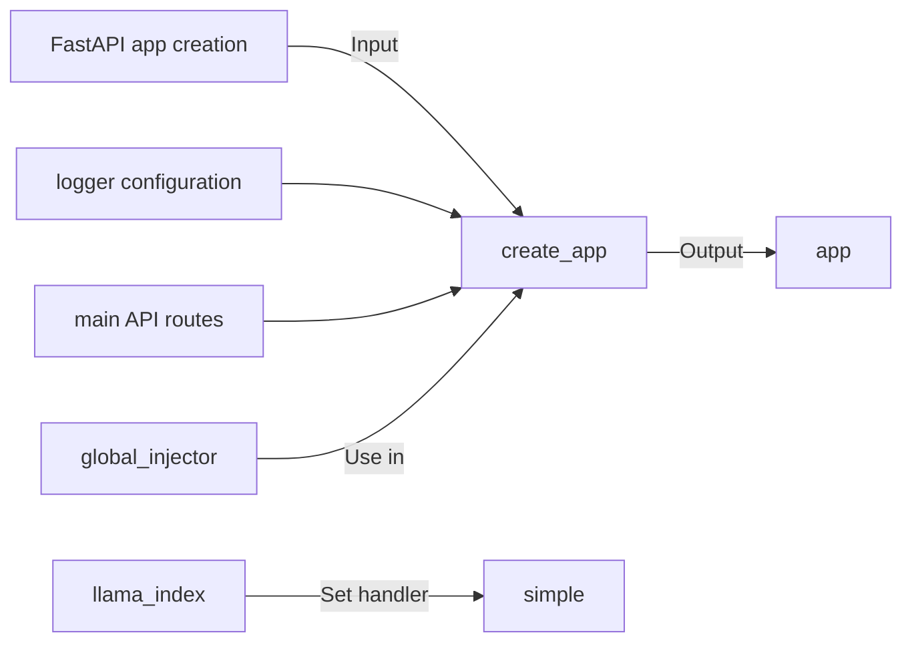

## Module: main.py
- **Module Name**: The module name is `main.py`.

- **Primary Objectives**: The primary purpose of this module is to create a FastAPI application, configure a logger, and define the main API routes.

- **Critical Functions**: The main method in this module is `create_app(global_injector)`. This function creates the FastAPI application.

- **Key Variables**: 
  - `llama_index` is used to set a global handler for observability.
  - `app` is the main variable that holds the FastAPI application instance.

- **Interdependencies**: This module depends on `llama_index` for observability, `global_injector` from `private_gpt.di` for dependency injection, and `create_app` from `private_gpt.launcher` to create the FastAPI application.

- **Core vs. Auxiliary Operations**: The core operation is the creation of the FastAPI application. The auxiliary operation is the configuration of the logger and the setting of the global handler for observability.

- **Operational Sequence**: 
  1. The module imports necessary dependencies.
  2. It sets a global handler for `llama_index` for simple observability.
  3. It creates the FastAPI application using the `create_app()` function with `global_injector` as an argument.

- **Performance Aspects**: This module is lightweight and does not have significant performance considerations. However, the performance of the FastAPI application created by this module depends on the logic defined in the `create_app()` function and the efficiency of the `global_injector` for dependency injection.

- **Reusability**: This module is highly reusable. You can use it as a template to create FastAPI applications. However, you might need to modify the `create_app()` function and `global_injector` depending on your specific needs.

- **Usage**: This module is typically used to create a FastAPI application in a Python project. It configures the logger, sets up observability, and defines the main API routes.

- **Assumptions**: The module assumes that the `create_app()` function and `global_injector` are correctly defined in their respective modules. It also assumes that `llama_index` is correctly set up for observability.
## Mermaid Diagram

