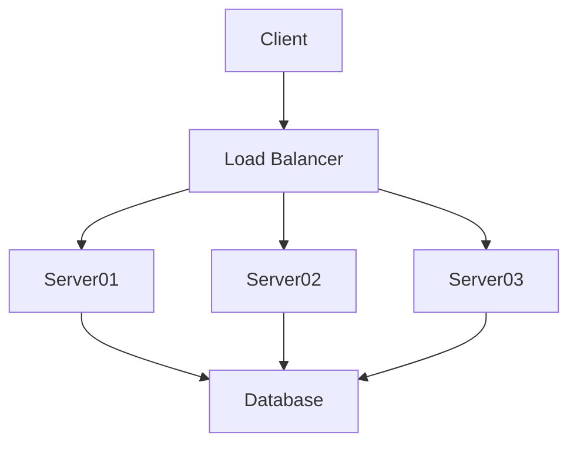

## Module: mock_injector.py
- **Module Name**: The module name is `mock_injector.py`.

- **Primary Objectives**: The module's purpose is to create a mock injector for testing. It is used to bind interfaces to mock objects and settings, which can be used in testing different components of the application.

- **Critical Functions**: 
    - `__init__`: Initializes the `MockInjector` class by creating an application injector.
    - `bind_mock`: Binds an interface to a mock object. If no mock is provided, it will create a new `MagicMock`.
    - `bind_settings`: Binds the settings by merging the unsafe settings with the provided settings.
    - `get`: Returns the object that an interface is bound to.
    - `injector`: A pytest fixture that returns an instance of `MockInjector`.

- **Key Variables**: 
    - `self.test_injector`: The application injector used for binding.
    - `interface`: The interface to be bound to a mock object or settings.
    - `mock`: The mock object that an interface is bound to.
    - `settings`: The settings to be merged with the unsafe settings.

- **Interdependencies**: This module interacts with other components such as the `Settings` class, `unsafe_settings`, `merge_settings` function, and the `create_application_injector` function.

- **Core vs. Auxiliary Operations**: 
    - Core operations include binding interfaces to mock objects or settings (`bind_mock` and `bind_settings`), and retrieving the object bound to a specific interface (`get`).
    - Auxiliary operations include the initialization of the `MockInjector` class (`__init__`), and the creation of the pytest fixture (`injector`).

- **Operational Sequence**: 
    - First, an instance of `MockInjector` is created.
    - Then, interfaces are bound to mock objects or settings using the `bind_mock` and `bind_settings` methods.
    - The bound objects can then be retrieved using the `get` method.

- **Performance Aspects**: The module has been designed to be efficient for testing purposes. However, the performance may be influenced by the complexity and size of the interfaces and mock objects being bound.

- **Reusability**: The module is highly reusable as it provides a way to create mock objects and bind them to interfaces for testing purposes.

- **Usage**: This module is used in testing where interfaces need to be bound to mock objects or settings. It can be used with the pytest framework.

- **Assumptions**: The module assumes that the interfaces and mock objects provided are compatible. It also assumes that the settings provided are in the correct format to be merged with the unsafe settings.
## Mermaid Diagram

