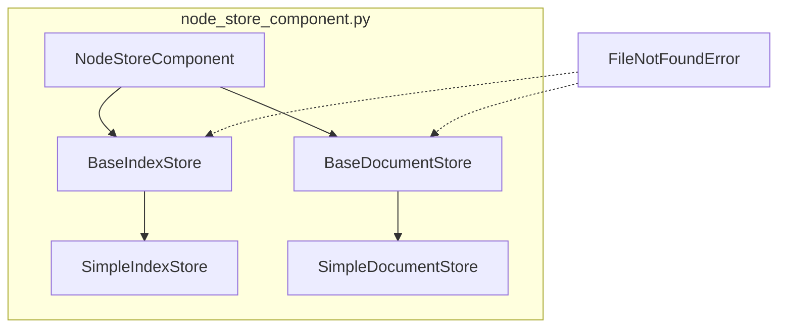

## Module: node_store_component.py
- **Module Name**: The module is named `node_store_component.py`.

- **Primary Objectives**: The purpose of this module is to manage the document and index stores for the Llama Index. It initializes and retrieves the stores from persistent storage, or creates new ones if they don't exist.

- **Critical Functions**: 
  - `__init__`: This is the constructor method that is called when an object is created from this class. It tries to retrieve the `index_store` and `doc_store` from persistent storage, if not found, it creates new ones.

- **Key Variables**: 
  - `index_store`: This variable holds the instance of the IndexStore.
  - `doc_store`: This variable holds the instance of the DocumentStore.
  - `local_data_path`: This variable holds the path to the local data directory.

- **Interdependencies**: 
  - This module interacts with the `SimpleIndexStore` and `SimpleDocumentStore` classes from the `llama_index.storage` package. 
  - It also interacts with the `local_data_path` from the `private_gpt.paths` module.

- **Core vs. Auxiliary Operations**: 
  - Core operations include initializing and managing the `index_store` and `doc_store`. 
  - Auxiliary operations include logging debug messages when the stores are not found in the local data directory.

- **Operational Sequence**: 
  - On initialization, the module tries to load the `index_store` and `doc_store` from the local data directory. 
  - If not found, it creates new instances of these stores.

- **Performance Aspects**: 
  - The performance of this module largely depends on the speed of the file system where the local data directory resides, as it needs to load and save data to this directory.

- **Reusability**: 
  - This module is highly reusable as it encapsulates the logic for managing the document and index stores, which can be used wherever these stores are needed.

- **Usage**: 
  - An instance of `NodeStoreComponent` is created and used to manage the document and index stores.

- **Assumptions**: 
  - It assumes that the `local_data_path` is a valid directory path. 
  - It also assumes that if the `index_store` or `doc_store` cannot be loaded from this path, it is safe to create new ones.
## Mermaid Diagram

