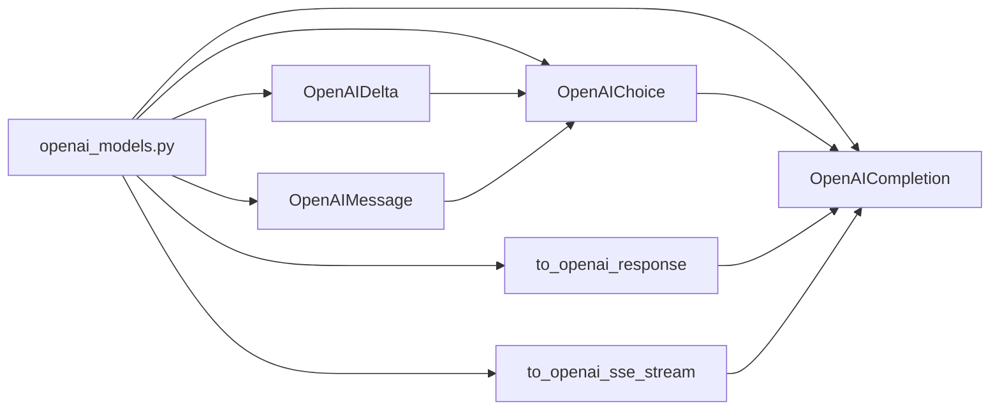

## Module: openai_models.py
- **Module Name**: openai_models.py

- **Primary Objectives**: This module is designed to manage interactions with OpenAI's GPT model. It includes classes and methods for handling different types of responses from the model, converting them to the desired format, and streaming them.

- **Critical Functions**: 
    - `from_text(cls, text: str | None, finish_reason: str | None = None, sources: list[Chunk] | None = None)`: A class method that creates an instance of OpenAICompletion from the provided text, finish reason, and sources.
    - `json_from_delta(cls, text: str | None, finish_reason: str | None = None, sources: list[Chunk] | None = None)`: A class method that creates a JSON string from the provided text, finish reason, and sources.
    - `to_openai_response(response: str | ChatResponse, sources: list[Chunk] | None = None)`: A function that converts a response to an OpenAICompletion instance.
    - `to_openai_sse_stream(response_generator: Iterator[str | CompletionResponse | ChatResponse], sources: list[Chunk] | None = None,)`: A function that generates an iterator of string responses in the Server-Sent Events (SSE) format.

- **Key Variables**: 
    - `content`: The content of the OpenAIDelta or OpenAIMessage.
    - `role`: The role of the OpenAIMessage.
    - `finish_reason`: The reason for finishing the OpenAIChoice.
    - `delta`: The delta of the OpenAIChoice.
    - `message`: The message of the OpenAIChoice.
    - `sources`: The sources of the OpenAIChoice.
    - `id`: The ID of the OpenAICompletion.
    - `object`: The object type of the OpenAICompletion.
    - `created`: The creation time of the OpenAICompletion.
    - `model`: The model of the OpenAICompletion.
    - `choices`: The choices of the OpenAICompletion.

- **Interdependencies**: This module interacts with other system components such as the `private_gpt.server.chunks.chunks_service`, `ChatResponse`, `CompletionResponse`, and `llama_index.llms`.

- **Core vs. Auxiliary Operations**: The core operations of this module are the creation of OpenAICompletion instances and the conversion of responses to the OpenAI format. The auxiliary operations include the creation of JSON strings from the responses.

- **Operational Sequence**: The sequence of operations depends on the usage of the module. However, a typical sequence could be the generation of a response from the GPT model, conversion of this response to an OpenAICompletion instance, and then conversion of this instance to a JSON string or a SSE stream.

- **Performance Aspects**: The module seems efficient as it uses Python's built-in data types and functions. However, the performance could be affected by the size and complexity of the responses from the GPT model.

- **Reusability**: This module is highly reusable. The classes and methods defined can be used in any application that needs to interact with OpenAI's GPT model.

- **Usage**: This module is used to handle responses from OpenAI's GPT model. It can convert these responses to a specific format (OpenAICompletion instance, JSON string, or SSE stream) and stream them.

- **Assumptions**: The module assumes that the responses from the GPT model can be converted to the OpenAICompletion format. It also assumes that the responses can be represented as a JSON string or a SSE stream.
## Mermaid Diagram

