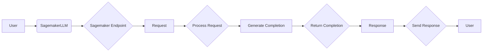
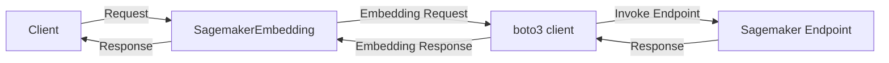

## Module: sagemaker.py
- **Module Name**: sagemaker.py

- **Primary Objectives**: This module is designed to interact with the AWS Sagemaker service. It provides functionality for invoking Sagemaker endpoints, handling responses, and performing tasks such as completing prompts and streaming chat.

- **Critical Functions**:
    - `__init__`: Initializes the SagemakerLLM class with various parameters.
    - `complete`: Invokes the Sagemaker endpoint to complete a given prompt.
    - `stream_complete`: Similar to `complete`, but handles streamed responses.
    - `chat`: Converts a sequence of chat messages into a prompt and completes it.
    - `stream_chat`: Similar to `chat`, but handles streamed responses.

- **Key Variables**:
    - `endpoint_name`: The name of the Sagemaker endpoint to be used.
    - `temperature`: Parameter for controlling the randomness of the model's output.
    - `max_new_tokens`: The maximum number of tokens to generate.
    - `context_window`: The maximum number of context tokens for the model.
    - `_boto_client`: The boto3 client used to interact with AWS services.

- **Interdependencies**: This module interacts with the AWS Sagemaker service, and also relies on various other modules and classes such as `boto3`, `llama_index.llms`, and `llama_index.callbacks`.

- **Core vs. Auxiliary Operations**: The core operations of this module involve invoking the Sagemaker endpoint and handling its responses (`complete`, `stream_complete`, `chat`, `stream_chat`). Auxiliary operations include setting up the class (`__init__`) and managing the internal buffer (`LineIterator`).

- **Operational Sequence**: The typical sequence would involve initializing a `SagemakerLLM` instance, then using it to perform completions and/or chat operations. These operations may be performed in a streaming manner, depending on the use case.

- **Performance Aspects**: Performance considerations would include the latency of the Sagemaker endpoint, the efficiency of the buffer management (`LineIterator`), and the overhead of the various conversion and formatting operations.

- **Reusability**: This module is designed to be reusable in any context where interaction with a Sagemaker endpoint is required. It can be adapted to different endpoints and parameters.

- **Usage**: To use this module, one would typically create an instance of `SagemakerLLM` with the desired parameters, then call its methods as needed.

- **Assumptions**: This module assumes that the Sagemaker endpoint is correctly set up and available, and that the AWS credentials are correctly configured. It also assumes that the `boto3` library is available and functional.
## Mermaid Diagram

## Module: sagemaker.py
- **Module Name**: SagemakerEmbedding in sagemaker.py
- **Primary Objectives**: The module is designed to interact with a deployed Sagemaker embedding model. It uses the endpoint of the Sagemaker model to fetch embeddings for given inputs.
- **Critical Functions**: 
  - `_embed`: This is the main function that interacts with the Sagemaker model endpoint, sending a list of sentences and receiving their corresponding embeddings.
  - `_get_query_embedding`, `_get_text_embedding`, `_get_text_embeddings`: These functions are used to get embeddings for a query, a text, and a list of texts respectively.
  - `_aget_query_embedding`, `_aget_text_embedding`: These are asynchronous versions of the above functions but they fallback to synchronous methods as async is not implemented.
- **Key Variables**: 
  - `endpoint_name`: The name of the Sagemaker model endpoint.
  - `_boto_client`: The boto3 client used to interact with AWS services.
  - `_async_not_implemented_warned`: A flag to track if the user has been warned about async not being implemented.
- **Interdependencies**: This module interacts with the AWS Sagemaker service via the boto3 client.
- **Core vs. Auxiliary Operations**: The core operations are the embedding functions. The auxiliary operations include warning about async not being implemented.
- **Operational Sequence**: The module first initializes the boto3 client and then uses it in the embedding functions to interact with the Sagemaker model endpoint.
- **Performance Aspects**: The performance of this module is heavily dependent on the response time of the Sagemaker model endpoint and the network latency.
- **Reusability**: This module is highly reusable for any task that requires fetching embeddings from a Sagemaker model.
- **Usage**: This module is used by creating an instance of the SagemakerEmbedding class with the appropriate endpoint name and then calling the embedding functions.
- **Assumptions**: The module assumes that the Sagemaker model endpoint is correctly set up and that the AWS credentials are correctly configured.
## Mermaid Diagram

