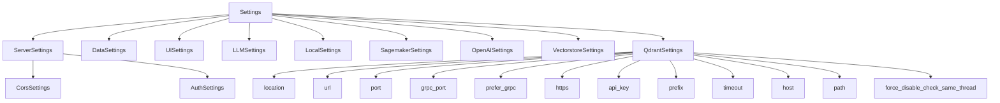

## Module: settings.py
- **Module Name**: settings.py

- **Primary Objectives**: This module is responsible for managing the configuration settings of the application. It handles settings related to CORS, Authentication, Server, Data, LLM, Local, Sagemaker, OpenAI, Vectorstore, UI, and Qdrant. It also provides methods for loading and accessing these settings.

- **Critical Functions**:
    - `settings()`: This function returns the current loaded settings from the DI container. It is used to maintain compatibility with existing code that requires global access to the settings.

- **Key Variables**:
    - `unsafe_settings`: This variable holds the active settings loaded from the settings loader.
    - `unsafe_typed_settings`: This variable holds the active settings loaded from the settings loader, cast into the `Settings` data model.

- **Interdependencies**: This module interacts with the settings loader module to load the active settings. It also interacts with the `private_gpt.di` module to get the global injector.

- **Core vs. Auxiliary Operations**: The core operations of this module are the definition of the settings data models and the loading of the active settings. The auxiliary operation is the provision of the `settings()` function to maintain compatibility with existing code.

- **Operational Sequence**: The active settings are loaded when the module is imported. These settings can then be accessed through the `settings()` function or directly through the `unsafe_settings` and `unsafe_typed_settings` variables.

- **Performance Aspects**: This module is not performance-critical as it is primarily concerned with configuration management.

- **Reusability**: This module is highly reusable as it provides a standardized way of managing application settings. The settings data models can be easily adapted to suit the needs of different applications.

- **Usage**: This module is used whenever access to the application settings is required. This can be for configuring the application at startup, or for accessing settings during runtime.

- **Assumptions**: It is assumed that the settings loader module correctly loads the active settings. It is also assumed that any code accessing the settings through this module will do so in a thread-safe manner.
## Mermaid Diagram

