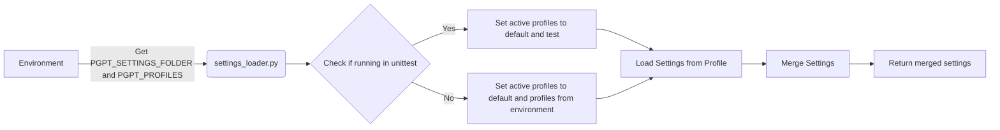

## Module: settings_loader.py
- **Module Name**: The module is named as `settings_loader.py`

- **Primary Objectives**: The module is designed to load application settings based on active profiles. It supports loading multiple profiles and merging them into one unified configuration.

- **Critical Functions**: 
    - `merge_settings(settings: Iterable[dict[str, Any]]) -> dict[str, Any]`: This function merges multiple settings dictionaries into one.
    - `load_settings_from_profile(profile: str) -> dict[str, Any]`: This function loads settings from a specific profile.
    - `load_active_settings() -> dict[str, Any]`: This function loads all active profiles and merges them.

- **Key Variables**: 
    - `_settings_folder`: The environment variable that holds the settings folder path.
    - `active_profiles`: A list of active profiles from which settings should be loaded.

- **Interdependencies**: The module interacts with other system components by providing them with the necessary configurations. It depends on `functools`, `logging`, `os`, `sys`, `Iterable`, `Path`, `Any`, `deep_update`, `unique_list`, `PROJECT_ROOT_PATH`, and `load_yaml_with_envvars`.

- **Core vs. Auxiliary Operations**: 
    - Core operations include loading settings from profiles and merging multiple settings.
    - Auxiliary operations include logging and error handling.

- **Operational Sequence**: The module first identifies the active profiles. Then, for each profile, it loads the settings and merges them into one dictionary.

- **Performance Aspects**: The module's performance is dependent on the number of active profiles and the size of the settings in each profile. It uses `functools.reduce` for efficient merging of settings.

- **Reusability**: The module is highly reusable as it can load settings from any profile and merge multiple settings. It can be used in any project that requires loading configurations from multiple sources.

- **Usage**: This module is used at the start of the application to load and merge settings from active profiles.

- **Assumptions**: The module assumes that the settings for each profile are stored in a `yaml` file in the settings folder. It also assumes that the settings can be merged into one dictionary.
## Mermaid Diagram

