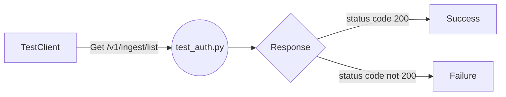

## Module: test_auth.py
- **Module Name**: The module name is "test_auth.py".

- **Primary Objectives**: The primary purpose of this module is to test the authentication process of the API endpoint "/v1/ingest/list". Specifically, it checks if this endpoint can be accessed without requiring authentication.

- **Critical Functions**: The main function in this module is "test_default_does_not_require_auth". This function sends a GET request to the "/v1/ingest/list" endpoint and checks if the response status code is 200, indicating a successful request.

- **Key Variables**: The key variable here is "response_before", which stores the response from the GET request to the "/v1/ingest/list" endpoint.

- **Interdependencies**: This module depends on the "TestClient" from the "fastapi.testclient" package to send the GET request.

- **Core vs. Auxiliary Operations**: The core operation is sending the GET request and checking the response status code. There are no auxiliary operations in this module.

- **Operational Sequence**: The sequence is straightforward: the GET request is sent to the "/v1/ingest/list" endpoint, the response is stored in "response_before", and then the status code of the response is checked to be 200.

- **Performance Aspects**: Performance considerations are minimal in this module, as it only sends a single GET request and checks the response.

- **Reusability**: This module, or specifically the "test_default_does_not_require_auth" function, can be adapted for reuse to test the authentication requirements of other API endpoints. Just replace "/v1/ingest/list" with the endpoint you want to test.

- **Usage**: This module is used in the testing phase of the software development lifecycle to ensure that the API endpoint "/v1/ingest/list" does not require authentication.

- **Assumptions**: The main assumption made here is that a status code of 200 indicates a successful request and thus means that the endpoint does not require authentication. However, a status code of 200 only means that the request was successful and does not necessarily imply anything about authentication requirements.
## Mermaid Diagram

