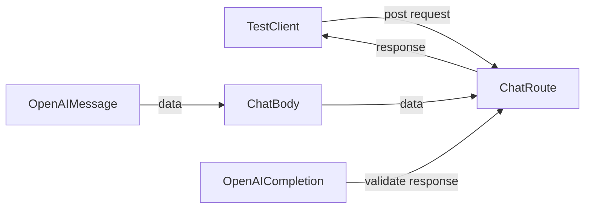

## Module: test_chat_routes.py
- **Module Name**: test_chat_routes.py
- **Primary Objectives**: The purpose of this module is to test the functionality of the chat routes in a FastAPI application.
- **Critical Functions**: 
  - `test_chat_route_produces_a_stream`: This function tests the chat route when the `stream` parameter is set to `True`. It sends a chat message to the route and checks if the response contains a stream of events.
  - `test_chat_route_produces_a_single_value`: This function tests the chat route when the `stream` parameter is set to `False`. It sends a chat message to the route and validates the response.
- **Key Variables**: 
  - `body`: An instance of the `ChatBody` class that represents the request body for the chat route. It contains the chat message and other parameters.
  - `response`: The response object returned by the test client when making a request to the chat route.
  - `raw_events`: A list of raw events extracted from the response text.
  - `events`: A list of processed events extracted from the raw events.
- **Interdependencies**: This module depends on the following components:
  - `fastapi.testclient.TestClient`: The test client used to make requests to the FastAPI application.
  - `private_gpt.open_ai.openai_models.OpenAICompletion`: The model used to validate the response from the chat route.
  - `private_gpt.server.chat.chat_router.ChatBody`: The class representing the request body for the chat route.
- **Core vs. Auxiliary Operations**: The core operations of this module are the two test functions that validate the behavior of the chat route. The auxiliary operations include extracting and processing events from the response, as well as validating the response using the `OpenAICompletion` model.
- **Operational Sequence**: The operational sequence of this module is as follows:
  1. The `test_chat_route_produces_a_stream` function sends a chat message with `stream=True` to the chat route and checks if the response contains a stream of events.
  2. The `test_chat_route_produces_a_single_value` function sends a chat message with `stream=False` to the chat route and validates the response using the `OpenAICompletion` model.
- **Performance Aspects**: There are no specific performance aspects mentioned in the provided code module.
- **Reusability**: This module is specific to testing the chat routes in a FastAPI application and may not be directly reusable in other contexts.
- **Usage**: This module is used to test the functionality of the chat routes by making requests to the routes and validating the responses.
- **Assumptions**: No assumptions are explicitly mentioned in the provided code module.
## Mermaid Diagram

