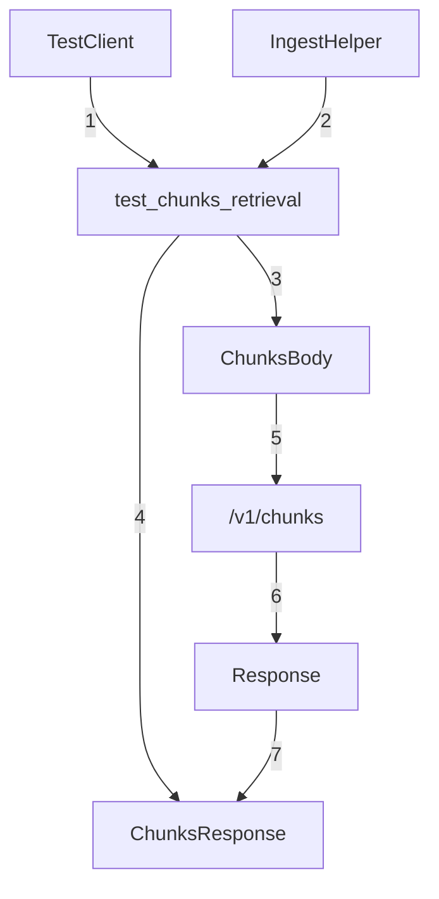

## Module: test_chunk_routes.py
- **Module Name**: The module name is `test_chunk_routes.py`.

- **Primary Objectives**: The main purpose of this module is to test the retrieval of chunks from the database. It checks if the system is correctly querying and returning chunks of data.

- **Critical Functions**: 
  - `test_chunks_retrieval(test_client: TestClient, ingest_helper: IngestHelper)`: This is the main function of the module. It tests the retrieval of chunks from the database.

- **Key Variables**: 
  - `test_client`: An instance of `TestClient` used to make requests to the API.
  - `ingest_helper`: An instance of `IngestHelper` used to ingest a file into the database.
  - `path`: The path of the file to be ingested.
  - `body`: The body of the POST request, which includes the text to be queried.
  - `response`: The response received from the POST request.
  - `chunk_response`: The validated response data.

- **Interdependencies**: This module interacts with the `ChunksBody`, `ChunksResponse`, `TestClient`, `IngestHelper`, and `pathlib.Path` modules.

- **Core vs. Auxiliary Operations**: The core operation is the `test_chunks_retrieval` function which tests the retrieval of chunks from the database. The ingestion of the file and the assertions are auxiliary operations that support the main test function.

- **Operational Sequence**: The module first ensures there's some chunk to query in the database by ingesting a file. It then sends a POST request to the "/v1/chunks" endpoint and validates the response.

- **Performance Aspects**: The performance of this module depends on the efficiency of the chunk retrieval process and the speed of the database query.

- **Reusability**: This module can be reused to test any chunk retrieval functionality in similar systems.

- **Usage**: This module is used during the testing phase of the software development lifecycle to ensure the chunk retrieval functionality works as expected.

- **Assumptions**: The module assumes that the `ingest_helper.ingest_file(path)` function correctly ingests the file into the database, and that the "/v1/chunks" endpoint correctly processes the POST request and returns the expected response.
## Mermaid Diagram

