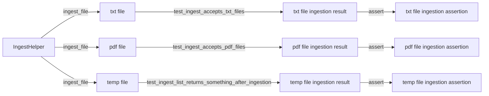

## Module: test_ingest_routes.py
- **Module Name**: The module name is `test_ingest_routes.py`.

- **Primary Objectives**: The purpose of this module is to test the ingestion of text and PDF files and to ensure that the ingestion process is working correctly.

- **Critical Functions**: 
  - `test_ingest_accepts_txt_files`: This function tests if the ingestion process correctly accepts and processes .txt files.
  - `test_ingest_accepts_pdf_files`: This function tests if the ingestion process correctly accepts and processes .pdf files.
  - `test_ingest_list_returns_something_after_ingestion`: This function tests if the ingestion process correctly returns a response after a file has been ingested.

- **Key Variables**: 
  - `ingest_helper`: This is an instance of the `IngestHelper` class used for ingesting files.
  - `path`: This variable holds the path of the file to be ingested.
  - `ingest_result`: This variable holds the result of the ingestion process.
  - `response_before`, `response_after`: These variables hold the responses before and after the ingestion process, respectively.
  - `count_ingest_before`, `count_ingest_after`: These variables hold the counts of the data in the responses before and after the ingestion process, respectively.

- **Interdependencies**: This module interacts with the `IngestHelper` class from the `tests.fixtures.ingest_helper` module and the `TestClient` class from the `fastapi.testclient` module.

- **Core vs. Auxiliary Operations**: The core operations are the ingestion of text and PDF files and the verification of the ingestion process. The auxiliary operations include writing to a temporary file and flushing and seeking it.

- **Operational Sequence**: The module first tests the ingestion of text files, then PDF files, and finally checks if the ingestion process correctly returns a response after a file has been ingested.

- **Performance Aspects**: The module uses assertions to ensure that the ingestion process is working correctly and efficiently.

- **Reusability**: This module is highly reusable for testing the ingestion process of different file types and for verifying the data returned after the ingestion process.

- **Usage**: This module is used for testing the ingestion process of text and PDF files and for verifying the data returned after the ingestion process.

- **Assumptions**: The module assumes that the ingestion process correctly accepts and processes text and PDF files and that it correctly returns a response after a file has been ingested.
## Mermaid Diagram

