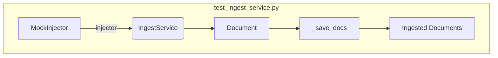

## Module: test_ingest_service.py
- **Module Name**: The module is named `test_ingest_service.py`. 

- **Primary Objectives**: This module is designed to test the save functionality of the `IngestService` within a local ChromaDB Vector Database setup. 

- **Critical Functions**: 
  - `test_save_many_nodes(injector: MockInjector)`: This function tests the `_save_docs` method of the `IngestService` class. It creates a list of documents, saves them via `IngestService`, and then checks if the number of ingested documents matches the original number.

- **Key Variables**: 
  - `max_batch_size`: A mock variable that controls the maximum batch size of ChromaDB.
  - `ingest_service`: An instance of the `IngestService` class.
  - `documents`: A list of document objects created for the test.
  - `ingested_docs`: A list of documents that have been ingested by the `IngestService`.

- **Interdependencies**: This module interacts with the `IngestService` from the `private_gpt.server.ingest.ingest_service` module, `Document` from the `llama_index` module, and `MockInjector` from the `tests.fixtures.mock_injector` module.

- **Core vs. Auxiliary Operations**: The core operation is testing the `_save_docs` method of `IngestService`. Auxiliary operations include creating mock documents and setting up the mock ChromaDB environment.

- **Operational Sequence**: The test first sets the `max_batch_size` to a small number. Then, it creates an instance of `IngestService` and a list of documents. It saves these documents using `IngestService` and checks if the number of ingested documents is the same as the original number.

- **Performance Aspects**: The performance of this test can be influenced by the `max_batch_size` variable, which is set to a small number to simulate a constrained environment.

- **Reusability**: This test module is highly reusable and can be used to test the save functionality of any service similar to `IngestService`.

- **Usage**: This module is used for testing purposes within the development environment to ensure the correct functionality of the `IngestService`'s `_save_docs` method.

- **Assumptions**: The test assumes that the `IngestService`'s `_save_docs` method will correctly save all documents and that the number of saved documents will match the number of original documents. It also assumes a local ChromaDB Vector Database setup.
## Mermaid Diagram

