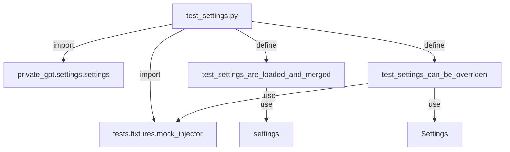

## Module: test_settings.py
- **Module Name**: The module is named `test_settings.py`.

- **Primary Objectives**: The purpose of this module is to test the settings of a server environment. It checks if the settings are loaded and merged correctly and whether they can be overridden.

- **Critical Functions**: The main methods/functions are `test_settings_are_loaded_and_merged()` and `test_settings_can_be_overriden(injector: MockInjector)`. The first function checks if the settings are loaded and merged correctly, and the second function tests if the settings can be overridden.

- **Key Variables**: The key variables in this module are `settings`, `MockInjector`, `mocked_settings`, and `injector`.

- **Interdependencies**: This module interacts with `private_gpt.settings.settings` and `tests.fixtures.mock_injector`.

- **Core vs. Auxiliary Operations**: The core operations are the testing of settings loading, merging, and overriding. There are no auxiliary operations in this module.

- **Operational Sequence**: The `test_settings_are_loaded_and_merged()` function is executed first to check the loading and merging of settings. Then, the `test_settings_can_be_overriden()` function is executed to test the override function of the settings.

- **Performance Aspects**: As this is a testing module, performance considerations are typically related to the speed and accuracy of the tests.

- **Reusability**: This module is highly reusable for testing settings in different environments or scenarios. The settings can be adjusted and the tests rerun as needed.

- **Usage**: This module is used during the testing phase of the development process to ensure that the settings are loaded, merged, and overridden correctly.

- **Assumptions**: The module assumes that the `private_gpt.settings.settings` and `tests.fixtures.mock_injector` modules are correctly implemented. It also assumes that the settings are initially set to "test" and can be overridden.
## Mermaid Diagram

