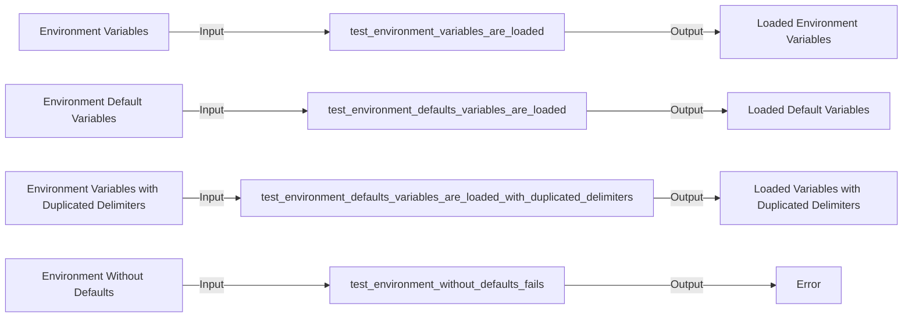

## Module: test_settings_loader.py
- **Module Name**: The module is named "test_settings_loader.py".

- **Primary Objectives**: This module is designed to test the functionality of loading settings from a YAML file while replacing placeholders with environment variables.

- **Critical Functions**: 
    - `test_environment_variables_are_loaded`: Tests if environment variables are correctly loaded.
    - `test_environment_defaults_variables_are_loaded`: Tests if default variables are loaded when no environment variable is provided.
    - `test_environment_defaults_variables_are_loaded_with_duplicated_delimiters`: Tests if the function can handle duplicated delimiters.
    - `test_environment_without_defaults_fails`: Tests if an error is raised when an environment variable without a default value is not provided.

- **Key Variables**: 
    - `sample_yaml`: A string containing the YAML data to be loaded.
    - `env`: A dictionary containing environment variables.
    - `loaded`: The result of loading the YAML data.

- **Interdependencies**: This module depends on the `load_yaml_with_envvars` function from the `private_gpt.settings.yaml` module.

- **Core vs. Auxiliary Operations**: The core operations of this module are the tests that validate the correct functionality of the `load_yaml_with_envvars` function. The auxiliary operations include setting up the `sample_yaml` and `env` variables for testing.

- **Operational Sequence**: Each test function creates a sample YAML string, calls the `load_yaml_with_envvars` function with the sample and environment variables, and then asserts the expected outcome.

- **Performance Aspects**: The performance of this module is based on the speed and accuracy of the `load_yaml_with_envvars` function. Optimizing this function can improve the module's performance.

- **Reusability**: This module is designed for testing and can be reused in different environments where the `load_yaml_with_envvars` function is used.

- **Usage**: This module is used during testing to verify the correct functionality of the `load_yaml_with_envvars` function.

- **Assumptions**: 
    - It is assumed that the `load_yaml_with_envvars` function correctly replaces placeholders in the YAML data with environment variables.
    - It is also assumed that a `ValueError` will be raised if an environment variable without a default value is not provided.
## Mermaid Diagram

