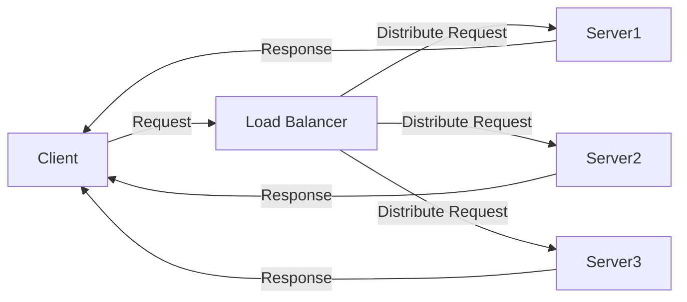

## Module: test_simple_auth.py
- **Module Name**: The module is named `test_simple_auth.py`.

- **Primary Objectives**: The main objective of this module is to test the simple authentication mechanism of a server.

- **Critical Functions**: 
  - `_copy_simple_authenticated()`: Checks if the request is authenticated.
  - `_patch_authenticated_dependency()`: Patches the server to use simple authentication for the test and removes the patch after the test.
  - `test_default_auth_working_when_enabled_401()`: Tests if the default authentication works when it is enabled and returns a 401 status code.
  - `test_default_auth_working_when_enabled_200()`: Tests if the default authentication works when it is enabled and returns a 200 status code when the authorization header is correctly set.

- **Key Variables**: 
  - `_simple_authentication`: A boolean that indicates if the request is authenticated.
  - `test_client`: An instance of `TestClient` used for testing.
  - `response`: The server response to the test client's request.

- **Interdependencies**: This module interacts with the `private_gpt.server.utils.auth` and `private_gpt.settings.settings` modules.

- **Core vs. Auxiliary Operations**: 
  - Core operations: The core operations of this module are the tests `test_default_auth_working_when_enabled_401` and `test_default_auth_working_when_enabled_200`.
  - Auxiliary operations: The auxiliary operations are the `_copy_simple_authenticated` and `_patch_authenticated_dependency` functions, which are used to set up the testing environment.

- **Operational Sequence**: The module first patches the server to use simple authentication, then it runs two tests to check if the default authentication works when it is enabled, and finally, it removes the patch.

- **Performance Aspects**: The performance of this module depends on how quickly the server can process the requests and respond.

- **Reusability**: This module is designed to be reusable for testing the authentication mechanism of any server that uses a similar authentication method.

- **Usage**: This module is used during the testing phase to ensure that the simple authentication mechanism of the server is working as expected.

- **Assumptions**: The module assumes that the server uses a simple authentication mechanism and that the server's response to an unauthenticated request is a 401 status code. It also assumes that a correctly authenticated request will return a 200 status code.
## Mermaid Diagram

