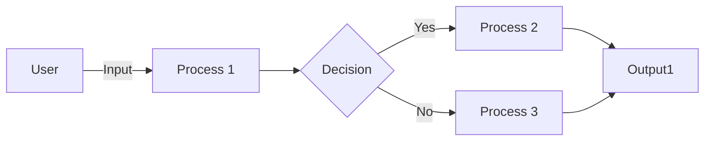

## Module: test_ui.py
- **Module Name**: The module is named `test_ui.py`. It appears to be a test module for a user interface.

- **Primary Objectives**: The main purpose of this module is to test the user interface (UI) of a FastAPI application. It checks if the UI starts at the given endpoint.

- **Critical Functions**: 
  - `test_ui_starts_in_the_given_endpoint(test_client: TestClient)`: This function tests if the UI starts at the given endpoint. It sends a GET request to the "/ui" endpoint and asserts that the response status code is 200, indicating a successful request.

- **Key Variables**: 
  - `test_client`: This is an instance of the `TestClient` class from the FastAPI testing library. It is used to send requests to the FastAPI application.
  - `response`: This variable stores the response received from the GET request sent to the "/ui" endpoint.

- **Interdependencies**: This module interacts with FastAPI's TestClient for testing and pytest for the testing framework.

- **Core vs. Auxiliary Operations**: The core operation of this module is the `test_ui_starts_in_the_given_endpoint` function, which tests the UI's starting endpoint. The auxiliary operation is the parameterization of the `test_client` using pytest's `@pytest.mark.parametrize`.

- **Operational Sequence**: First, the `test_client` is parameterized with the UI settings. Then, a GET request is sent to the "/ui" endpoint using the `test_client`. The response status code is checked to be 200, indicating that the request was successful.

- **Performance Aspects**: Performance is not a key consideration in this module as it is a test module. However, the efficiency of the test could be influenced by the performance of the FastAPI application being tested.

- **Reusability**: This module is highly reusable. It can be used to test any FastAPI application's UI with minor modifications.

- **Usage**: This module is used in the testing phase of the software development lifecycle to ensure that the UI of the FastAPI application starts at the correct endpoint.

- **Assumptions**: The module assumes that the FastAPI application's UI is enabled and set to start at the "/ui" endpoint. It also assumes that a successful GET request to the "/ui" endpoint will return a status code of 200.
## Mermaid Diagram

