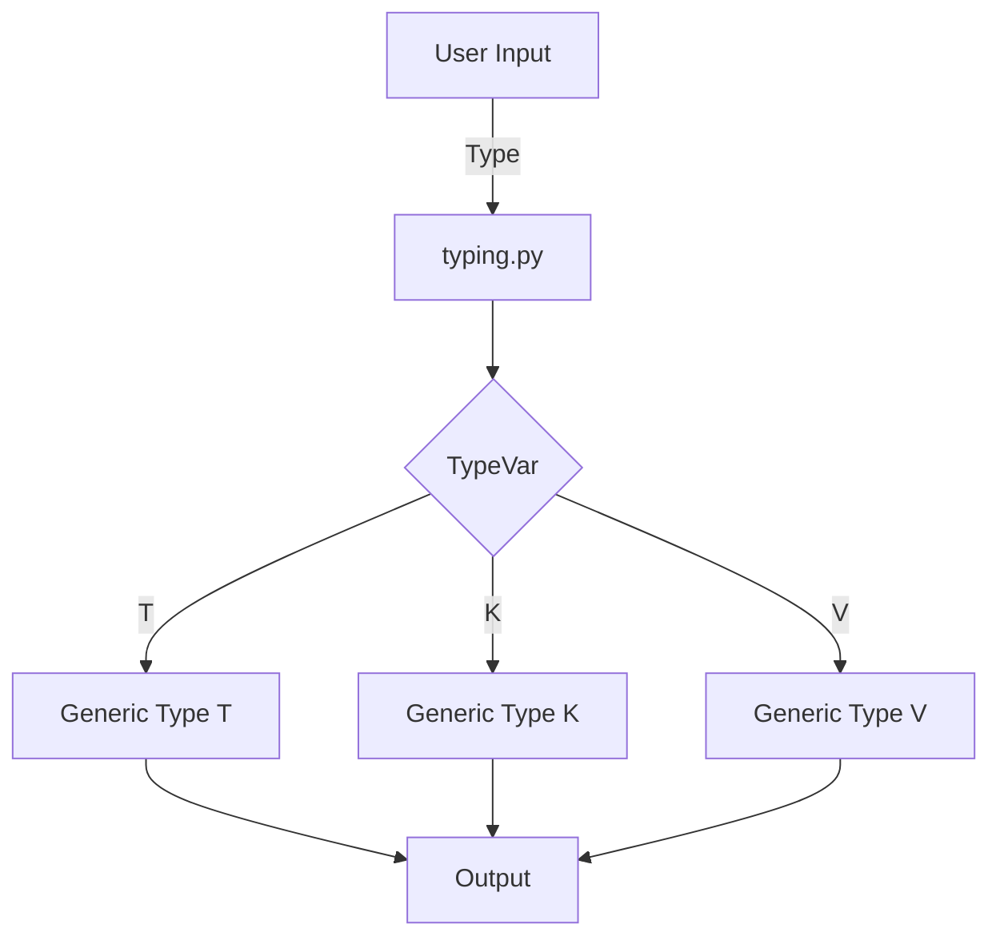

## Module: typing.py
- **Module Name**: The module is `typing.py`.

- **Primary Objectives**: The purpose of this module is to provide support for type hints. It's a part of Python's standard library that provides runtime support for type hints as specified by PEP 484, PEP 526, PEP 560, and PEP 586.

- **Critical Functions**: The main functions in this module are `TypeVar` which is used for creating type variables which can be used with generic classes. In this case, three type variables T, K, and V are being created.

- **Key Variables**: The essential variables are T, K, and V. They are type variables that can be used to denote any type.

- **Interdependencies**: This module interacts with other system components that require type hinting. It can be used in conjunction with any module or function that uses type hints.

- **Core vs. Auxiliary Operations**: The core operation is the creation of type variables. There are no auxiliary operations in this snippet.

- **Operational Sequence**: First, the `TypeVar` function from the `typing` module is imported. Then, three type variables T, K, and V are created.

- **Performance Aspects**: Using type hints can improve the readability and maintainability of the code, but it does not directly affect the runtime performance.

- **Reusability**: This module and the type variables are highly reusable. They can be imported and used in any Python script that requires type hinting.

- **Usage**: This module is used when you want to specify that a function or method should return or accept values of a specific type, but you want to allow for a range of types rather than a single type.

- **Assumptions**: It assumes that the users are familiar with the concept of type hinting and generic programming in Python.
## Mermaid Diagram

