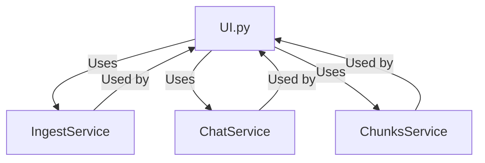

## Module: ui.py
- **Module Name**: ui.py

- **Primary Objectives**: The purpose of this module is to provide a user interface for interacting with a GPT model. This includes querying documents, chatting with the model, and searching in documents. 

- **Critical Functions**: 
  - `_chat(self, message: str, history: list[list[str]], mode: str, *_: Any) -> Any`: Handles chat interactions with the model.
  - `_list_ingested_files(self) -> list[list[str]]`: Lists the files that have been ingested.
  - `_upload_file(self, file: TextIO) -> None`: Handles file upload.
  - `_build_ui_blocks(self) -> gr.Blocks`: Builds the UI blocks for the Gradio interface.
  - `get_ui_blocks(self) -> gr.Blocks`: Returns the UI blocks.
  - `mount_in_app(self, app: FastAPI, path: str) -> None`: Mounts the Gradio UI in a FastAPI app.

- **Key Variables**:
  - `UI_TAB_TITLE`: The title of the UI tab.
  - `SOURCES_SEPARATOR`: Separator used for sources.
  - `self._ingest_service`: The ingestion service used.
  - `self._chat_service`: The chat service used.
  - `self._chunks_service`: The chunks service used.
  - `self._ui_block`: Cache for the UI blocks.

- **Interdependencies**: This module interacts with several other components including ingestion, chat, and chunks services. It also uses the Gradio library for the UI.

- **Core vs. Auxiliary Operations**: The core operations of this module involve creating and managing the user interface for interaction with the GPT model. Auxiliary operations include functions like listing ingested files and uploading files.

- **Operational Sequence**: The sequence of operations depends on the user's actions. However, the general flow involves building the UI, waiting for user input (such as a chat message or file upload), processing the input, and updating the UI with the response.

- **Performance Aspects**: The performance of this module is dependent on the underlying services (ingestion, chat, and chunks services) and the Gradio library. 

- **Reusability**: This module is highly reusable. The UI can be mounted in any FastAPI application and the blocks can be easily customized for different use cases.

- **Usage**: This module is used to provide a user interface for interacting with a GPT model. It can be run locally or integrated into a FastAPI application.

- **Assumptions**: The module assumes that the necessary services (ingestion, chat, and chunks services) are available and properly configured. It also assumes that the Gradio library is installed and working correctly.
## Mermaid Diagram

