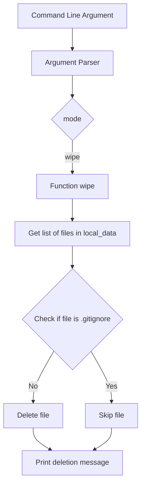

## Module: utils.py
Here is a comprehensive analysis of the provided code module:

- **Module Name**: The module is named "utils.py".

- **Primary Objectives**: The purpose of this module is to provide utility functions for wiping files and directories in a specified path.

- **Critical Functions**: 
  - `wipe()`: This function is responsible for wiping files and directories in the specified path. It iterates over all the files in the path, excluding the ".gitignore" file, and removes them using the `os.remove()` function for files and `shutil.rmtree()` function for directories.

- **Key Variables**: 
  - `path`: This variable stores the path where the files and directories need to be wiped.
  - `all_files`: This variable stores a list of all the files in the specified path.
  - `files_to_remove`: This variable stores a filtered list of files to be removed, excluding the ".gitignore" file.
  - `file_name`: This variable stores the name of each file in the `files_to_remove` list.
  - `file_path`: This variable stores the complete path of each file in the `files_to_remove` list.

- **Interdependencies**: This module depends on the following components:
  - `argparse` module: It is used to parse command-line arguments.
  - `os` module: It is used for interacting with the operating system, such as listing files, removing files, and checking file types.
  - `shutil` module: It is used for removing directories and their contents.

- **Core vs. Auxiliary Operations**: The core operation of this module is the `wipe()` function, which is responsible for removing files and directories. There are no auxiliary operations in this module.

- **Operational Sequence**: The operational sequence of this module is as follows:
  1. The `wipe()` function is called.
  2. The function retrieves the list of files in the specified path.
  3. It filters out the files to be removed, excluding the ".gitignore" file.
  4. It iterates over the files to be removed and removes them using the appropriate function based on the file type (file or directory).

- **Performance Aspects**: The performance considerations for this module depend on the number of files and directories in the specified path. Removing a large number of files or directories can take a significant amount of time and system resources.

- **Reusability**: This module can be reused in other projects that require file and directory wiping functionality. The `wipe()` function can be called from other modules or scripts by importing the `utils` module.

- **Usage**: To use this module, you can import it in your Python script or module. You can then call the `wipe()` function with the desired path as an argument.

- **Assumptions**: This module assumes that the specified path exists and contains files and directories to be wiped. It also assumes that the user has the necessary permissions to remove the files and directories.
## Mermaid Diagram

