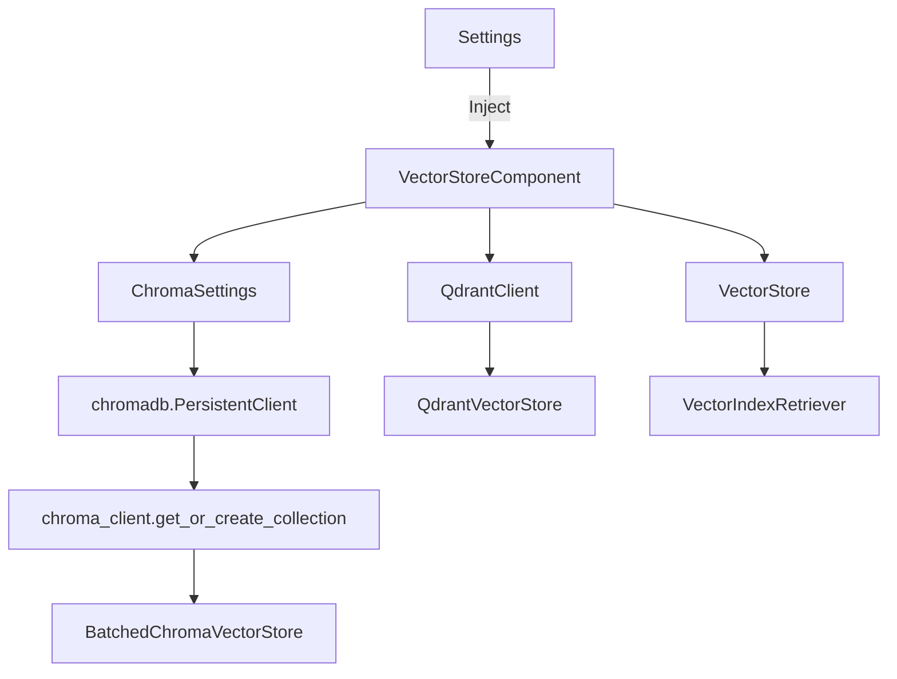

## Module: vector_store_component.py
**Module Name**: vector_store_component.py

**Primary Objectives**: The primary objective of this module is to provide a component for managing vector stores in a private GPT system. It supports two types of vector stores: Chroma and Qdrant.

**Critical Functions**: 
1. `_chromadb_doc_id_metadata_filter`: This function filters the documents based on the context filter provided.
2. `VectorStoreComponent`: The constructor initializes the vector store component based on the settings provided. It creates and configures the appropriate vector store based on the database type specified in the settings.
3. `get_retriever`: This function returns a vector index retriever based on the vector store index and context filter provided.

**Key Variables**:
- `vector_store`: An instance variable that holds the vector store object.

**Interdependencies**: 
- The module depends on the `chromadb` package for the Chroma vector store functionality and the `qdrant_client` package for the Qdrant vector store functionality.
- It also depends on other modules such as `chromadb.config.Settings`, `llama_index.VectorStoreIndex`, `llama_index.indices.vector_store.VectorIndexRetriever`, `private_gpt.components.vector_store.batched_chroma.BatchedChromaVectorStore`, `private_gpt.open_ai.extensions.context_filter.ContextFilter`, `private_gpt.paths.local_data_path`, and `private_gpt.settings.settings.Settings`.

**Core vs. Auxiliary Operations**: 
- The core operations of this module include initializing the vector store component based on the settings and providing a retriever for the vector store index.
- The auxiliary operations include filtering documents based on the context filter and handling specific database types (Chroma and Qdrant).

**Operational Sequence**: 
1. The `VectorStoreComponent` constructor is called with the settings provided.
2. Based on the `vectorstore.database` setting, the appropriate vector store is created and configured.
3. The `get_retriever` function is called to create a vector index retriever based on the vector store index and context filter.

**Performance Aspects**: 
- The performance of the module may depend on the size of the vector store and the efficiency of the underlying vector store implementations (Chroma and Qdrant).
- The use of batched operations in the Chroma vector store may improve performance for large-scale vector stores.

**Reusability**: 
- The module can be reused in any private GPT system that requires vector store management.
- It provides a flexible interface for adding support for different vector store databases.

**Usage**: 
- To use the module, create an instance of `VectorStoreComponent` with the appropriate settings.
- Use the `vector_store` instance variable to access the vector store object.
- Use the `get_retriever` function to create a vector index retriever for the vector store index.

**Assumptions**: 
- The module assumes that the `settings` object provided to the constructor contains the necessary configuration for the vector store database.
- The module assumes that the `context_filter` object passed to the `get_retriever` function is compatible with the vector store implementation (specifically for Chroma vector store).
## Mermaid Diagram

