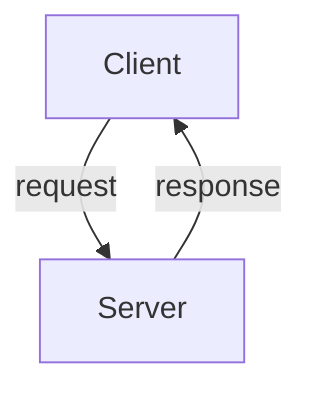

## Module: yaml.py
- **Module Name**: The module name is `yaml.py`.

- **Primary Objectives**: The primary purpose of this module is to load a YAML file and replace any environment variables found within the file with their actual values. It can replace variables that follow the pattern `${VAR}` or `${VAR:default}`.

- **Critical Functions**: 
  - `load_yaml_with_envvars(stream: TextIO, environ: dict[str, Any] = os.environ) -> dict[str, Any]`: This is the main function that loads the YAML file, replaces environment variables, and returns the data as a dictionary.
  - `load_env_var(_, node) -> str`: This is a helper function used to extract the matched value, expand the environment variable, and replace the match.

- **Key Variables**: 
  - `stream`: This is the input YAML file.
  - `environ`: This is the environment variable dictionary, defaulting to the current OS environment.
  - `loader`: This is the YAML loader used to read the YAML file.
  - `env_var`: This is the environment variable extracted from the YAML file.
  - `value`: This is the value of the environment variable.
  - `default`: This is the default value if the environment variable is not set.

- **Interdependencies**: This module depends on the `os`, `re`, and `typing` modules from the Python standard library, and the `SafeLoader` class from the `yaml` module.

- **Core vs. Auxiliary Operations**: The core operation of this module is the loading of a YAML file and the replacement of environment variables. The auxiliary operations include the extraction of matched values and the handling of default values.

- **Operational Sequence**: The sequence of operations is as follows: 
  - Initialize the YAML loader with the input stream.
  - Add a resolver and a constructor to the loader to handle environment variable replacements.
  - Load the data from the YAML file with environment variables replaced.
  - Dispose of the loader.

- **Performance Aspects**: Performance considerations would primarily be dependent on the size of the YAML file and the number of environment variables to be replaced.

- **Reusability**: This module is highly reusable. It can be used whenever there is a need to load a YAML file and replace environment variables.

- **Usage**: This module is used by importing it and calling the `load_yaml_with_envvars` function with a YAML file as input.

- **Assumptions**: The module assumes that the YAML file is properly formatted and that any environment variables used in the file are either set in the environment or have a default value specified.
## Mermaid Diagram

