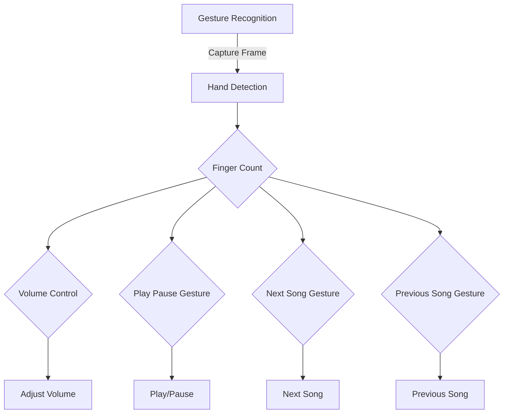

## Module: gesture_recognition.py
- **Module Name**: gesture_recognition.py

- **Primary Objectives**: This module is designed to recognize hand gestures and perform various functions, such as adjusting the volume, playing or pausing songs, and navigating between songs in Spotify.

- **Critical Functions**: 
  - `start_capture()`: This is the main function in the module. It starts capturing video from the webcam, detects hand landmarks using the MediaPipe library, interprets the hand gestures, and performs the corresponding Spotify functions.

- **Key Variables**: 
  - `mp_hand_drawing`, `mp_hands`: Used for drawing hand landmarks and hand tracking.
  - `mediaCap`: Captures video feed from the webcam.
  - `max_distance`, `play_pause_active`, `next_prev_active`: Used for volume control and to avoid repeated play/pause and next/prev song actions.
  - `finger_tip_ids`, `finger_count`, `finger_up`: Used to track the position and movement of fingers.
  - `thumb_tip_x`, `thumb_tip_y`, `index_tip_x`, `index_tip_y`, `thumb_index_distance`: Used to calculate the distance between thumb and index finger for volume control.

- **Interdependencies**: This module interacts with the `mediapipe` library for hand tracking and the `spotify_functions` module for controlling Spotify.

- **Core vs. Auxiliary Operations**: 
  - Core operations include capturing video from the webcam, detecting hand landmarks, interpreting hand gestures, and performing corresponding Spotify functions.
  - Auxiliary operations include drawing hand landmarks on the captured video and displaying the video with overlaid information.

- **Operational Sequence**: The module starts by capturing video from the webcam. It then processes each frame to detect hand landmarks. Based on the detected landmarks, it interprets the hand gestures and performs the corresponding Spotify functions. It also overlays the video with hand landmarks and other information before displaying it.

- **Performance Aspects**: The performance of this module largely depends on the accuracy of the hand tracking and gesture recognition, the responsiveness of the Spotify functions, and the processing speed of the video frames.

- **Reusability**: This module can be adapted for use with other applications that can be controlled through hand gestures. However, the gesture interpretation and the corresponding functions would need to be modified accordingly.

- **Usage**: This module is used to control Spotify through hand gestures. It can be run as a standalone script that starts when the user wants to control Spotify using hand gestures.

- **Assumptions**: 
  - It assumes that the webcam is working properly and can capture video.
  - It assumes that the MediaPipe library can accurately track hand landmarks.
  - It assumes that the user's hand gestures follow the pre-defined patterns for the Spotify functions.
## Mermaid Diagram

