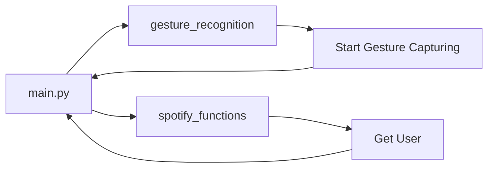

## Module: main.py
- **Module Name**: The module is main.py.

- **Primary Objectives**: The main purpose of this module is to authenticate the user, start the gesture control and capture the user's gestures.

- **Critical Functions**: 
  - `sf.get_user()`: This function is used to get the username and trigger account authentication.
  - `gr.start_capture()`: This function is used to start capturing the user's gestures.

- **Key Variables**: 
  - `username`: This variable stores the username returned by the `sf.get_user()` function.

- **Interdependencies**: This module depends on two other modules: 
  - `gesture_recognition` module for capturing the user's gestures.
  - `spotify_functions` module for getting the user's username and triggering account authentication.

- **Core vs. Auxiliary Operations**: 
  - Core Operations: Getting the username, triggering account authentication, and starting gesture capture.
  - Auxiliary Operations: Printing the username.

- **Operational Sequence**: The module first imports the necessary modules. It then triggers account authentication by getting the username using the `sf.get_user()` function. After that, it starts capturing the user's gestures using the `gr.start_capture()` function.

- **Performance Aspects**: Performance considerations would primarily be the efficiency and accuracy of the gesture recognition and the speed of the authentication process.

- **Reusability**: The gesture recognition and spotify functions are encapsulated in their respective modules, which makes them reusable. The main module can also be adapted to use different recognition or function modules.

- **Usage**: This module is used to authenticate a user and start capturing their gestures for control purposes.

- **Assumptions**: 
  - The `sf.get_user()` function will successfully authenticate the user and return a valid username.
  - The `gr.start_capture()` function will successfully start capturing the user's gestures.
  - The necessary modules `gesture_recognition` and `spotify_functions` are correctly implemented and imported.
## Mermaid Diagram

